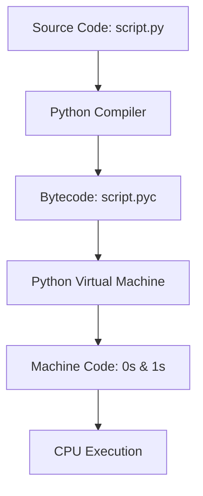
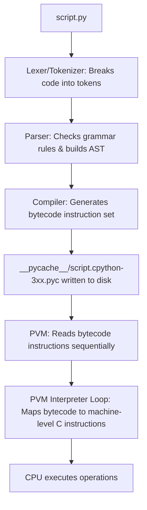
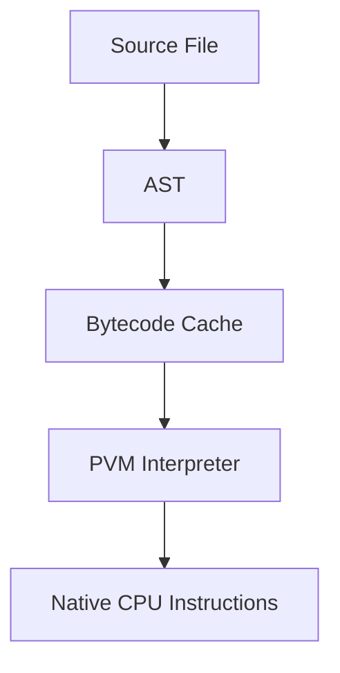

# Python OOP: Introduction to Python & The Execution Model

---

# 1. Definition

## What is a Programming Language?
A **Programming Language** is a formal system of rules, syntax, and symbols that allows humans to write instructions (source code) that a computer's central processing unit (CPU) can execute. Since computer hardware only understands low-level electrical signals represented as **Binary Code** (0s and 1s), a programming language acts as an abstraction layer and communication bridge between human logic and physical machine logic.

## Official Python Documentation Definition
> "Python is an interpreted, object-oriented, high-level programming language with dynamic semantics. Its high-level built-in data structures, combined with dynamic typing and dynamic binding, make it very attractive for Rapid Application Development, as well as for use as a scripting or glue language to connect existing components together."

## Simple Explanation
Computers are fast but lack native intelligence. They only understand binary. To talk to them, we use a programming language like Python. We write simple, readable text instructions, and Python automatically translates them into 0s and 1s so the computer knows exactly what to do.

## Technical Explanation
Python is an **interpreted, dynamically typed, garbage-collected** language. 
* **Dynamic Typing** means variables do not require explicit type declarations; the type is bound to the value at runtime.
* **Interpretation** in Python is a two-step process: source code (`.py`) is compiled into intermediate bytecode (`.pyc`), which is then executed by the **Python Virtual Machine (PVM)**, an interpreter loop translating bytecode into platform-specific machine code.



---

# 2. Why Do We Need It?

### The Problem Before High-Level Languages
In the early days of computing, programmers wrote instructions in **Machine Language** (raw binary strings) or **Assembly Language** (low-level mnemonic codes representing register moves).

```assembly
; Example of adding two numbers in Assembly (x86)
MOV EAX, 5
ADD EAX, 10
```
* **Explanation**: This assembly code moves the integer `5` into the accumulator register (`EAX`) and adds `10` to it.
* **Expected Output**: Accumulator holds `15`.
* **Memory Explanation**: Operations target CPU registers directly.
* **Time/Space Complexity**: $\mathcal{O}(1)$ execution.
* **Common Mistakes**: Writing to the wrong register or overwriting active memory.
* **Best Practices**: Document register usage thoroughly.

#### Problems with Low-Level Programming:
1. **Hardware Dependency**: Assembly code written for an Intel processor will not run on an ARM processor.
2. **Massive Boilerplate**: A simple calculation requires multiple lines of register allocation and stack management.
3. **No Safety Nets**: Direct memory access leads to system crashes (segmentation faults) if a pointer address is calculated incorrectly.

### Why Python Was Conceived
Python was created in the late 1980s by **Guido van Rossum** at CWI in the Netherlands to succeed the ABC language. Guido wanted a language that was:
* **Platform Independent**: Runs on Windows, macOS, and Linux without modification.
* **Human-Readable**: Mimics natural English syntax to reduce development time.
* **Multi-Paradigm**: Supports Procedural, Object-Oriented, and Functional programming.

---

# 3. Real-Life Analogies

### Analogy 1: The International Summit (Compiler vs. Interpreter)
Imagine an international conference where a Japanese speaker needs to convey a speech to an English-speaking audience.
* **The Compiler Approach**: A translator takes the entire written speech in Japanese beforehand, translates the whole document into English, and hands the finished English document to the audience. The audience reads it quickly. (Matches C, C++, Rust).
* **The Interpreter Approach**: The Japanese speaker talks sentence by sentence. An interpreter stands next to them, listens to one sentence, translates it immediately to the audience, and waits for the next sentence. If the speaker says something nonsensical in the 5th sentence, the program halts *at that exact moment*. (Matches Python, JavaScript).

### Analogy 2: The IKEA Assembly (PVM)
When you buy furniture from IKEA, the instruction booklet (Source Code) is written in universal pictures. However, the customer (PVM) is the one who reads the pictures, picks up the physical screws (Bytecode), and translates them into physical turns of the screwdriver to build the table (Machine Code execution).

---

# 4. Syntax

```python
# The simplest Python instruction
print("Hello World")
```
* **Explanation**: The standard entry-point function call to output text to the console.
* **Expected Output**:
  ```
  Hello World
  ```
* **Memory Explanation**: Python allocates a string object `"Hello World"` in Heap memory and passes its reference pointer to the standard stdout print descriptor.
* **Time Complexity**: $\mathcal{O}(1)$
* **Space Complexity**: $\mathcal{O}(1)$ auxiliary space.
* **Common Mistakes**: Forgetting parentheses in Python 3 (e.g., `print "Hello World"` is Python 2 syntax and raises a SyntaxError).
* **Best Practices**: Use double quotes for printable text containing single quotes, e.g., `print("It's Python")`.

### Keyword and Symbol Breakdown:
* **`print`**: A built-in function identifier.
* **`()`**: Parentheses call/execute the callable object preceding them.
* **`"..."`**: Double quotes enclose characters to form a literal string object.

---

# 5. Syntax Breakdown

Let's dissect the command-line execution syntax:

```bash
python -m py_compile script.py
```
* **Explanation**: Executes Python's built-in compile module to manually generate bytecode.
* **Expected Output**: Generates a `.pyc` file inside a `__pycache__` folder.
* **Memory Explanation**: Reads `script.py` from disk, compiles it into bytecode in RAM, and writes the bytecode back to disk.
* **Time Complexity**: $\mathcal{O}(N)$ where $N$ is the number of lines.
* **Space Complexity**: $\mathcal{O}(N)$ to store the compilation tree.
* **Common Mistakes**: Trying to run `.pyc` files directly without the Python interpreter.
* **Best Practices**: Let Python handle caching automatically rather than manually compiling files.

---

# 6. Memory Diagram

When a script is loaded into Python, the operating system allocates memory segments:

```
+-------------------------------------------------------------+
| RAM MEMORY SEGMENTS                                         |
|                                                             |
| [ CODE SEGMENT ]                                            |
|   Holds the PVM interpreter loop program executable.        |
|                                                             |
| [ STACK SEGMENT ]                                           |
|   Holds execution frames (local variable pointers).         |
|                                                             |
| [ HEAP SEGMENT ]                                            |
|   Holds Python objects (e.g., the string "Hello World",     |
|   integers, lists) and the Compiled Bytecode Cache.          |
+-------------------------------------------------------------+
```

---

# 7. Internal Working (Behind the Scenes)

## The Detailed Execution Pipeline



### 1. Tokenizing & Parsing
The Lexer converts characters into lexical tokens (like keywords, variables, operators). The Parser takes these tokens, validates them against Python's grammar rules, and produces an **Abstract Syntax Tree (AST)**.

### 2. Bytecode Generation
The Python compiler compiles the AST into **Bytecode**—a platform-neutral, instruction set representation. Each instruction is exactly 1 or 2 bytes long.

### 3. The PVM Loop
The PVM is a stack-based interpreter loop. It reads the bytecode instructions one by one, executes the corresponding C code (since the reference implementation, CPython, is written in C), and updates state.

---

# 8. Rules

### 1. The Compilation Phase Rule
Python is compiled. A common misconception is that it bypasses compilation. Python *always* compiles source code to bytecode before execution. If there is a syntax error, the compiler halts before any line runs.

### 2. Script File Naming Rules
* Must end with the `.py` extension.
* Avoid naming files after built-in modules (e.g., do not name your file `sys.py` or `os.py`), as this will corrupt the import namespace.

### 3. Dynamic Typing Binding Rule
Variables in Python are reference labels. A variable can reference an integer at line 5 and a string at line 10.

---

# 9. Naming Conventions (PEP 8)

* **Module/File Names**: Keep names short, lowercase, and use underscores if necessary, e.g., `main_processor.py`.
* **Draft/Testing Files**: Avoid suffix names like `test1.py` or `temp.py` in production repositories.

| Context | Bad Example | Good Example | Industry Standard |
| :--- | :--- | :--- | :--- |
| File Name | `MyScript.PY` | `my_script.py` | `data_ingestion.py` |

---

# 10. Common Mistakes & Bugs

### Mistake 1: Confusing Python 2 and Python 3 Syntax
```python
# BUGGY CODE (in Python 3)
print "Hello World"
```
* **Why it happens**: Legacy tutorials or older system environments.
* **How to avoid**: Always use parentheses for function calls in Python 3.

---

### Mistake 2: Naming files after built-in libraries
```python
# BUGGY CODE (inside a file named 'random.py')
import random
print(random.randint(1, 10))
```
* **Why it happens**: Circular references happen because Python tries to import the current file instead of the standard library module.
* **How to avoid**: Never name files after modules like `random.py`, `math.py`, `sys.py`, etc.

---

# 11. Best Practices & Pythonic Code

* **Check Python Version**: Verify your environment using `python --version` before running scripts.
* **Use Virtual Environments**: Isolate project dependencies using `venv`.
```bash
python -m venv myenv
source myenv/bin/activate  # On Linux/macOS
myenv\Scripts\activate     # On Windows
```

---

# 12. Interview Questions

### Q1. Is Python a compiled or an interpreted language?
* **Answer**: It is both. Python source code is first compiled into intermediate bytecode (`.pyc`), which is then interpreted and executed by the Python Virtual Machine (PVM).

---

### Q2. What is the role of the `__pycache__` folder?
* **Answer**: It stores the compiled bytecode (`.pyc` files). This prevents Python from having to recompile the source code every time a script is imported or executed, speeding up script load times.

---

### Q3. Tricky Output Question
**What is the output of the following command on a syntax-error-free script?**
```bash
python -c "print('test')"
```
* **Expected Output**: `test`
* **Explanation**: The `-c` flag tells Python to execute the passed string directly as command-line code.

---

# 13. Exam Points

* **ABC Language**: Python's direct predecessor.
* **1991**: The year Python was officially released by Guido van Rossum.
* **Bytecode**: The platform-independent intermediate representation generated by the Python compiler.
* **Dynamic Typing**: Variable data types are checked and bound at runtime.

---

# 14. Real-World Examples

## Example 1: Basic System Verification
```python
import sys

def verify_system() -> None:
    # Print Python version details
    print(f"Python Version: {sys.version}")
    print(f"Platform: {sys.platform}")

verify_system()
```
* **Explanation**: Queries system variables to identify version specifications.
* **Expected Output**: Prints the Python version and platform name (e.g., `win32` or `darwin`).
* **Memory Explanation**: Python loads the `sys` module namespace and accesses its properties.
* **Time/Space Complexity**: $\mathcal{O}(1)$

---

# 15. Mini Practice

### Easy
Write a script that prints your name and your favorite programming language on separate lines.

### Medium
Compile a Python file named `hello.py` manually using the command line and locate the `.pyc` file in the directory structure.

### Hard
Write a script that imports `sys` and checks if the Python version is at least 3.10. If not, raise an exception to abort execution.

---

# 16. Summary Table

| Feature | Compiler | Interpreter | PVM |
| :--- | :--- | :--- | :--- |
| **Output** | Machine Code / Executables | Direct Execution | Translates Bytecode |
| **Translation** | Entire code at once | Line-by-line | Instruction-by-instruction |

---

# 17. Cheat Sheet

```bash
# Run a script
python script.py

# Check version
python --version

# Run inline code
python -c "print('Hello')"
```

---

# 18. Flow Diagram



---

# 19. Comparison Table

| Property | Python | Java | C++ |
| :--- | :--- | :--- | :--- |
| **Type Binding** | Dynamic | Static | Static |
| **Compilation Target** | Bytecode (`.pyc`) | Bytecode (`.class`) | Native Machine Code |
| **Execution** | PVM | JVM | Direct OS Execution |

---

# 20. Things to Remember

> [!IMPORTANT]
> **Key takeaways on Python Execution:**
> 1. **Compilation is implicit**: Python compiles to bytecode automatically.
> 2. **Avoid system name clashes**: Never name files after modules.
