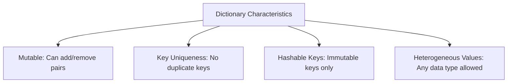
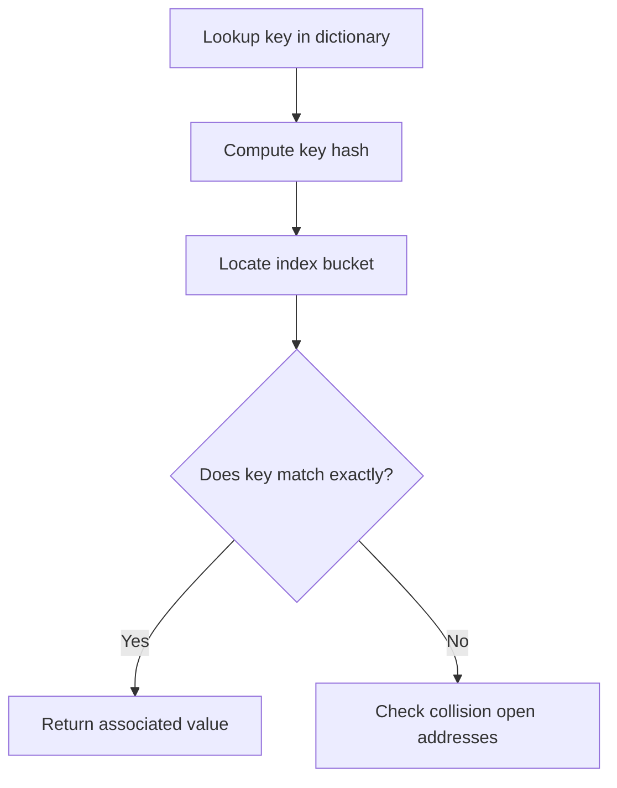

# Python OOP: Dictionaries - Hash Table Architecture & Data Mapping

---

# 1. Definition

## Dictionary Data Type
A **Dictionary** (`dict` in Python) is a mutable, insertion-ordered (since Python 3.7) collection of associative key-value pairs.
* **Associative Keys**: Dictionaries map unique, immutable (hashable) keys to arbitrary value objects on the heap.
* **Key Uniqueness**: A dictionary cannot contain duplicate keys. Re-assigning a value to an existing key overwrites the old value.
* **Heterogeneous Values**: Values can be of any data type, mutable or immutable (including lists, dictionaries, or custom objects).



---

# 2. Why Do We Need It?

### The Problem With Positional Lookups
If you store database records in a list, retrieving a specific record requires knowing its numeric index or performing a linear search.

```python
# Lookup in a list of tuples
users = [(101, "Aman"), (102, "Rohit")]
# To find Rohit, you must scan each tuple sequentially
```

#### Issues:
1. **Inefficient Search**: Scanning a list takes $\mathcal{O}(N)$ time.
2. **Brittle Indexing**: If elements are inserted or deleted, index positions shift, corrupting hardcoded lookups.
3. **No Semantic Mapping**: Numeric indexes do not provide semantic meaning (e.g., accessing `user[3]` does not clarify what property is stored at index 3).

---

# 3. Real-Life Analogies

### Analogy: The Student Registry
Imagine a school registrar filing student dossiers:
* Instead of filing dossiers by their physical queue order (List), each dossier is filed under the student's unique **Roll Number** (Key).
* To find a student's file, you don't read every dossier. You check the Roll Number label, open the cabinet drawer directly (Hash Table Lookup), and retrieve their dossier (Value).

---

# 4. Syntax

```python
# 1. Initialization
student = {
    "name": "Saurabh",
    "age": 21,
    "courses": ["Python", "SQL"]
}

# 2. Safe Reading (get)
student_name = student.get("name")

# 3. Creating & Updating
student["grade"] = "A"
```
* **Explanation**: Demonstrates initializing a dictionary, accessing values safely, and inserting a new key-value pair.
* **Expected Output**: Compiles and executes. `student` includes `"grade": "A"`.
* **Memory Explanation**: Calculates hash for keys and updates the dictionary hash table layout.
* **Time Complexity**: $\mathcal{O}(1)$ average for operations.
* **Space Complexity**: $\mathcal{O}(N)$ where $N$ is pair count.
* **Common Mistakes**: Accessing missing keys using bracket notation (e.g., `student["email"]` raises a `KeyError`).
* **Best Practices**: Use `.get()` for safe read operations.

---

# 5. Syntax Breakdown

Let's dissect standard dictionary methods:

* **`.get(key, default)`**: Returns value for `key`. If missing, returns `default` (or `None`) safely.
* **`.keys()`**: Returns a dynamic view object of all dictionary keys.
* **`.values()`**: Returns a dynamic view object of all dictionary values.
* **`.items()`**: Returns a dynamic view object of key-value tuples.
* **`.update(other)`**: Updates dictionary with key-value pairs from another dictionary.

---

# 6. Memory Diagram

When declaring `d = {"a": 10}`:

```
HEAP (Hash Map Structure)
=========================================================
| Key Hash Value | Key Pointer   | Value Pointer        |
=========================================================
|   hash("a")    | 0x100A ("a")  | 0x500X (int: 10)     |
=========================================================
```

* **Explanation**: The key hash maps directly to a storage bucket containing pointers to both key and value objects on the heap.

---

# 7. Internal Working (Behind the Scenes)

## Hash Table Implementation
Python dictionaries use highly optimized hash tables.
1. When key-value pair is inserted, Python hashes the key using `hash(key)`.
2. It uses this hash value to index into a sparse array.
3. **Python 3.6+ Optimization**: Python uses a split table architecture. It stores keys and values in a dense array (keeping insertion order) and maintains a separate sparse index array containing index positions in the dense array. This reduces dictionary memory usage by up to 25%.

---

# 8. Rules

### Dictionary Rules
1. **Key Hashability**: Dictionary keys must be immutable and hashable (e.g., strings, numbers, tuples with only hashable elements). Lists, sets, and dicts cannot be keys.
2. **Key Uniqueness**: If you assign a value to an existing key, the new value overwrites the old one.
3. **No Slicing**: Dictionaries are mapped structures and do not support slicing.

---

# 9. Naming Conventions (PEP 8)

* Use singular nouns followed by mapping terms (e.g., `user_map`, `student_lookup`).
* Use snake_case.

| Variable Name | Bad Example | Good Example | Industry Standard |
| :--- | :--- | :--- | :--- |
| Dictionary | `dictInstance` | `student_database` | `student_profile_map` |

---

# 10. Common Mistakes & Bugs

### Mistake 1: Bracket access on missing keys
```python
# BUGGY CODE
grades = {"math": 90}
print(grades["science"])  # Raises KeyError!
```
* **Expected Output**: `KeyError: 'science'`
* **How to avoid**: Use `grades.get("science", 0)` to provide a safe fallback.

---

### Mistake 2: Mutating keys during iteration
```python
# BUGGY CODE
d = {"a": 1, "b": 2}
for key in d:
    if d[key] == 2:
        del d[key]  # Raises RuntimeError!
```
* **Why it happens**: Modifying a dictionary's size under active iteration corrupts the iterator.
* **How to avoid**: Iterate over a copy of keys: `for key in list(d.keys()):`.

---

# 11. Best Practices & Pythonic Code

* **Use Dictionary Union Operators** (introduced in Python 3.9) to merge dictionaries cleanly.
```python
# Pythonic Merge
merged_dict = dict1 | dict2
```

---

# 12. Interview Questions

### Q1. Why must dictionary keys be immutable?
* **Answer**: Dictionaries use hash tables to locate keys in $\mathcal{O}(1)$ average time. If keys were mutable (like lists), their contents could change, which would alter their hash value. A modified hash value means the key would map to a different bucket, making it impossible for Python to locate the value in the table.

---

### Q2. What is the difference between `.pop()` and `del` for deleting dictionary keys?
* **Answer**: 
  * `del d[key]` is a statement that removes the key-value pair. It raises a `KeyError` if the key is not found and does not return the deleted value.
  * `d.pop(key, default)` is a method that removes the key and returns its associated value. If the key is not found, it returns the `default` fallback without raising an error.

---

### Q3. Tricky Output Question
**What is the output of the following statement?**
```python
d = {}
d[True] = "Yes"
d[1] = "No"
print(d)
```
* **Expected Output**: `{True: 'No'}`
* **Explanation**: In Python, `True == 1` evaluates to `True`, and their hash values are identical (`hash(True) == hash(1)`). Therefore, `d[1]` targets the exact same hash bucket as `d[True]`, overwriting the value to `"No"`.

---

# 13. Exam Points

* **`dict()`**: Constructor to build dictionary objects.
* **`popitem()`**: Removes and returns the last inserted key-value pair as a tuple.
* **`setdefault()`**: Returns the value of a key if present; otherwise inserts the key with a default value.

---

# 14. Real-World Examples

## Example 1: Creating a Frequency Map (DSA Pattern)
```python
def get_frequencies(word: str) -> dict[str, int]:
    freq_map = {}
    for char in word:
        # Use get to initialize counts to 0
        freq_map[char] = freq_map.get(char, 0) + 1
    return freq_map

print(get_frequencies("mississippi"))
```
* **Explanation**: Builds a character frequency dictionary.
* **Expected Output**: `{'m': 1, 'i': 4, 's': 4, 'p': 2}`
* **Time Complexity**: $\mathcal{O}(N)$
* **Space Complexity**: $\mathcal{O}(U)$ where $U$ is unique characters.

---

## Example 2: Combining Inventories
```python
def combine_inventories(inv1: dict[str, int], inv2: dict[str, int]) -> dict[str, int]:
    combined = inv1.copy()
    for key, value in inv2.items():
        combined[key] = combined.get(key, 0) + value
    return combined

shop1 = {"Apples": 10, "Bananas": 20}
shop2 = {"Bananas": 15, "Oranges": 30}
print(combine_inventories(shop1, shop2))
```
* **Explanation**: Merges inventories by summing values of common keys.
* **Expected Output**: `{'Apples': 10, 'Bananas': 35, 'Oranges': 30}`
* **Time Complexity**: $\mathcal{O}(N + M)$

---

# 15. Mini Practice

### Easy
Create a dictionary containing names and scores. Retrieve a score using `.get()` with a default fallback of `0`.

### Medium
Merge two dictionaries using both the classic `.update()` method and the Python 3.9+ union operator `|`.

### Hard
Write a function that calculates the sum of all numerical values stored inside a nested dictionary structure.

---

# 16. Summary Table

| Method Syntax | Return Value | Modifies Original | Safe If Key Missing |
| :--- | :--- | :--- | :--- |
| `d.get(k, default)`| Value of key | No | Yes (returns default) |
| `d.pop(k, default)`| Value of key | Yes | Yes (returns default) |
| `d.popitem()` | Last (key, value) tuple | Yes | No (`KeyError` if empty) |
| `d.clear()` | `None` | Yes | Yes |

---

# 17. Cheat Sheet

```python
# Initialize
d = {}

# Merge
merged = d1 | d2

# Iterate pairs
for k, v in d.items():
    pass
```

---

# 18. Flow Diagram



---

# 19. Comparison Table

| Feature | Dictionary | List |
| :--- | :--- | :--- |
| **Access Key** | Arbitrary Hashable Key | Integer Index |
| **Lookup Complexity**| $\mathcal{O}(1)$ average | $\mathcal{O}(N)$ linear scan |

---

# 20. Things to Remember

> [!IMPORTANT]
> **Key takeaways on Dictionaries:**
> 1. **Use get for safe reads**: Bracket read access raises `KeyError` on missing keys.
> 2. **Never change size during loop**: Mutating dictionary elements under active loops triggers `RuntimeError`.