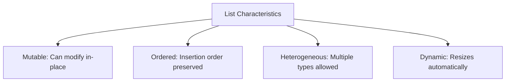
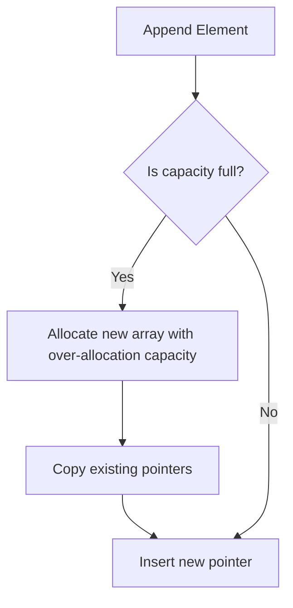

# Python OOP: Lists - Memory Architecture & DSA Patterns

---

# 1. Definition

## List Data Type
A **List** (`list` in Python) is a mutable, ordered, dynamic sequence of heterogeneous elements.
* **Mutable**: You can modify, add, or delete elements from a list after it has been created without generating a new list in memory.
* **Heterogeneous**: A single list can contain elements of different data types (e.g., integers, floats, strings, and other lists).
* **Dynamic**: The size of a list changes automatically as you add or remove elements.



---

# 2. Why Do We Need It?

### The Problem With Fixed Arrays
In statically typed languages (like C), arrays have a fixed size defined at compile-time and can only store a single data type.

```c
// C-Style Array
int scores[5] = {90, 80, 85, 95, 88};
```

#### Issues:
1. **No Resizing**: If a 6th element needs to be added, you must manually allocate a larger array, copy all elements, and delete the old array.
2. **Homogeneous Limitation**: You cannot store a mixture of strings, numbers, and floats in a single array.
3. **Insert/Delete Complexity**: Manually shifting elements left or right during inserts or deletes is error-prone.

---

# 3. Real-Life Analogies

### Analogy: The Train Carriage
Think of a list as a train with passenger carriages:
* The train is ordered; carriages are linked sequentially.
* Carriages can hold different items: passengers (strings), cargo (integers), or mail (floats).
* The train is mutable and dynamic: you can detach a carriage from the middle (delete/remove) or attach a new carriage to the end (append) at any time.

---

# 4. Syntax

```python
# 1. Initialization
fruits = ["Apple", "Banana", "Cherry"]

# 2. In-place modification (Mutability)
fruits[1] = "Blueberry"

# 3. Dynamic resizing (Append)
fruits.append("Date")
```
* **Explanation**: Demonstrates initializing a list, modifying an element at an index in-place, and appending a new element.
* **Expected Output**: Compiles and executes. `fruits` becomes `["Apple", "Blueberry", "Cherry", "Date"]`.
* **Memory Explanation**: Modifies pointers stored in the list's dynamic array in heap memory.
* **Time Complexity**: $\mathcal{O}(1)$ for element update and append (amortized).
* **Space Complexity**: $\mathcal{O}(N)$ where $N$ is element count.
* **Common Mistakes**: Attempting to write to an out-of-range index (e.g., `fruits[10] = "error"` raises an `IndexError`).
* **Best Practices**: Use `.append()` for single additions and `.extend()` for merging iterables.

---

# 5. Syntax Breakdown

Let's dissect list methods:

* **`.append(item)`**: Adds `item` to the end of the list ($\mathcal{O}(1)$ amortized time).
* **`.insert(idx, item)`**: Inserts `item` at index `idx`, shifting elements right ($\mathcal{O}(N)$ time).
* **`.extend(iterable)`**: Appends all items from `iterable` to the list ($\mathcal{O}(M)$ time, where $M$ is iterable length).
* **`.pop(idx)`**: Removes and returns the element at index `idx` (default is the last element; $\mathcal{O}(1)$ for last, $\mathcal{O}(N)$ for middle).
* **`.remove(item)`**: Removes the first occurrence of `item` ($\mathcal{O}(N)$ time).

---

# 6. Memory Diagram

When executing `lst = [10, 20]`, followed by `lst.append(30)`:

```
CPython List Representation (Dynamic Array)
==============================================
| Allocated Capacity: 4 | Size Count: 2       |
==============================================
| Index | Pointer Address                    |
==============================================
|   0   | 0x500X (int: 10)                   |
|   1   | 0x600Y (int: 20)                   |
|   2   | NULL                               |
|   3   | NULL                               |
==============================================

After append(30) -> Capacity remains 4, Size becomes 3:
|   2   | 0x700Z (int: 30)                   |
```

---

# 7. Internal Working (Behind the Scenes)

## Dynamic Resizing (CPython)
Under the hood, CPython implements lists using a C array of pointers (`PyObject**`). 
* **Over-allocation**: To prevent allocating memory on every append, CPython allocates extra slots (growth pattern: `0, 4, 8, 16, 25, 35, 46, 58, 72, 88...`).
* **Amortized Complexity**: If the capacity is full, CPython calls `realloc` to allocate a larger array block. Because resizing happens rarely, append has an **amortized time complexity of $\mathcal{O}(1)$**.

---

# 8. Rules

### List Rules
1. **Out of Range Errors**: Accessing or writing to an index that does not exist (e.g., `lst[len(lst)]`) raises an `IndexError`.
2. **Sort In-place**: The `.sort()` method sorts the list **in-place** and returns `None`. It does not return a new sorted list (use `sorted(lst)` for that).
3. **Negative Indexes**: Indexes count backwards: `-1` is the last item, `-len(lst)` is the first item.

---

# 9. Naming Conventions (PEP 8)

* Use plural nouns for lists.
* Use snake_case.

| Variable Name | Bad Example | Good Example | Industry Standard |
| :--- | :--- | :--- | :--- |
| List Instance | `studentList` | `students` | `active_student_records` |

---

# 10. Common Mistakes & Bugs

### Mistake 1: Assignment copies reference, not values
```python
# BUGGY CODE
a = [1, 2, 3]
b = a
b.append(4)  # Modifies BOTH a and b!
```
* **Expected Output**: `a` becomes `[1, 2, 3, 4]`.
* **How to avoid**: Create a copy: `b = a.copy()` or `b = a[:]`.

---

### Mistake 2: Storing the return value of `.sort()`
```python
# BUGGY CODE
lst = [3, 1, 2]
sorted_list = lst.sort()
print(sorted_list)  # Prints None!
```
* **Why it happens**: `.sort()` mutates the list in-place and returns `None`.
* **How to avoid**: Use `sorted_list = sorted(lst)` or run `lst.sort()` followed by `print(lst)`.

---

# 11. Best Practices & Pythonic Code

* **Use `enumerate()`** when you need both the index and the value during iteration.
```python
# Pythonic Iteration
for idx, name in enumerate(names):
    print(f"{idx}: {name}")
```

---

# 12. Interview Questions

### Q1. What is the difference between `.append()` and `.extend()`?
* **Answer**: 
  * `.append()` adds its argument as a single object to the end of the list (e.g., `[1, 2].append([3, 4])` results in `[1, 2, [3, 4]]`).
  * `.extend()` iterates over its argument and adds each element to the list (e.g., `[1, 2].extend([3, 4])` results in `[1, 2, 3, 4]`).

---

### Q2. Explain the difference between `list.sort()` and `sorted(list)`.
* **Answer**: 
  * `list.sort()` is a list method that sorts the target list in-place and returns `None`, mutating the original object.
  * `sorted()` is a built-in function that accepts any iterable, builds a new sorted list, and returns it, leaving the original object unchanged.

---

### Q3. Tricky Output Question
**What is the output of the following statement?**
```python
x = [[]] * 3
x[0].append(5)
print(x)
```
* **Expected Output**: `[[5], [5], [5]]`
* **Explanation**: The multiplication operator `*` duplicates the reference to the inner list. All three outer index slots point to the exact same list object on the heap.

---

# 13. Exam Points

* **Timsort**: The hybrid, stable sorting algorithm used by Python's `.sort()` (best: $\mathcal{O}(N)$, average/worst: $\mathcal{O}(N \log N)$).
* **Mutability**: Lists are mutable, meaning they allow in-place modification.
* **`list()`**: Constructor used to convert iterables to list objects.

---

# 14. Real-World Examples

## Example 1: Finding the Second Largest Element (DSA Pattern)
```python
def find_second_largest(numbers: list[int]) -> int | None:
    if len(numbers) < 2:
        return None
    
    first = second = float('-inf')
    for num in numbers:
        if num > first:
            second = first
            first = num
        elif num > second and num != first:
            second = num
            
    return int(second) if second != float('-inf') else None

print("Second largest:", find_second_largest([10, 20, 20, 15, 8]))
```
* **Explanation**: Finds the second largest distinct value in a single pass.
* **Expected Output**: `Second largest: 15`
* **Time Complexity**: $\mathcal{O}(N)$
* **Space Complexity**: $\mathcal{O}(1)$

---

## Example 2: Checking if List is Sorted
```python
def is_sorted(numbers: list[int]) -> bool:
    # Compare each adjacent pair
    for i in range(len(numbers) - 1):
        if numbers[i] > numbers[i + 1]:
            return False
    return True

print("Is sorted?", is_sorted([1, 2, 3, 5, 8]))
```
* **Explanation**: Validates ascending order.
* **Expected Output**: `Is sorted? True`
* **Time Complexity**: $\mathcal{O}(N)$
* **Space Complexity**: $\mathcal{O}(1)$

---

# 15. Mini Practice

### Easy
Create a list of 5 integers, replace the 3rd element with `99`, and print the list.

### Medium
Write a program that takes a list of integers and returns two lists: one containing positive numbers, and the other containing negative numbers.

### Hard
Write a function that calculates the mean of a list of floats, raising a `ValueError` if the list is empty.

---

# 16. Summary Table

| Operation | Method Syntax | Time Complexity | Mutates Original |
| :--- | :--- | :--- | :--- |
| **Append** | `lst.append(x)` | $\mathcal{O}(1)$ (amortized) | Yes |
| **Insert** | `lst.insert(i, x)` | $\mathcal{O}(N)$ | Yes |
| **Delete Index** | `lst.pop(i)` | $\mathcal{O}(N)$ ($\mathcal{O}(1)$ for end) | Yes |
| **In-place Sort**| `lst.sort()` | $\mathcal{O}(N \log N)$ | Yes |

---

# 17. Cheat Sheet

```python
# Copying
new_list = old_list.copy()

# Slicing Reversal
reversed_list = lst[::-1]

# Index & Value Iteration
for idx, val in enumerate(lst):
    pass
```

---

# 18. Flow Diagram



---

# 19. Comparison Table

| Feature | `lst.sort()` | `sorted(lst)` |
| :--- | :--- | :--- |
| **Object Mutability** | In-place mutation | Returns new sorted list object |
| **Return Value** | `None` | Sorted list reference |

---

# 20. Things to Remember

> [!IMPORTANT]
> **Key takeaways on Lists:**
> 1. **Avoid pointer duplication traps**: Using `[[]] * 3` creates shared references to a single inner list object.
> 2. **Check boundaries**: Accessing non-existent indexes raises `IndexError`.