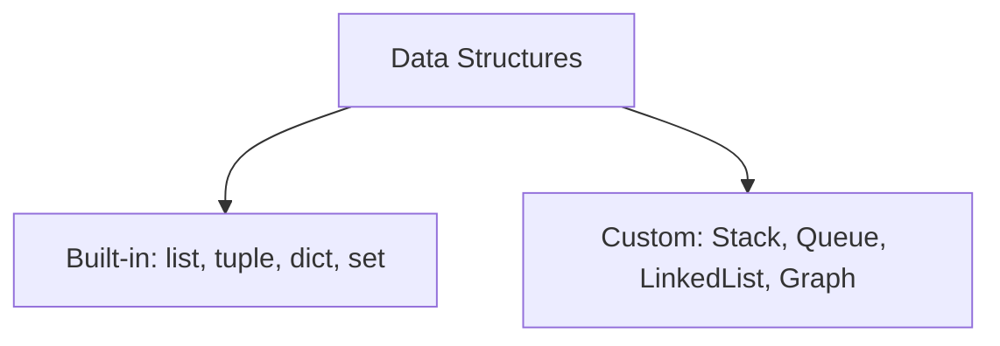
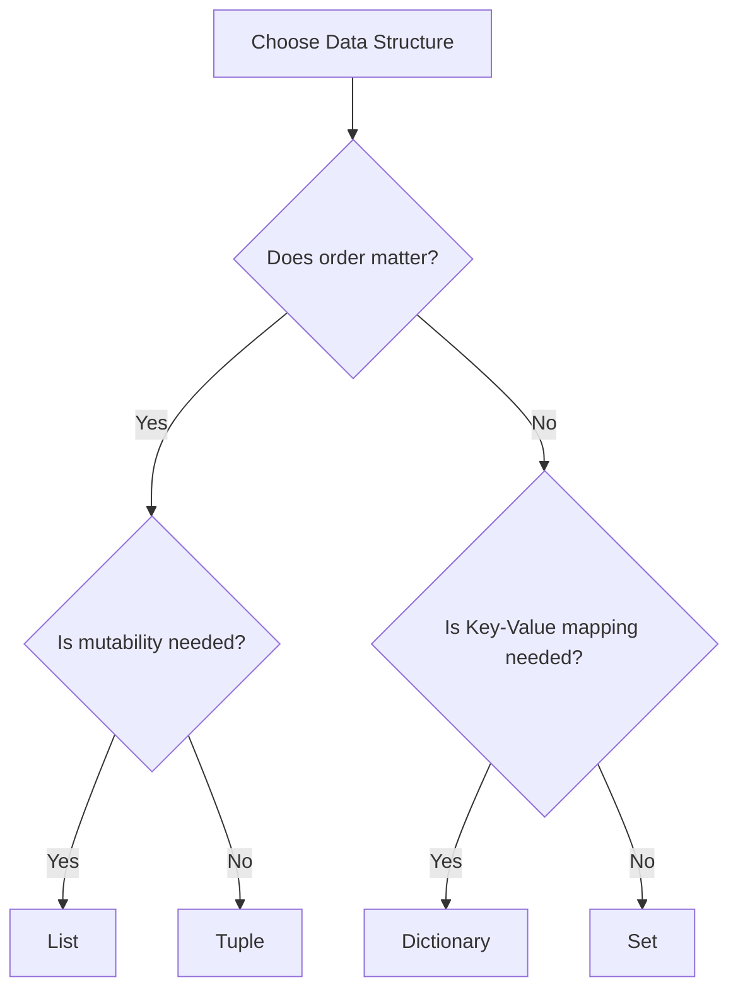

# Python OOP: Classification of Built-in Data Structures

---

# 1. Definition

## Data Structure
A **Data Structure** is a specialized format for organizing, storing, managing, and manipulating data efficiently inside computer memory.

## Python Classification
Python divides data structures into two broad categories:
1. **Built-in Data Structures**: Standard structures built directly into the Python interpreter (e.g., `list`, `tuple`, `dict`, `set`).
2. **Custom (User-Defined) Data Structures**: Custom logical containers designed by programmers using classes (e.g., `Stack`, `Queue`, `Linked List`, `Binary Tree`, `Graph`).



---

# 2. Why Do We Need It?

### The Problem With Variable-only Data Storage
Without data structures, each data point must be assigned its own distinct variable name. If you have 10,000 student names in a school database, you would need 10,000 separate variables.

```python
# Storage without data structures
student1 = "Aman"
student2 = "Rohit"
# ... 10,000 variables
```

#### Issues:
1. **Unmanageable Namespaces**: Keeping track of thousands of separate names in code is impossible.
2. **No Mass Processing**: You cannot write loops to process, sort, filter, or query variables programmatically.
3. **Memory Waste**: Managing thousands of individual variables requires separate stack entries instead of a single contiguous memory block.

---

# 3. Real-Life Analogies

### Analogy: The Wardrobe Organizer
Imagine a giant bedroom wardrobe:
* **No Organizer**: All your clothes, shoes, belts, and ties are thrown into a pile on the floor (unorganized variables). Finding a matching sock takes hours.
* **Hanger Rails (Lists)**: Keeps your shirts ordered side-by-side in insertion order.
* **Shoe Box Rack (Tuples)**: Safe containers holding specific pairs of shoes. Once closed, you don't change what is inside.
* **Labeled Drawers (Dictionaries)**: Drawers labeled "Socks", "Ties", "Belts". You look at the label (Key) and open it to get the item (Value) immediately.
* **Key Ring (Sets)**: A collection where you only keep unique keys. If you buy a duplicate key, you don't add it.

---

# 4. Syntax

```python
# 1. List (Mutable, ordered)
lst = [1, 2, 3]

# 2. Tuple (Immutable, ordered)
tup = (1, 2, 3)

# 3. Dictionary (Mutable, keyed mapping)
dictionary = {"a": 1, "b": 2}

# 4. Set (Mutable, unordered, unique)
s = {1, 2, 3}
```
* **Explanation**: Syntactic initialization signatures for the four core built-in structures.
* **Expected Output**: Compiles and executes.
* **Memory Explanation**: Python allocates container object wrappers pointing to individual items in heap memory.
* **Time Complexity**: $\mathcal{O}(1)$ allocation.
* **Space Complexity**: $\mathcal{O}(N)$ where $N$ is element count.
* **Common Mistakes**: Using curly braces `{}` to create an empty set (which creates an empty dictionary instead).
* **Best Practices**: Choose the structure that matches your data requirements (e.g., unique lookup vs ordered indexing).

---

# 5. Syntax Breakdown

Let's dissect data structure initializers:

* **`[]`**: Initializes lists.
* **`()`**: Initializes tuples.
* **`{}`**: Initializes dictionaries (or sets if elements are declared as literals without key-value colons).
* **`set()`**: The mandatory constructor to initialize an empty set.

---

# 6. Memory Diagram

Container structures in Python are **arrays of pointers**. The container object does not hold values directly; it holds memory addresses pointing to values.

```
LIST OBJECT (Address 0x100A)
==============================================
| Array Index | Target Object Address        |
==============================================
|      0      | 0x500X (int: 10)             |
|      1      | 0x600Y (str: "Hi")           |
==============================================
```

---

# 7. Internal Working (Behind the Scenes)

## Memory Allocation Speeds
* **Lists**: Dynamic arrays. They allocate extra memory slots (over-allocation) to make future append operations run in $\mathcal{O}(1)$ time.
* **Tuples**: Static arrays. Once allocated, their memory size is fixed, making them smaller and faster to iterate over than lists.
* **Dictionaries/Sets**: Hash Tables. They use hash tables to locate keys instantly, achieving constant average lookup times $\mathcal{O}(1)$.

---

# 8. Rules

### Data Structure Rules
1. **Hashability Rule**: Only immutable (hashable) objects can be used as dictionary keys or set elements. Lists and dicts cannot be set elements.
2. **Empty Set Rule**: Empty set must be created using `set()`, not `{}`.
3. **Tuple Immutability**: While the tuple reference list is fixed, if a tuple contains a mutable object (like a list), that nested list can still be modified.

---

# 9. Naming Conventions (PEP 8)

* Use snake_case for data structure variables.
* Use plural names for lists/sets/tuples to indicate collections (e.g., `student_names`, `active_sessions`).

| Collection Type | Bad Example | Good Example | Industry Standard |
| :--- | :--- | :--- | :--- |
| List variable | `student = [1,2]` | `students = [1,2]` | `registered_student_ids = [101, 102]` |

---

# 10. Common Mistakes & Bugs

### Mistake 1: Empty Set Creation
```python
# BUGGY CODE
my_set = {}
my_set.add(10)
```
* **Expected Output**: `AttributeError: 'dict' object has no attribute 'add'`
* **How to avoid**: Use `my_set = set()`.

---

### Mistake 2: Mutable elements inside Sets
```python
# BUGGY CODE
invalid_set = {[1, 2], "hello"}
```
* **Why it happens**: Lists are mutable and therefore unhashable.
* **How to avoid**: Use tuples instead of lists if you need container elements in sets: `{(1, 2), "hello"}`.

---

# 11. Best Practices & Pythonic Code

* **Use List/Dict Comprehensions** for readable and optimized collection setup.
```python
# Pythonic List Comprehension
squares = [x**2 for x in range(1, 6)]
```

---

# 12. Interview Questions

### Q1. What is the difference between built-in and custom data structures?
* **Answer**: Built-in structures (lists, tuples, dicts, sets) are natively implemented in C, highly optimized, and available out-of-the-box. Custom structures (stacks, queues, linked lists, graphs) are user-defined abstractions implemented by programmers using classes and pointers to solve specific algorithmic problems.

---

### Q2. Why are sets unordered?
* **Answer**: Sets are implemented as hash tables. Elements are stored in memory locations determined by their hash values rather than their insertion order, making their retrieval sequence arbitrary.

---

### Q3. Tricky Output Question
**What is the output of the following statement?**
```python
x = ([1, 2], 3)
x[0].append(3)
print(x)
```
* **Expected Output**: `([1, 2, 3], 3)`
* **Explanation**: Although the tuple itself is immutable and we cannot replace the list object with another object, the list object *inside* the tuple is mutable, allowing in-place modifications.

---

# 13. Exam Points

* **List**: Ordered, mutable sequence.
* **Tuple**: Ordered, immutable sequence.
* **Set**: Unordered collection of unique, immutable elements.
* **Dictionary**: Unordered mapping of unique keys to arbitrary values.

---

# 14. Real-World Examples

## Example 1: Selecting the Right Container
```python
# 1. Unique visitor IPs (Requires Set for uniqueness)
visitor_ips = {"192.168.1.1", "192.168.1.2"}

# 2. Key-Value user database (Requires Dict for lookup speed)
user_database = {
    101: {"name": "Aman", "role": "Admin"}
}

print(visitor_ips)
print(user_database[101])
```
* **Explanation**: Matches container properties to system requirements.
* **Time/Space Complexity**: $\mathcal{O}(1)$ lookup.

---

# 15. Mini Practice

### Easy
Initialize an empty list, tuple, set, and dictionary. Verify their type classes using Python code.

### Medium
Explain why dict keys must be hashable, and provide examples of invalid key definitions.

### Hard
Write a program that converts a list with duplicate elements to a set to remove duplicates, and then back to a list.

---

# 16. Summary Table

| Data Structure | Mutability | Ordering | Duplicates Allowed | Key-Value Mapping |
| :--- | :--- | :--- | :--- | :--- |
| **List** | Mutable | Ordered | Yes | No |
| **Tuple** | Immutable | Ordered | Yes | No |
| **Set** | Mutable | Unordered | No | No |
| **Dictionary** | Mutable | Ordered (3.7+) | Values: Yes | Yes |

---

# 17. Cheat Sheet

```python
# Initializers
lst = []
tup = ()
dictionary = {}
s = set()

# Membership check (O(1) in set/dict, O(N) in list/tuple)
if x in collection:
    pass
```

---

# 18. Flow Diagram



---

# 19. Comparison Table

| Property | Set | List |
| :--- | :--- | :--- |
| **Lookup Time** | $\mathcal{O}(1)$ (Hash table lookup) | $\mathcal{O}(N)$ (Linear scan) |
| **Index Access** | Forbidden | Allowed |

---

# 20. Things to Remember

> [!IMPORTANT]
> **Key takeaways on Data Structures:**
> 1. **Match structures to needs**: Use sets for fast uniqueness lookups; use lists for ordered records.
> 2. **Empty collections pitfall**: `{}` is *always* a dictionary, never a set.