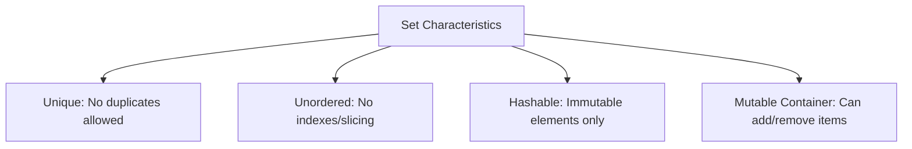
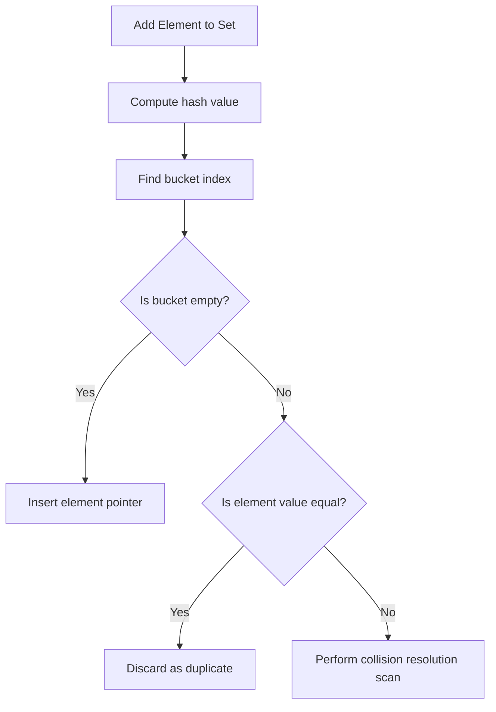

# Python OOP: Sets - Hashing Mechanics & Mathematical Operations

---

# 1. Definition

## Set Data Type
A **Set** (`set` in Python) is a mutable, unordered collection of unique, immutable (hashable) elements.
* **Unique**: A set cannot contain duplicate elements. Duplicates are automatically discarded.
* **Unordered**: Elements do not have a fixed position or index; they are stored based on their hash values.
* **Hashable Elements**: While the set container is mutable (you can add/remove elements), the individual elements stored inside must be immutable (e.g., strings, numbers, booleans, tuples).



---

# 2. Why Do We Need It?

### The Problem With Linear Search Arrays
If you need to verify if an item exists in a list of $N$ elements, Python must scan the list element-by-element from the beginning.

```python
# Linear lookup in list
users = ["Aman", "Rohit", "Saurabh"]
if "Saurabh" in users:  # Scans list sequentially O(N)
    pass
```

#### Issues:
1. **Slow Lookup Speed**: In a list of 1,000,000 items, checking membership takes $\mathcal{O}(N)$ time.
2. **Duplicate Pollution**: Storing duplicate values when you only need unique entries wastes memory.
3. **No Native Set Math**: Performing mathematical operations like finding common values between two groups requires nested loops.

---

# 3. Real-Life Analogies

### Analogy: The ID Card Register
* **The List**: A queue of people waiting to enter a building. If you want to check if a specific person is in the queue, you must walk down the line and read each ID card (Linear search $\mathcal{O}(N)$).
* **The Set**: An ID card rack with slots matching card ID numbers. When someone arrives, they put their card in their specific slot. To check if someone is in the building, you look at their card ID number, calculate their slot index, and look directly at that slot (Hash lookup $\mathcal{O}(1)$).

---

# 4. Syntax

```python
# 1. Initialization
colors = {"Red", "Green", "Blue"}

# 2. Mathematical Set Operations
set_a = {1, 2, 3}
set_b = {3, 4, 5}

union_set = set_a | set_b         # {1, 2, 3, 4, 5}
intersection_set = set_a & set_b  # {3}
```
* **Explanation**: Demonstrates set initialization and mathematical operations (Union, Intersection).
* **Expected Output**: Compiles and executes.
* **Memory Explanation**: Calculates hash values for elements and updates the hash table structure.
* **Time Complexity**: $\mathcal{O}(1)$ average lookup, $\mathcal{O}(N + M)$ for set operations.
* **Space Complexity**: $\mathcal{O}(N)$ where $N$ is set size.
* **Common Mistakes**: Creating an empty set using `{}` (which reserves memory for a dictionary).
* **Best Practices**: Use sets when you need fast membership checking or duplicate removal.

---

# 5. Syntax Breakdown

Let's dissect set operators and methods:

* **`|` (or `.union()`)**: Returns elements in either set.
* **`&` (or `.intersection()`)**: Returns elements common to both sets.
* **`-` (or `.difference()`)**: Returns elements in the first set but not in the second.
* **`^` (or `.symmetric_difference()`)**: Returns elements in either set, but not both.

---

# 6. Memory Diagram

When we declare `s = {10, 20}`:

```
HEAP (Hash Table Bucket Array)
==============================================
| Hash Value Bucket Index | Object Reference |
==============================================
|         0x2A            | 0x500X (int: 10) |
|         0x4B            | 0x600Y (int: 20) |
==============================================
```

* **Explanation**: Elements are indexed by their hash value bucket locations, which accounts for the unordered nature of sets.

---

# 7. Internal Working (Behind the Scenes)

## Hashing and Hash Tables
Under the hood, Python sets are implemented as hash tables.
1. When you add `"Apple"` to a set, Python calls `hash("Apple")` to compute a unique integer.
2. It wraps this integer modulo the table size to determine a bucket index.
3. It inserts the value pointer in that bucket.
4. **Collision Handling**: If two elements share a bucket, Python uses open addressing to locate the next free slot.
5. **Membership Test**: To check if `"Apple"` exists, Python computes its hash and looks up the bucket index directly. This makes membership checks run in **$\mathcal{O}(1)$ average time complexity**.

---

# 8. Rules

### Set Rules
1. **Unhashable Types**: Trying to add mutable objects (like lists `[]` or dictionaries `{}`) to a set raises a `TypeError: unhashable type`.
2. **Strict Uniqueness**: Adding a duplicate value (e.g., adding `10` when `10` already exists) has no effect.
3. **Empty Set Gotcha**: To create an empty set, you must use `set()`. Using `{}` creates an empty dictionary.

---

# 9. Naming Conventions (PEP 8)

* Use plural nouns for sets.
* Use uppercase names if defining static sets of constants.

| Variable Name | Bad Example | Good Example | Industry Standard |
| :--- | :--- | :--- | :--- |
| Set Instance | `visitorIp` | `visitor_ips` | `allowed_visitor_ips` |

---

# 10. Common Mistakes & Bugs

### Mistake 1: The Empty Set Initializer
```python
# BUGGY CODE
my_set = {}
my_set.add(10)
```
* **Expected Output**: `AttributeError: 'dict' object has no attribute 'add'`
* **How to avoid**: Initialize with `set()`: `my_set = set()`.

---

### Mistake 2: Using `.remove()` on missing elements
```python
# BUGGY CODE
colors = {"Red", "Blue"}
colors.remove("Green")  # Raises KeyError!
```
* **Why it happens**: `.remove()` raises a `KeyError` if the element does not exist.
* **How to avoid**: Use `.discard("Green")` which deletes the element if present, and does nothing if it is missing.

---

# 11. Best Practices & Pythonic Code

* **Use Sets for Membership Testing** instead of lists.
```python
# Pythonic Lookup
allowed_users = {"admin", "editor", "moderator"}
if user in allowed_users:  # Runs in O(1) time
    pass
```

---

# 12. Interview Questions

### Q1. Why can you store a tuple in a set, but not a list?
* **Answer**: Tuples are immutable and therefore hashable. Their hash value remains constant throughout their lifetime. Lists are mutable and their contents can change, which would change their hash value and corrupt the hash table. Thus, lists are unhashable and cannot be elements of a set.

---

### Q2. What is the time complexity of the command `x in s` if `s` is a set?
* **Answer**: $\mathcal{O}(1)$ average time complexity. Since sets use hash table lookups, checking membership does not require scanning the collection.

---

### Q3. Tricky Output Question
**What is the output of the following statement?**
```python
s = {1, 1.0, "1"}
print(s)
```
* **Expected Output**: `{1, '1'}` (or `{1.0, '1'}`)
* **Explanation**: In Python, `1 == 1.0` evaluates to `True`, and their hash values are identical (`hash(1) == hash(1.0)`). Thus, Python treats `1.0` as a duplicate of `1` and discards it. `"1"` is a string, which has a different hash and is retained.

---

# 13. Exam Points

* **`set()`**: The only constructor to initialize empty sets.
* **`discard()`**: Removes an element safely without throwing errors.
* **Disjoint**: Two sets are disjoint if they share no elements.

---

# 14. Real-World Examples

## Example 1: Removing Duplicates while Preserving Order (DSA Pattern)
```python
def remove_duplicates(items: list[int]) -> list[int]:
    seen = set()
    unique_items = []
    for item in items:
        if item not in seen:
            seen.add(item)
            unique_items.append(item)
    return unique_items

print(remove_duplicates([4, 5, 2, 4, 1, 2, 5]))
```
* **Explanation**: Eliminates duplicates while preserving original element order.
* **Expected Output**: `[4, 5, 2, 1]`
* **Time Complexity**: $\mathcal{O}(N)$
* **Space Complexity**: $\mathcal{O}(N)$

---

## Example 2: Finding Exclusive Elements
```python
def get_exclusive(list1: list[int], list2: list[int]) -> set[int]:
    # Returns elements in list1 that are not in list2
    return set(list1) - set(list2)

print(get_exclusive([1, 2, 2, 3, 4], [3, 4, 5]))
```
* **Explanation**: Evaluates the difference set.
* **Expected Output**: `{1, 2}`
* **Time Complexity**: $\mathcal{O}(N + M)$

---

# 15. Mini Practice

### Easy
Create a set containing the numbers 1 to 5, add `6` to it, and print the set.

### Medium
Check if two sets share any common elements without using the `.intersection()` method or `&` operator.

### Hard
Write a function that parses a sentence, removes all punctuation, and returns the count of unique words in a case-insensitive manner.

---

# 16. Summary Table

| Method Syntax | Operator Equivalent | Action | Raises Error if Missing |
| :--- | :--- | :--- | :--- |
| `A.union(B)` | `A \| B` | Union of A and B | No |
| `A.intersection(B)`| `A & B` | Intersection of A and B | No |
| `A.difference(B)` | `A - B` | Elements in A but not B | No |
| `A.remove(x)` | N/A | Deletes element `x` | Yes (`KeyError`) |
| `A.discard(x)` | N/A | Deletes element `x` | No |

---

# 17. Cheat Sheet

```python
# Create Empty Set
s = set()

# Safe discard
s.discard("val")

# Subset check
is_sub = set_a <= set_b
```

---

# 18. Flow Diagram



---

# 19. Comparison Table

| Feature | Sets | Lists |
| :--- | :--- | :--- |
| **Lookup Speed** | $\mathcal{O}(1)$ average | $\mathcal{O}(N)$ linear scan |
| **Order Preservation**| No (unordered) | Yes (preserves insertion order) |

---

# 20. Things to Remember

> [!IMPORTANT]
> **Key takeaways on Sets:**
> 1. **Tuples are fine, lists are not**: Only immutable elements are allowed inside sets.
> 2. **Avoid empty braces**: `{}` initializes a dictionary; use `set()` to initialize sets.