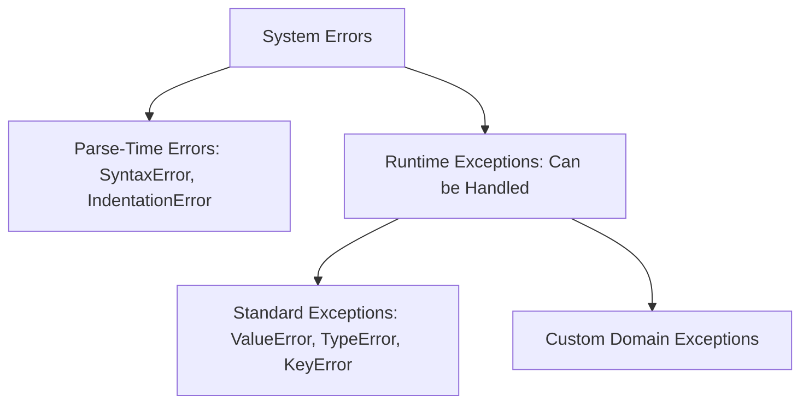
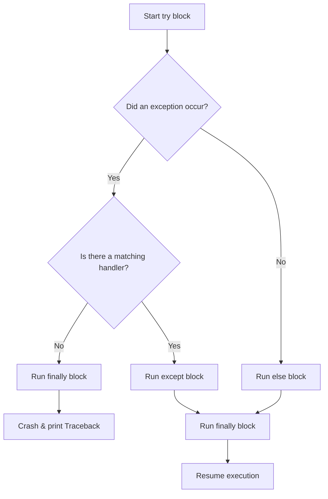

# Python OOP: Exception Handling & Defensive Design

---

# 1. Definition

## Exception
An **Exception** is an unexpected, anomalous event that occurs during the execution of a program (runtime) that disrupts the normal flow of instructions. Unlike syntax errors, exceptions occur when the code is grammatically correct but fails due to operational issues (e.g., dividing by zero or opening a non-existent file).

## Exception Handling
**Exception Handling** is a defensive programming mechanism that allows a application to intercept runtime errors, run recovery procedures, and resume execution without crashing.



---

# 2. Why Do We Need It?

### The Problem With Unguarded Runtime Failures
Without exception handling, any runtime error immediately triggers a system crash. Python prints a traceback stack dump and terminates the process.

```python
# Unguarded division
denominator = int(input("Enter denominator: "))
result = 100 / denominator  # Crashes if denominator is 0
print("Processing complete")  # Never executed
```

#### Issues:
1. **Poor User Experience**: Applications crash unexpectedly, losing active user state.
2. **Resource Leaks**: If a file or network connection is open when an error occurs, it remains locked in memory.
3. **Security Vulnerability**: Raw traceback printouts leak system paths, database names, and internal logic to users.

---

# 3. Real-Life Analogies

### Analogy: The Spare Tire
Imagine driving a car down a highway:
* **The Normal Path**: Driving smoothly (normal execution).
* **The Exception**: You run over a nail and get a flat tire (runtime exception).
* **No Exception Handling**: The car crashes, and your journey ends immediately (program termination).
* **Exception Handling (try-except)**: You pull over safely, retrieve the spare tire from the trunk (except block recovery), mount it, and continue driving to your destination (normal program resumption).
* **Finally Block**: Putting your tools back in the trunk. Whether you fixed the tire or had to call a tow truck, you must close the trunk before leaving (releasing system resources).

---

# 4. Syntax

```python
# 1. Complete Exception handling lifecycle
try:
    num = int(input("Enter number: "))
    result = 10 / num
except ZeroDivisionError as e:
    print(f"ZeroDivisionError: {e}")
except ValueError as e:
    print(f"ValueError: {e}")
else:
    print(f"Success! Result: {result}")
finally:
    print("Execution complete.")
```
* **Explanation**: Demonstrates handling multiple exceptions with `else` and `finally` blocks.
* **Expected Output**: (Interactive input prompts user).
* **Memory Explanation**: If an exception occurs, Python allocates an Exception object containing traceback details and routes execution to the matching except block.
* **Time Complexity**: $\mathcal{O}(1)$ for block entry.
* **Space Complexity**: $\mathcal{O}(1)$ auxiliary space.
* **Common Mistakes**: Using a generic `except:` block, which suppresses keyboard interrupts (`Ctrl+C`) and system exits.
* **Best Practices**: Always specify exact exceptions (e.g., `except ZeroDivisionError`).

---

# 5. Syntax Breakdown

Let's dissect the exception lifecycle blocks:

* **`try`**: Wraps the risky block of code that might raise exceptions.
* **`except ExceptionClass as e`**: Intercepts the specified exception, binding the error object to `e`.
* **`else`**: Runs only if the `try` block completes successfully without raising any exceptions.
* **`finally`**: Runs unconditionally after all other blocks, typically used for cleanup actions.

---

# 6. Memory Diagram

When a `ZeroDivisionError` is raised:

```
STACK                                      HEAP (Exception Object)
======================                     ============================================
|  Name   | Reference|                     |  Address  | Object Type       | Value    |
======================                     ============================================
|   e     |  0x500A  | ------------------> |  0x500A   | ZeroDivisionError | "division|
|         |          |                     |           |                   |  by zero"|
======================                     ============================================
```

* **Explanation**: Python instantiates the exception class on the heap and binds the variable name `e` inside the active `except` frame.

---

# 7. Internal Working (Behind the Scenes)

## Exception Propagation Stack
When an exception is raised inside nested function calls:
1. Python searches the current local execution frame for a matching `except` block.
2. If none is found, it terminates the current frame, pops it off the stack, and propagates the exception up to the calling function's frame.
3. This search continues up the execution stack. If it reaches the global module frame without finding a handler, the interpreter halts and prints the traceback.

---

# 8. Rules

### Exception Rules
1. **Order of Except Blocks**: Exception classes must be caught from most specific to least specific. Catching a parent class (like `Exception`) before a child class (like `ValueError`) makes the child block unreachable.
2. **Finally execution is absolute**: Even if a `try` block contains a `return` statement, the `finally` block executes **before** the function actually returns control.
3. **Syntax Errors**: Errors like missing colons are parse-time failures, not runtime exceptions; they cannot be caught by `try-except` blocks.

---

# 9. Naming Conventions (PEP 8)

* Custom exception class names must end with the suffix `Error`.
* Use PascalCase for custom exception classes.

| Exception Class | Bad Example | Good Example | Industry Standard |
| :--- | :--- | :--- | :--- |
| Custom Error | `low_balance` | `LowBalanceError` | `InsufficientFundsError` |

---

# 10. Common Mistakes & Bugs

### Mistake 1: Blank generic except blocks
```python
# BUGGY CODE
try:
    val = int(input())
except:  # Suppresses EVERYTHING, including Ctrl+C
    print("Error")
```
* **Expected Output**: Silently intercepts system signals.
* **How to avoid**: Always specify target exceptions: `except ValueError:`.

---

### Mistake 2: Unreachable except blocks due to class order
```python
# BUGGY CODE
try:
    x = 1 / 0
except Exception:  # Parent catchall
    print("Exception caught")
except ZeroDivisionError:  # Unreachable!
    print("Zero division")
```
* **Why it happens**: `ZeroDivisionError` inherits from `Exception`. Since `Exception` is checked first, it intercepts the error, making the specific handler dead code.
* **How to avoid**: Place specific handlers first.

---

# 11. Best Practices & Pythonic Code

* **Use Custom Exceptions** to build clear domain-specific business logic rules.
```python
# Pythonic Custom Exception
class PasswordWeakError(ValueError):
    """Raised when passwords fail validation standards."""
```

---

# 12. Interview Questions

### Q1. What is the role of the `else` block in exception handling?
* **Answer**: The `else` block runs only if no exceptions are raised in the `try` block. It is useful for separating code that might fail (placed in `try`) from code that should only execute if the previous operation succeeded (placed in `else`).

---

### Q2. How does `finally` handle returns inside `try` blocks?
* **Answer**: The `finally` block is guaranteed to run. If a `try` block has a `return` statement, Python suspends the return execution, runs the `finally` block, and then completes the return transfer.

---

### Q3. Tricky Output Question
**What is the output of the following function call?**
```python
def test():
    try:
        return 1
    finally:
        return 2

print(test())
```
* **Expected Output**: `2`
* **Explanation**: The `finally` block's return statement overrides the return value specified in the `try` block.

---

# 13. Exam Points

* **`raise`**: Keyword used to trigger an exception manually.
* **`Exception`**: The base class for most standard Python exceptions.
* **`Traceback`**: The history of active execution calls printed when an exception crashes the program.

---

# 14. Real-World Examples

## Example 1: Creating Custom Exceptions for Domain Logic
```python
class InsufficientFundsError(Exception):
    def __init__(self, balance: float, amount: float):
        super().__init__(f"Withdrawal failed: requested {amount}, balance is {balance}")
        self.balance = balance
        self.amount = amount

def process_withdrawal(balance: float, amount: float) -> float:
    if amount > balance:
        raise InsufficientFundsError(balance, amount)
    return balance - amount

try:
    process_withdrawal(100.0, 150.0)
except InsufficientFundsError as e:
    print(e)
```
* **Explanation**: Implements a banking validation rule.
* **Expected Output**: `Withdrawal failed: requested 150.0, balance is 100.0`
* **Time Complexity**: $\mathcal{O}(1)$

---

# 15. Mini Practice

### Easy
Write a function that prompts the user for an integer, catching any `ValueError` to return a default value of `0`.

### Medium
Implement a function `get_element_safely(lst, index, fallback)` that retrieves list items, handling both `IndexError` and `TypeError`.

### Hard
Write a sign-up validation helper that throws `UsernameTooShortError` (username < 4 chars) or `PasswordWeakError` (password < 8 chars) based on inputs.

---

# 16. Summary Table

| Block | Execution Condition | Required | Purpose |
| :--- | :--- | :--- | :--- |
| **`try`** | Always runs | Yes | Contains operations that might fail |
| **`except`** | Runs on matching exception | No (at least one except or finally) | Implements recovery logic |
| **`else`** | Runs if no exception occurs | No | Executes success-only statements |
| **`finally`** | Always runs | No | Performs resource cleanup |

---

# 17. Cheat Sheet

```python
# Standard Block
try:
    pass
except SpecificError as e:
    pass
else:
    pass
finally:
    pass

# Raise
raise ValueError("Invalid configuration")
```

---

# 18. Flow Diagram



---

# 19. Comparison Table

| Property | `SyntaxError` | `Runtime Exception` |
| :--- | :--- | :--- |
| **Phase** | Parse-time compilation | Execution phase |
| **Catchability**| Cannot be caught in `try-except` | Can be caught and handled |

---

# 20. Things to Remember

> [!IMPORTANT]
> **Key takeaways on Exceptions:**
> 1. **Specify exceptions**: Never use bare `except:` blocks; always catch specific classes.
> 2. **Place specific catches first**: Specific exceptions must precede general exceptions in the handler order.