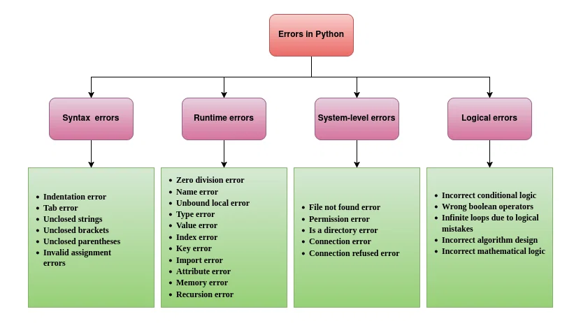
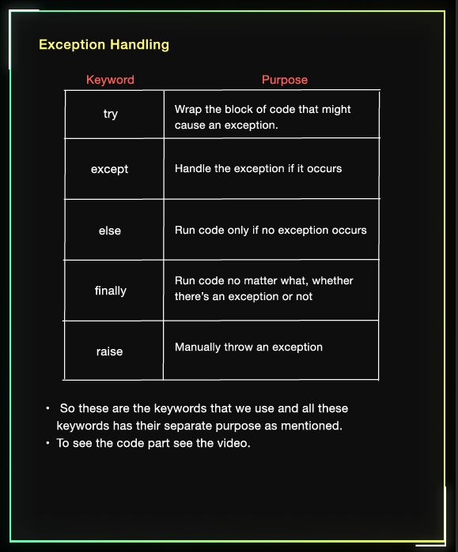
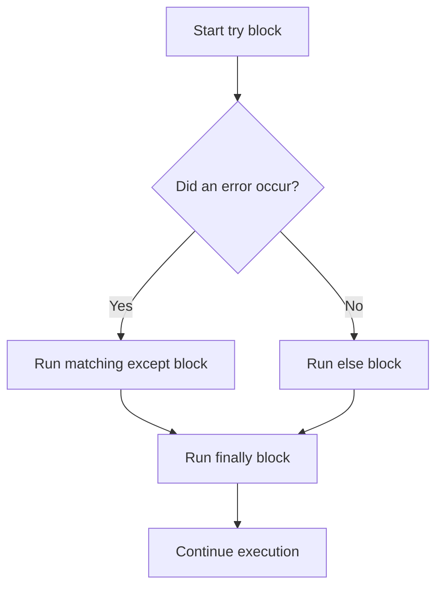

# Chapter 11: Exception Handling in Python

> **Topic Index:** 11 | **Prerequisites:** Basic Python Variables, Control Flow, and Functions  
> **Original Concept Attribution:** Sheryians Coding School (Enhanced for DSA & Professional Development)

---

## 📌 Introduction: Errors vs. Exceptions

In Python, not all errors are created equal. Broadly, we divide issues into four categories as shown in the classification diagram below:



---

### 1️⃣ Parse-Time/Syntax Errors (Cannot be Handled at Runtime)
These occur before the Python interpreter even starts executing the script. They happen because the code violates Python's grammar rules. Since the script cannot be parsed, these errors **cannot be caught or handled** by standard `try-except` blocks.

Common examples:
*   **`SyntaxError`**: Code violates language syntax (e.g., missing colons, unbalanced parentheses).
*   **`IndentationError`**: Incorrect spacing/indentation (e.g., mixing spaces and tabs, missing indent inside loops/functions).
*   **`TabError`**: Specifically occurs when code mixes tabs and spaces for indentation in the same block.

```python
# SyntaxError Example
# if True
#     print("Missing colon")

# IndentationError Example
# def test():
# print("No indentation")
```

### 2️⃣ Exceptions (Runtime Errors that Can be Handled)
An **Exception** is an unexpected event that occurs **during the execution** of a program. The code is grammatically correct, but when Python tries to run it, something goes wrong (e.g., dividing by zero, accessing a non-existent file). 

When an exception occurs, Python halts the normal flow of execution, raises an exception object, and terminates the program unless it is explicitly handled.

```python
# ZeroDivisionError Exception Example
numerator = 10
denominator = 0

# The next line raises ZeroDivisionError and terminates the script immediately
result = numerator / denominator  
print("This line will NEVER be executed!") 
```

---

## 🧠 Common Built-in Exceptions in Python

Python provides a rich hierarchy of built-in exceptions. Understanding these helps you anticipate points of failure in your code.

| Exception | Root Cause | Example |
| :--- | :--- | :--- |
| `ZeroDivisionError` | division or modulo by zero | `10 / 0` |
| `NameError` | referencing a variable that has not been defined | `print(undefined_var)` |
| `TypeError` | operation applied to an object of inappropriate type | `'2' + 2` |
| `ValueError` | argument has correct type but inappropriate value | `int('abc')` |
| `IndexError` | sequence index out of range | `lst = [1, 2]; lst[5]` |
| `KeyError` | accessing a dictionary key that doesn't exist | `d = {}; d['key']` |
| `FileNotFoundError` | attempting to open a file that does not exist | `open('missing.txt')` |

---

## 🛠️ Handling Exceptions: The `try-except` Block

To prevent exceptions from crashing our programs, we wrap risky code in a `try` block and define recovery steps in one or more `except` blocks.

### 1️⃣ Basic Syntax and Multiple Except Blocks
It is a best practice to catch **specific** exceptions rather than using a generic `except:` block. This ensures that you don't accidentally suppress unrelated errors.

```python
def safe_divide(a: float, b: float) -> float | None:
    try:
        result = a / b
        return result
    except ZeroDivisionError as e:
        print(f"Error occurred: {e} (Attempted to divide by zero)")
        return None
    except TypeError as e:
        print(f"Error occurred: {e} (Invalid type provided)")
        return None
    except Exception as e:
        print(f"An unexpected error occurred: {e}")
        return None

# Test Run
print("Success:", safe_divide(10, 2))
print("Division by Zero:", safe_divide(10, 0))
print("Invalid Type:", safe_divide(10, "two")) # type: ignore
```

---

## ⚡ The Full Lifecycle: `try`, `except`, `else`, & `finally`



Python offers two additional blocks to give you complete control over cleanups and branching:

1.  **`else` Block:** Runs only if **no exceptions** were raised in the `try` block.
2.  **`finally` Block:** **Always** runs, regardless of whether an exception occurred or was caught. This is crucial for releasing resources (e.g., closing file streams, database connections).



### 💻 Code Demonstration of the Full Lifecycle
```python
def process_file(filename: str) -> None:
    file_handle = None
    try:
        print(f"\nAttempting to open {filename}...")
        file_handle = open(filename, "r")
        content = file_handle.read()
        print("File read successfully!")
    except FileNotFoundError:
        print(f"Error: The file '{filename}' was not found.")
    else:
        # Runs only if opening and reading succeeded without exception
        print(f"Character Count: {len(content)}")
    finally:
        # Runs no matter what to release resources
        if file_handle:
            file_handle.close()
            print("Resource released: File closed.")
        else:
            print("Cleanup: No open file handles to release.")

# Test cases
process_file("non_existent_file.txt")  # FileNotFoundError -> except -> finally
# (Assume a file 'sample.txt' exists with some content)
# process_file("sample.txt")           # success -> else -> finally
```

---

## 🚀 Raising Exceptions and Creating Custom Exceptions

### 1️⃣ Raising Exceptions with `raise`
You can manually raise exceptions using the `raise` keyword when a business logic constraint is violated.

```python
def check_age(age: int) -> None:
    if age < 0:
        raise ValueError("Age cannot be negative!")
    if age < 18:
        print("Access Denied: Minor.")
    else:
        print("Access Granted.")

try:
    check_age(-5)
except ValueError as e:
    print(f"Caught expected validation error: {e}")
```

### 2️⃣ Creating Custom Exception Classes
For complex applications, you can define domain-specific exceptions by inheriting from the built-in `Exception` class.

```python
class InsufficientFundsError(Exception):
    """Exception raised when a bank account has insufficient balance for withdrawal."""
    def __init__(self, balance: float, amount: float, message: str = "Insufficient funds for this withdrawal.") -> None:
        self.balance = balance
        self.amount = amount
        self.message = message
        super().__init__(self.message)

    def __str__(self) -> str:
        return f"{self.message} | Current Balance: ${self.balance:.2f} | Requested: ${self.amount:.2f}"

# Simulation
def withdraw(balance: float, amount: float) -> float:
    if amount > balance:
        raise InsufficientFundsError(balance, amount)
    return balance - amount

try:
    new_balance = withdraw(150.00, 200.00)
except InsufficientFundsError as e:
    print(f"Transaction Failed: {e}")
```

---

## 📝 Practice Labs & Solutions

Here are standard interview and practical programming problems involving exception handling, implemented with professional type hinting, docstrings, and clean explanations.

### Q1. Safe Conversions
*Write a utility function that safely converts any input string into an integer. If the conversion fails due to a ValueError or TypeError, return a user-specified fallback value.*

```python
from typing import Any

def safe_convert_to_int(value: Any, fallback: int = 0) -> int:
    """
    Attempts to convert a value to an integer. 
    Returns the integer if successful, or the fallback value otherwise.
    """
    try:
        return int(value)
    except (ValueError, TypeError):
        return fallback

# Test Run
print(safe_convert_to_int("123"))      # Output: 123
print(safe_convert_to_int("abc", -1))  # Output: -1
print(safe_convert_to_int(None, 99))   # Output: 99
```

---

### Q2. List Lookup with Recovery
*Write a function that retrieves an element at a given index from a list. If the index is out of bounds, print a descriptive message and return a fallback value. If the index is not an integer, handle the TypeError.*

```python
from typing import List, Any

def get_element_safely(lst: List[Any], index: int, fallback: Any = None) -> Any:
    """
    Retrieves the element at the specified index from list.
    Handles IndexError and TypeError gracefully.
    """
    try:
        return lst[index]
    except IndexError:
        print(f"Warning: Index {index} is out of bounds for list of size {len(lst)}.")
        return fallback
    except TypeError:
        print("Warning: Index must be an integer.")
        return fallback

# Test Run
numbers = [10, 20, 30]
print(get_element_safely(numbers, 1))      # Output: 20
print(get_element_safely(numbers, 5, -1))  # Output: -1 (Prints index warning)
print(get_element_safely(numbers, "one"))  # Output: None (Prints type warning) # type: ignore
```

---

### Q3. Validated Interactive User Input
*Write an interactive function that asks the user to enter a positive integer. If the user inputs an invalid integer or a negative integer, display an appropriate message and prompt them again. Loop until a valid input is received.*

```python
def get_positive_integer(prompt: str) -> int:
    """
    Prompts the user for a positive integer and repeats until valid input is given.
    """
    while True:
        try:
            user_input = input(prompt)
            value = int(user_input)
            if value <= 0:
                raise ValueError("The number must be positive (greater than zero).")
            return value
        except ValueError as e:
            # Captures both non-integer values and manually raised ValueError for negatives
            print(f"Invalid Input: {e}. Please try again.")

# Test Simulation (Requires manual run)
# print(get_positive_integer("Enter a positive number: "))
```

---

### Q4. Multiple Custom Validation Exceptions
*Implement a sign-up validation helper that raises custom exceptions depending on failure conditions: `UsernameTooShortError` (less than 4 characters) or `PasswordWeakError` (less than 8 characters, or doesn't contain a number).*

```python
class UsernameTooShortError(ValueError):
    """Raised when username length is below 4 characters."""
    pass

class PasswordWeakError(ValueError):
    """Raised when password fails complexity requirements."""
    pass

def validate_credentials(username: str, password: str) -> bool:
    """
    Validates username and password criteria.
    Raises custom errors if constraints are violated.
    """
    if len(username) < 4:
        raise UsernameTooShortError("Username must be at least 4 characters long.")
    
    if len(password) < 8:
        raise PasswordWeakError("Password must be at least 8 characters long.")
    
    if not any(char.isdigit() for char in password):
        raise PasswordWeakError("Password must contain at least one digit.")
        
    return True

# Test Run
try:
    validate_credentials("bob", "pass123")
except UsernameTooShortError as e:
    print(f"Username Error: {e}")

try:
    validate_credentials("alice", "weakpass")
except PasswordWeakError as e:
    print(f"Password Error: {e}")
```