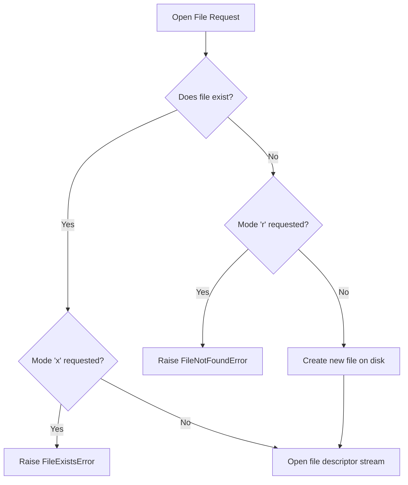

# Python OOP: File Handling & Stream Management

---

# 1. Definition

## File
A **File** is a named, persistent resource stored on a secondary storage device (like an SSD or HDD) containing a collection of data bytes.

## File Handling
**File Handling** is the process of establishing an input/output (I/O) connection stream between a running Python script and a file on disk to perform CRUD (Create, Read, Update, Delete) operations.


---

# 2. Why Do We Need It?

### The Problem With Volatile RAM Storage
Variables, arrays, dictionaries, and objects in Python are stored in **RAM (Random Access Memory)**.
* **Volatility**: RAM is volatile memory. Once a Python script finishes executing or the computer loses power, all data stored in RAM is immediately cleared.

```python
# Volatile state
names = ["Aman", "Rohit"]
# Script ends -> list is lost forever
```

#### Issues:
1. **No Persistence**: User profiles, database configurations, and application logs cannot be saved across system restarts.
2. **Memory Limitations**: RAM is limited and expensive compared to secondary disk storage. Large datasets (gigabytes/terabytes) must be streamed from disk.
3. **No Inter-Process Communication**: Different programs cannot share data unless they write to and read from a shared persistent file format.

---

# 3. Real-Life Analogies

### Analogy: The Filing Cabinet
* **The Disk (HDD/SSD)**: A physical filing cabinet in an office.
* **The File**: A labeled paper folder inside the cabinet.
* **`open()`**: Going to the cabinet, taking out the folder, and placing it on your desk.
* **The File Mode ('r' vs 'w')**:
  * **Read Mode ('r')**: You open the folder to read it; your pen is kept in your drawer, and you cannot make edits.
  * **Write Mode ('w')**: You open the folder, throw away all the existing papers inside, and start writing fresh pages.
* **`close()` / `with`**: Putting the papers back in the folder, locking the filing cabinet, and leaving. If you forget to close it, anyone can access or lock the cabinet (file resource lock).

---

# 4. Syntax

```python
# 1. Safe, automatic stream management (with keyword)
with open("notes.txt", "w", encoding="utf-8") as file:
    file.write("Python is awesome!\n")

# 2. Reading from the file safely
with open("notes.txt", "r", encoding="utf-8") as file:
    content = file.read()
```
* **Explanation**: Demonstrates writing and reading strings using the recommended `with` context manager.
* **Expected Output**: Compiles and executes. Writes `"Python is awesome!\n"` to `notes.txt`.
* **Memory Explanation**: Python opens a file descriptor, allocates a string buffer in memory, and flushes it to disk.
* **Time Complexity**: $\mathcal{O}(N)$ where $N$ is character length of written string.
* **Space Complexity**: $\mathcal{O}(N)$ to store read content in memory.
* **Common Mistakes**: Forgetting to close files when not using the `with` statement.
* **Best Practices**: Always specify file encodings (e.g., `encoding="utf-8"`) to prevent platform-specific bugs.

---

# 5. Syntax Breakdown

Let's dissect file access modes:

* **`'r'` (Read)**: Opens a file for reading (default). Raises `FileNotFoundError` if the file does not exist.
* **`'w'` (Write)**: Opens a file for writing. Creates the file if it does not exist; **overwrites** it if it does.
* **`'a'` (Append)**: Opens a file for writing, appending data to the end without deleting existing content.
* **`'x'` (Exclusive Create)**: Creates a new file. Fails with `FileExistsError` if the file already exists.

---

# 6. Memory Diagram

When using the `with` statement, CPython manages resources using context protocols:

```
+-------------------------------------------------------------+
| Context Manager Protocol Lifecycle                          |
|                                                             |
| 1. ENTER: file = open("notes.txt")                          |
|    Allocates system file descriptor & binds reference.      |
|                                                             |
| 2. EXECUTE BLOCK: file.read()                               |
|    Streams bytes from disk into RAM buffer.                 |
|                                                             |
| 3. EXIT: Automatically invokes file.close()                 |
|    Releases system locks, flushes buffer, frees file        |
|    descriptor slot.                                         |
+-------------------------------------------------------------+
```

---

# 7. Internal Working (Behind the Scenes)

## Buffering and File Descriptors
Under the hood:
1. When you call `open()`, Python makes a system call (`sys_open`) to the Operating System.
2. The OS checks permissions and returns a **File Descriptor** (an integer index pointing to the OS file table).
3. **Buffering**: To minimize slow disk operations, Python stores writes in a RAM buffer. Writes are only physically committed to disk when the buffer is full, when `.flush()` is called, or when the file is closed.
4. **Context Managers (`with`)**: Use the `__enter__` and `__exit__` magic methods to guarantee that `file.close()` is called, even if exceptions are raised inside the block.

---

# 8. Rules

### File Rules
1. **Closing Files**: If you do not use the `with` statement, you must call `file.close()` manually. Otherwise, system resource locks remain active, preventing other processes from modifying the file.
2. **Binary Mode**: When reading non-text files (like images, ZIPs, or audio), you must open the file in binary mode (`'rb'` or `'wb'`).
3. **Write Overwrite**: `'w'` mode truncates the file size to 0 before writing; any previous contents are deleted.

---

# 9. Naming Conventions (PEP 8)

* Use snake_case for file object reference variables (e.g., `data_file`).
* Use descriptive constants for system filenames.

| Variable Name | Bad Example | Good Example | Industry Standard |
| :--- | :--- | :--- | :--- |
| File Object | `f` | `data_file` | `user_log_file` |

---

# 10. Common Mistakes & Bugs

### Mistake 1: Forgetting to close files
```python
# BUGGY CODE
f = open("data.txt", "w")
f.write("text")
# Missing f.close() - File remains locked!
```
* **Expected Output**: File might remain empty on disk due to unflushed buffers.
* **How to avoid**: Always use the `with` context manager.

---

### Mistake 2: File Not Found Errors on Reads
```python
# BUGGY CODE
with open("missing.txt", "r") as f:
    print(f.read())
```
* **Why it happens**: Attempting to read a file that does not exist in the active working directory.
* **How to avoid**: Check if the file exists first:
```python
import os
if os.path.exists("missing.txt"):
    # open file
```

---

# 11. Best Practices & Pythonic Code

* **Always specify encodings explicitly** to prevent formatting crashes across Windows, macOS, and Linux.
```python
# Pythonic File Open
with open("file.txt", "r", encoding="utf-8") as f:
    pass
```

---

# 12. Interview Questions

### Q1. Why is the `with` statement preferred over standard `open()` and `close()` blocks?
* **Answer**: The `with` statement utilizes Python's context manager protocol. It guarantees that the file is closed automatically as soon as execution leaves the block, even if an unhandled exception occurs inside. This prevents resource leaks and file corruption.

---

### Q2. What is the difference between `.readline()` and `.readlines()`?
* **Answer**: 
  * `.readline()` reads a single line from the file and returns it as a string.
  * `.readlines()` reads all remaining lines and returns them as a list of strings, where each element is a line.

---

### Q3. Tricky Output Question
**What is the output if you call write on a file opened in `'r'` mode?**
```python
with open("notes.txt", "r") as f:
    f.write("text")
```
* **Expected Output**: `UnsupportedOperation: not writable`
* **Explanation**: The file descriptor was allocated with read-only permissions.

---

# 13. Exam Points

* **`os.remove()`**: Function used to delete files from the disk.
* **`FileNotFoundError`**: Exception raised when trying to read a missing file.
* **Binary Mode**: Indicated by the `'b'` suffix (e.g., `'rb'`), which processes files as raw bytes rather than strings.

---

# 14. Real-World Examples

## Example 1: Creating and Writing User Profile Data
```python
def save_profile(username: str, age: int) -> None:
    # Safe path creation and data write
    with open("user_profile.txt", "w", encoding="utf-8") as file:
        file.write(f"Username: {username}\n")
        file.write(f"Age: {age}\n")

# Execution
save_profile("saurabh_21", 21)
```
* **Explanation**: Writes formatted variables to disk storage.
* **Time Complexity**: $\mathcal{O}(N)$
* **Space Complexity**: $\mathcal{O}(1)$

---

## Example 2: Counting Lines in a File safely
```python
import os

def count_lines(filename: str) -> int:
    if not os.path.exists(filename):
        return 0
        
    with open(filename, "r", encoding="utf-8") as file:
        # Sum lines without loading entire file contents into memory
        return sum(1 for _ in file)

# Execution
print("Total lines:", count_lines("user_profile.txt"))
```
* **Explanation**: Counts lines efficiently using an iterator to avoid loading large files into RAM.
* **Time Complexity**: $\mathcal{O}(L)$ where $L$ is line count.
* **Space Complexity**: $\mathcal{O}(1)$

---

# 15. Mini Practice

### Easy
Create a file named `info.txt` and write your name and age into it.

### Medium
Write a program that checks if a file exists before opening it to read and print its contents line-by-line.

### Hard
Write a program that appends a log entry timestamp string to an existing log file without deleting its previous contents.

---

# 16. Summary Table

| Mode | Action | File Must Exist | Overwrites Content |
| :--- | :--- | :--- | :--- |
| **`'r'`** | Read | Yes | No |
| **`'w'`** | Write | No | Yes |
| **`'a'`** | Append | No | No |
| **`'x'`** | Exclusive Write | No (fails if exists) | No |

---

# 17. Cheat Sheet

```python
# Check exist
import os
os.path.exists("file.txt")

# Read file line by line
with open("file.txt", "r", encoding="utf-8") as file:
    for line in file:
        print(line.strip())
```

---

# 18. Flow Diagram



---

# 19. Comparison Table

| Feature | `'w'` Mode | `'a'` Mode |
| :--- | :--- | :--- |
| **Pointer Position** | Start of file (index 0) | End of file |
| **Previous Contents**| Deleted (truncated) | Preserved |

---

# 20. Things to Remember

> [!IMPORTANT]
> **Key takeaways on File Handling:**
> 1. **Specify encoding**: Always set `encoding="utf-8"` to prevent cross-platform text corruption.
> 2. **Context managers are mandatory**: Use the `with` statement to manage file streams safely and automatically.