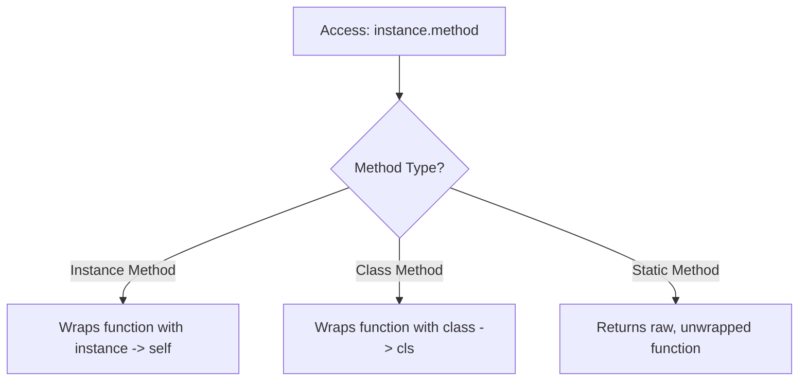
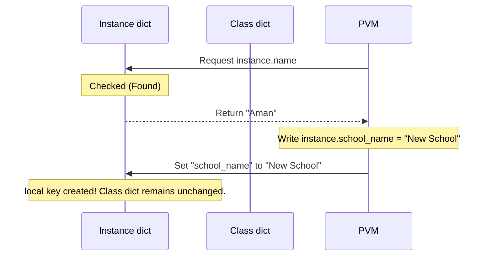

# Python Attributes & Methods: The Definitive Guide to Class/Instance State and Behavior

---

# 1. Definition

In Object-Oriented Programming (OOP) in Python, classes encapsulate two primary elements: **State** (Attributes) and **Behavior** (Methods).

## Attributes (State)
Attributes are variables bound to a class or its instances. They represent the data associated with the entity.
* **Class Attribute**: A variable declared directly inside the class body, outside of any methods. It is shared by all instances of that class.
* **Instance Attribute**: A variable bound to a specific instance of a class (typically initialized inside `__init__` using `self`). It is unique to each individual object.

## Methods (Behavior)
Methods are functions defined inside a class that operate on the class or its instances.
* **Instance Method**: The default method type. It operates on a specific instance and must take `self` as its first parameter. It can read and modify both instance and class attributes.
* **Class Method**: A method bound to the class itself rather than individual instances. It is decorated with `@classmethod` and takes `cls` as its first parameter. It can access and modify class attributes but cannot access instance-specific data.
* **Static Method**: A method that acts like a normal function utility namespace-isolated inside a class. It is decorated with `@staticmethod`, takes no implicit first argument (`self` or `cls`), and cannot read or modify class or instance attributes directly.

.png>)

# 2. Why Do We Need It?

### The Problem Before Attributes & Methods (Procedural Chaos)
In procedural programming, state and behavior are completely decoupled. Data is passed around as global variables, dictionaries, or tuples, and functions modify this data externally.

```python
# Procedural state and behavior management
student_1 = {"name": "Aman", "age": 20, "grades": [90, 85]}
student_2 = {"name": "Rohan", "age": 21, "grades": [88, 92]}

def calculate_average(student):
    return sum(student["grades"]) / len(student["grades"])

# School name is a global variable
school_name = "Sheryians Coding School"
```
* **Explanation**: The data structure is exposed, and there is no boundary preventing functions from accidentally corrupting the data.
* **Expected Output**: Runs successfully but lacks modularity and structure.
* **Memory Explanation**: Dict data resides at separate heap locations; functions are loaded globally.
* **Time/Space Complexity**: $\mathcal{O}(1)$ for lookup, $\mathcal{O}(N)$ for calculating average.
* **Common Mistakes**: Accidentally passing a malformed dictionary to the function.
* **Best Practices**: Bind state and behavior together inside a class template.

#### Issues with Procedural Management:
1. **Namespace Pollution**: Global variables like `school_name` can be overwritten anywhere in the codebase.
2. **Lack of Encapsulation**: Any function can modify the student's grades or age without validation rules.
3. **Behavior Duplication**: Methods are not tied to the data structure, meaning helper functions must be explicitly imported and passed raw structures.

### The OOP Solution
By combining class/instance attributes with instance/class/static methods, Python provides:
* **True Encapsulation**: Methods act as gatekeepers to state modification.
* **Shared state efficiency**: Class attributes allow constant values (like `school_name = "Sheryians Coding School"`) to reside in a single class namespace memory block rather than being duplicated in every single instance object, reducing memory footprints.
* **Clear separation of concerns**: Instance methods handle object mutations, class methods handle factory patterns, and static methods handle independent helper logic.

---

# 3. Real-Life Analogies

### Analogy 1: Sheryians Coding School (Directly Preserving Notes Context)
Let's apply these concepts to **Sheryians Coding School** (preserving your original notes reference):
* **Class Attribute (`school_name`)**: The name `"Sheryians Coding School"` is painted on the main building. Every student attending the school shares this exact same name. If the school changes its name to `"Sheryians Tech University"`, it updates once at the building level (class namespace), and every student immediately shares the new name.
* **Instance Attribute (`student_name`, `age`)**: The student's ID card contains their name (e.g., `"Aman"`) and age (e.g., `22`). Each student has their own unique ID card (instance namespace).
* **Instance Method (`study()`, `take_exam()`)**: An action performed by an individual student. For instance, Aman studies for himself, updating his personal grades.
* **Class Method (`change_school_name()`)**: An administrative action. The principal changes the name of the school on the building. It doesn't target an individual student; it targets the school entity (`cls`).
* **Static Method (`validate_student_age()`)**: A general check. E.g., verifying if an input age (e.g., `18`) meets the school admission criteria. It's a general helper utility that doesn't need to check a student's profile or change the building name.

### Analogy 2: Smartphone Factory
* **Class Attribute**: The operating system version (e.g., `OS = "Android 14"`). Every phone rolled out shares this operating system.
* **Instance Attribute**: The phone's unique IMEI number and the customer's lock screen wallpaper.
* **Instance Method**: `change_wallpaper()`, which changes only *that specific phone's* screen.
* **Class Method**: `update_firmware()`, which updates the firmware for all phones of that class.
* **Static Method**: `celsius_to_fahrenheit()`, which is a utility converter used in the weather widget.

---

# 4. Syntax

```python
class SheryiansSchool:
    # 1. Class Attribute
    school_name = "Sheryians Coding School"
    
    def __init__(self, name: str, age: int) -> None:
        # 2. Instance Attributes
        self.name = name
        self.age = age
        
    # 3. Instance Method
    def get_student_details(self) -> str:
        return f"Student: {self.name}, Age: {self.age}, School: {self.school_name}"
        
    # 4. Class Method
    @classmethod
    def change_school_name(cls, new_name: str) -> None:
        cls.school_name = new_name
        
    # 5. Static Method
    @staticmethod
    def is_eligible_age(age: int) -> bool:
        return age >= 16
```
* **Explanation**: Syntactic structure demonstrating all five attribute and method configurations within Python.
* **Expected Output**: Defines the class ready for execution.
* **Memory Explanation**: Stores the method descriptors, decorators, and class attributes in the `SheryiansSchool` class namespace dictionary.
* **Time/Space Complexity**: N/A
* **Common Mistakes**: Forgetting the decorators `@classmethod` or `@staticmethod`, causing Python to treat them as standard instance methods.
* **Best Practices**: Keep naming descriptive and always use `self` and `cls` parameters in their respective contexts.

### Explaining keywords, decorators, and symbols:
* **`self`**: The reference parameter to the calling instance object.
* **`cls`**: The reference parameter to the class object itself.
* **`@classmethod`**: A decorator that binds the method to the class namespace, transforming its signature.
* **`@staticmethod`**: A decorator that prevents Python from passing an implicit first argument (no `self` or `cls`).

---

# 5. Syntax Breakdown

Let's dissect each line of the syntax block above:

* **`school_name = "Sheryians Coding School"`**
  Declares a class attribute directly in the class scope. It is loaded once during compilation and is accessible by calling `SheryiansSchool.school_name` or `instance.school_name`.
* **`def __init__(self, name, age):`**
  Constructs the instance. Parameters `name` and `age` are bound to `self.name` and `self.age`, adding them to the unique instance dictionary (`__dict__`).
* **`def get_student_details(self):`**
  An instance method. When called as `student.get_student_details()`, Python automatically binds `student` to the `self` parameter, letting it access `self.name` and `self.age`.
* **`@classmethod`**
  Tells the Python interpreter that the following method belongs to the class, not instance objects.
* **`def change_school_name(cls, new_name):`**
  The first parameter `cls` receives the class reference `SheryiansSchool`. Changing `cls.school_name` modifies the attribute at the class namespace level.
* **`@staticmethod`**
  Tells the interpreter that the method is a static utility that doesn't bind to instances or classes.
* **`def is_eligible_age(age):`**
  A parameter list with no `self` or `cls`. It behaves like a standard function.

---

# 6. Memory Diagram

When we execute:
```python
s1 = SheryiansSchool("Aman", 22)
s2 = SheryiansSchool("Rohan", 21)
```

```
STACK                                      HEAP
======================                     ========================================================================
|  Name   | Reference|                     |  Address  | Object Type | Value (__dict__)                           |
======================                     ========================================================================
|   s1    |  0x100A  | ------------------> |  0x100A   | Instance    | {"name": "Aman", "age": 22}                |
----------------------                     ========================================================================
|   s2    |  0x200B  | ---------\          |  0x800F   | Class Object| {"school_name": "Sheryians Coding School", |
======================           \         |           |             |  "__init__": <function>,                   |
                                  \        |           |             |  "change_school_name": <classmethod>,      |
                                   \       |           |             |  "is_eligible_age": <staticmethod>}        |
                                    -----> ========================================================================
                                           |  0x200B   | Instance    | {"name": "Rohan", "age": 21}               |
                                           ========================================================================
```

### Key Memory Insights:
1. **Attributes Separation**: `name` and `age` are stored within the instance dicts (`0x100A` and `0x200B`). `school_name` is stored exactly once inside the Class Object namespace (`0x800F`).
2. **Methods sharing**: Method code blocks are not copied to each instance. They are stored once in the Class Object (`0x800F`). When you call `s1.get_student_details()`, the Python descriptor protocol accesses the method from `0x800F` and binds `s1` (`0x100A`) to the `self` parameter.

---

# 7. Internal Working (Behind the Scenes)

## Method Binding: Bound vs. Unbound Methods

How does Python know which object's data to access? The secret lies in **Method Binding**.

* **Unbound Method**: A function declared inside a class before instantiation. It remains a standard function descriptor.
* **Bound Method**: When a method is accessed on an instance, Python's descriptor protocol wraps the function and the instance together into a **Method Object**. The instance is automatically prepended to the argument list as `self`.

```python
class Demo:
    def greet(self):
        return "Hello"

d = Demo()
print(Demo.greet)  # Unbound (regular function descriptor)
print(d.greet)     # Bound method object
```
* **Explanation**: Demonstrates the difference between class-level unbound functions and instance-level bound method objects.
* **Expected Output**:
  ```
  <function Demo.greet at 0x...>
  <bound method Demo.greet of <__main__.Demo object at 0x...>>
  ```
* **Memory Explanation**: Python intercepts the dot operator (`d.greet`) and dynamically constructs a temporary bound method wrapper object containing references to both the instance `d` and the function `Demo.greet`.
* **Time Complexity**: $\mathcal{O}(1)$ descriptor lookup.
* **Space Complexity**: $\mathcal{O}(1)$ allocation of bound method object.
* **Common Mistakes**: Confusing a bound method reference with calling it, e.g., omitting parentheses like `d.greet` instead of `d.greet()`.
* **Best Practices**: Call bound methods directly using parentheses.

---

## Behind the Scenes: Descriptors under `@classmethod` and `@staticmethod`

Decorators are not magical syntax sugars; they implement the **Descriptor Protocol** (`__get__` method):
* **`@classmethod`**: Implements a descriptor that intercept calls and binds the class reference (`cls`) to the first parameter instead of the instance.
* **`@staticmethod`**: Implements a descriptor that wraps the inner function, preventing any binding behavior from attaching class or instance arguments.



---

# 8. Rules of Attributes & Methods

### 1. Attribute Lookup Chain
When accessing `instance.attr`:
1. Check instance dictionary (`instance.__dict__`).
2. Check Class namespace (`Class.__dict__`).
3. Check Parent Class namespace in MRO sequence.
4. If not found, raise `AttributeError`.

### 2. Class Attribute Mutation Trap
If you attempt to modify a class attribute through an instance (e.g., `s1.school_name = "New School"`), Python **does not** modify the class attribute. Instead, it creates a new **instance attribute** with that name on `s1`, shadowing the class attribute.

```python
class School:
    name = "Sheryians"

s1 = School()
s1.name = "Coding School"  # Shadows class attribute!
print(School.name)         # Remains "Sheryians"
print(s1.name)             # Prints "Coding School"
```
* **Explanation**: Demonstrates attribute shadowing where writing to a class attribute via an instance name creates a local instance override.
* **Expected Output**:
  ```
  Sheryians
  Coding School
  ```
* **Memory Explanation**: `School.__dict__` keeps `"name": "Sheryians"`. The assignment `s1.name = ...` writes `"name": "Coding School"` into `s1.__dict__`.
* **Time/Space Complexity**: $\mathcal{O}(1)$
* **Common Mistakes**: Assuming modifying a class variable via an instance updates the value globally for all other instances.
* **Best Practices**: Always modify class attributes using the class name directly: `School.name = "New School"`.

---

# 9. Naming Conventions (PEP 8)

* **Public Attributes**: lowercase_with_underscores, e.g., `self.student_name`.
* **Protected Attributes**: `_protected_variable` (single underscore). Indicates internal implementation details; should not be accessed outside class hierarchy.
* **Private Attributes**: `__private_variable` (double underscore). Triggers name mangling.

### Good, Bad, and Industry Examples

```python
# Bad Naming Conventions
class sheryians:
    def __init__(self, StUdEnT_NaMe):
        self.name = StUdEnT_NaMe  # Unclear naming style

# Good Naming Conventions
class SheryiansSchool:
    def __init__(self, student_name: str) -> None:
        self.student_name = student_name  # PEP 8 compliant
```
* **Explanation**: Comparison of bad camel-case/pascal parameter styles vs PEP 8 compliant style.
* **Expected Output**: Compiles identical classes but yields different readability scores.
* **Memory Explanation**: Identical namespace allocations.
* **Time/Space Complexity**: N/A
* **Common Mistakes**: Mixing CamelCase for variables and lowercase for classes.
* **Best Practices**: Use lowercase snake_case for parameters, methods, and variables; PascalCase for classes.

---

# 10. Common Mistakes & Bugs

### Mistake 1: Shared Mutables in Class Attributes
```python
# BUGGY CODE
class StudentList:
    students = []  # Shared class variable

    def __init__(self, name):
        self.students.append(name)

s1 = StudentList("Aman")
s2 = StudentList("Rohan")
print(s1.students)  # Output: ['Aman', 'Rohan'] (Expected ['Aman'])
```
* **Explanation**: Declaring list structures as class attributes shares them globally among all instances.
* **Expected Output**: `['Aman', 'Rohan']`
* **Memory Explanation**: `students` is stored in the class namespace at heap, so both instances write to the same list memory reference.
* **Time Complexity**: $\mathcal{O}(1)$ append.
* **Space Complexity**: $\mathcal{O}(N)$ sharing list space.
* **Common Mistakes**: Expecting class attributes to automatically replicate for instances.
* **Best Practices**: Declare lists inside the constructor using `self.students = []`.

---

### Mistake 2: Missing Decorator for Static / Class Methods
```python
# BUGGY CODE
class Utility:
    def helper_function(value):  # Missing @staticmethod
        return value * 2

u = Utility()
print(u.helper_function(5))  # Raises TypeError
```
* **Explanation**: Calling instance method helper without self-reference results in parameter mismatch.
* **Expected Output**: `TypeError: helper_function() takes 1 positional argument but 2 were given` (since `u` is implicitly passed).
* **Memory Explanation**: Runtime tries to pass the instance reference as the first argument to the function namespace.
* **Time/Space Complexity**: N/A
* **Common Mistakes**: Writing helper functions inside a class and omitting decorators.
* **Best Practices**: Use `@staticmethod` explicitly for independent helper methods.

---

# 11. Best Practices & Pythonic Code

### When to Use Which Method Type
* **Use Instance Method** when you need to read or update an object's internal properties (e.g., updating a student's age or grade).
* **Use Class Method** for factory initializations (e.g., parsing a CSV string of student records and returning an instantiated object).
* **Use Static Method** for formatting values, checking strings, or performing computations that do not rely on class variables or object instances.

### Pythonic Factory Patterns
```python
class Student:
    def __init__(self, name: str, age: int) -> None:
        self.name = name
        self.age = age

    @classmethod
    def from_csv(cls, csv_line: str):
        name, age_str = csv_line.split(",")
        return cls(name, int(age_str))
```
* **Explanation**: Class method factory pattern to instantiate students directly from CSV formatted strings.
* **Expected Output**: Returns standard initialized Student instance.
* **Memory Explanation**: Invokes metaclass creation routine through `cls` pointer, returning a new instance on the Heap.
* **Time Complexity**: $\mathcal{O}(N)$ to split string.
* **Space Complexity**: $\mathcal{O}(1)$ auxiliary space.
* **Common Mistakes**: Creating parsing functions outside the class scope instead of grouping them logically.
* **Best Practices**: Use class methods to implement alternative constructor entry paths.

---

# 12. Interview Questions

### Q1. What happens if you define a class attribute and an instance attribute with the same name? (Tricky Theory)
* **Answer**: The instance attribute shadows the class attribute. During lookup, Python reads the instance dictionary first. The class attribute remains untouched in the class namespace and is still accessible by calling `ClassName.attribute`.

---

### Q2. Can static methods access class attributes? (Theory)
* **Answer**: No, static methods do not receive implicit class (`cls`) or instance (`self`) references. To access class attributes inside a static method, you must explicitly use the class name, e.g., `ClassName.class_attribute`.

---

### Q3. Output-based Tricky Question
**What is the output of the following code?**
```python
class Count:
    num = 0
    def __init__(self):
        Count.num += 1

c1 = Count()
c2 = Count()
print(c1.num, c2.num, Count.num)
```
* **Expected Output**:
  ```
  2 2 2
  ```
* **Explanation**: The class attribute `num` is modified globally by referencing `Count.num` inside the constructor. The lookup on instances `c1.num` and `c2.num` cascades to the class namespace since the instances do not shadow the attribute.
* **Memory Explanation**: A single location at Heap contains class attribute `num`. Increment is run twice, setting it to 2.
* **Time/Space Complexity**: $\mathcal{O}(1)$

---

# 13. Exam Points

* **Class Attribute One-Liner**: A shared class-level variable defined in the class body that is shared across all instance objects.
* **Instance Attribute One-Liner**: An object-level variable bound via `self` representing unique instance-specific state.
* **Static Method One-Liner**: A method decorated with `@staticmethod` that runs without implicit parameters, behaving like a utility function.
* **MRO (Method Resolution Order)**: The linearized path Python follows to resolve attributes or methods from parent classes.

---

# 14. Real-World Examples

## Example 1: Student Management System (Sheryians Coding School Context)

This practical example demonstrates class attributes tracking total enrollment and student instance attributes holding individual academic status.

```python
class SheryiansStudent:
    # Class Attributes
    school_name = "Sheryians Coding School"
    total_students = 0

    def __init__(self, name: str, age: int) -> None:
        self.name = name
        self.age = age
        self.grades: list[float] = []
        SheryiansStudent.total_students += 1

    # Instance Method
    def add_grade(self, grade: float) -> None:
        if 0 <= grade <= 100:
            self.grades.append(grade)
        else:
            raise ValueError("Grade must be between 0 and 100")

    # Instance Method
    def get_gpa(self) -> float:
        return sum(self.grades) / len(self.grades) if self.grades else 0.0

    # Class Method
    @classmethod
    def get_enrollment_report(cls) -> str:
        return f"{cls.school_name} has {cls.total_students} active students enrolled."

# Execution
student1 = SheryiansStudent("Aman", 22)
student2 = SheryiansStudent("Rohan", 21)

student1.add_grade(95.0)
student1.add_grade(88.0)

print(student1.get_gpa())
print(SheryiansStudent.get_enrollment_report())
```
* **Explanation**: Comprehensive student system tracking grades and enrollment totals via class counters.
* **Expected Output**:
  ```
  91.5
  Sheryians Coding School has 2 active students enrolled.
  ```
* **Memory Explanation**: `student1` and `student2` dictionaries store names and grades. Class attribute `total_students` tracks number of class allocations.
* **Time Complexity**: $\mathcal{O}(1)$ for registrations and additions, $\mathcal{O}(G)$ to average grades.
* **Space Complexity**: $\mathcal{O}(G)$ for storing grades.
* **Common Mistakes**: Incrementing `self.total_students += 1` in constructor (only creates instance variable shadowing the counter).
* **Best Practices**: Refer directly to class name when writing to global class attributes.

---

## Example 2: API Request Validator (Industry E-Commerce Usage)

This production implementation manages request counting and header sanitization using static configuration states.

```python
class RequestValidator:
    request_limit = 100
    active_requests = 0

    def __init__(self, endpoint: str) -> None:
        self.endpoint = endpoint
        RequestValidator.active_requests += 1

    @classmethod
    def update_limits(cls, new_limit: int) -> None:
        cls.request_limit = new_limit

    @staticmethod
    def sanitize_header(header_val: str) -> str:
        return header_val.strip().lower()

# Execution
print(RequestValidator.sanitize_header("   Bearer Token_XYZ   "))
RequestValidator.update_limits(150)
print(RequestValidator.request_limit)
```
* **Explanation**: Handles limits updating globally and header sanitization using decorators.
* **Expected Output**:
  ```
  bearer token_xyz
  150
  ```
* **Memory Explanation**: Clean modification of global boundaries without creating instanced wrappers.
* **Time/Space Complexity**: $\mathcal{O}(1)$
* **Common Mistakes**: Trying to query instance headers from static sanitize function directly.
* **Best Practices**: Decouple helper validations from actual state management.

---

## Example 3: Temperature Converter (Static Utility Namespace)

```python
class TempConverter:
    conversion_count = 0

    @staticmethod
    def celsius_to_fahrenheit(celsius: float) -> float:
        TempConverter.conversion_count += 1
        return (celsius * 9/5) + 32

# Execution
print(TempConverter.celsius_to_fahrenheit(0))
print(TempConverter.conversion_count)
```
* **Explanation**: Pure functional converters placed inside an OOP structure.
* **Expected Output**:
  ```
  32.0
  1
  ```
* **Time/Space Complexity**: $\mathcal{O}(1)$

---

# 15. Mini Practice

### Easy (Attributes & Methods Setup)
Create a class `Employee` with a class attribute `company_name = "Tech Corp"`. Add instance attributes `name` and `salary` in constructor. Add an instance method `show_info()`.

### Medium (Factory alternative constructor)
Create a class `Date` with attributes `day`, `month`, `year`. Add a class method `from_string(cls, date_str)` that parses a dash-separated string (e.g. `"28-06-2026"`) and returns an instance.

### Hard (Utility validation state checker)
Create a class `PasswordManager` with a static method `is_strong(password)` that returns True if length is greater than 8 and contains at least one number. Include a class variable tracking total passwords analyzed.

---

# 16. Summary Table

| Concept | Scope | Access Syntax | Target Objective |
| :--- | :--- | :--- | :--- |
| **Class Attribute** | Shared across class | `Class.name` or `self.name` | Constants / Shared state counters |
| **Instance Attribute** | Unique to instance | `self.name` | Specific object properties |
| **Instance Method** | Bounds to instance object | `instance.method()` | Manipulating instance variables |
| **Class Method** | Bounds to Class namespace | `Class.method()` | Alternative Constructors / Factories |
| **Static Method** | Namespace Utility | `Class.method()` | Pure functions / Independent helpers |

---

# 17. Cheat Sheet

### Syntax Snippet Quick Lookup
```python
class Demo:
    shared = "Class Variable"  # Class Attribute
    
    def __init__(self, value):
        self.val = value       # Instance Attribute
        
    def show(self):            # Instance Method
        return self.val
        
    @classmethod
    def factory(cls, v):       # Class Method
        return cls(v)
        
    @staticmethod
    def calc(x, y):            # Static Method
        return x + y
```

---

# 18. Flow Diagrams

### Attribute Shadowing Lifecycle



---

# 19. Comparison Tables

### Class Attribute vs. Instance Attribute

| Property | Class Attribute | Instance Attribute |
| :--- | :--- | :--- |
| **Declaration Location** | Class body (outside methods) | Inside methods (via `self.name`) |
| **Memory Allocation** | Once per Class definition | Once per new Instance creation |
| **Common Use** | Global values, trackers | Unique identifier state details |

### Instance Method vs. Class Method vs. Static Method

| Feature | Instance Method | Class Method | Static Method |
| :--- | :--- | :--- | :--- |
| **Decorator** | None | `@classmethod` | `@staticmethod` |
| **First Arg** | `self` (calling instance) | `cls` (calling class) | None |
| **Access Area** | Instance & Class State | Class State only | No implicit bindings |

---

# 20. Things to Remember

> [!IMPORTANT]
> **Key takeaways on Attributes & Methods**
> 1. **Do not use mutable class attributes**: Avoid empty lists or dicts at class level; they are shared references.
> 2. **Avoid mutating class variables using instances**: Mutating `self.class_variable = val` creates an instance variable override (shadowing).
> 3. **Decorators matter**: Missing `@classmethod` or `@staticmethod` results in runtime `TypeError` issues due to binding assumptions.
> 4. **Bound Method Wrapping**: Accessing methods via instances wraps the raw function automatically.