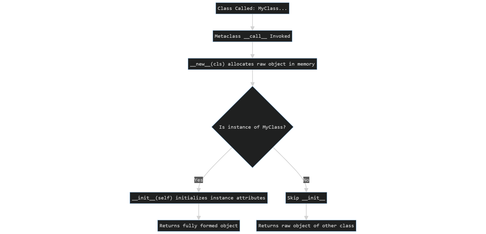
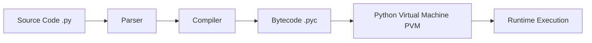
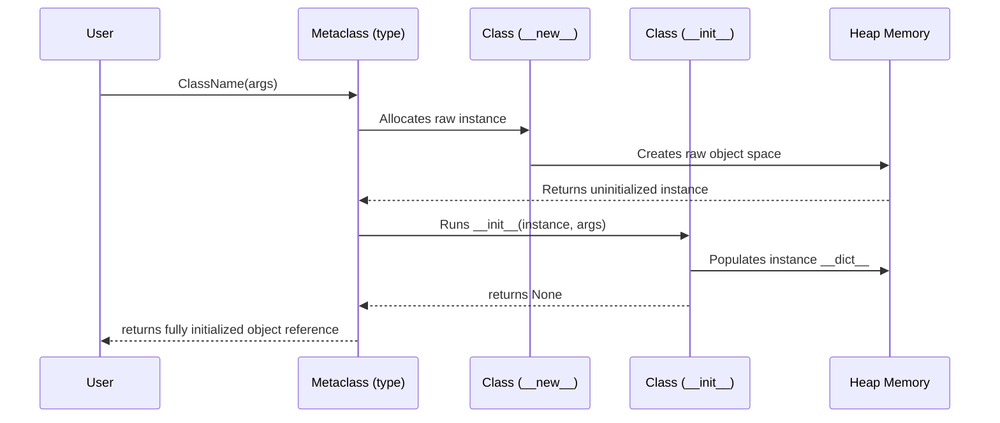
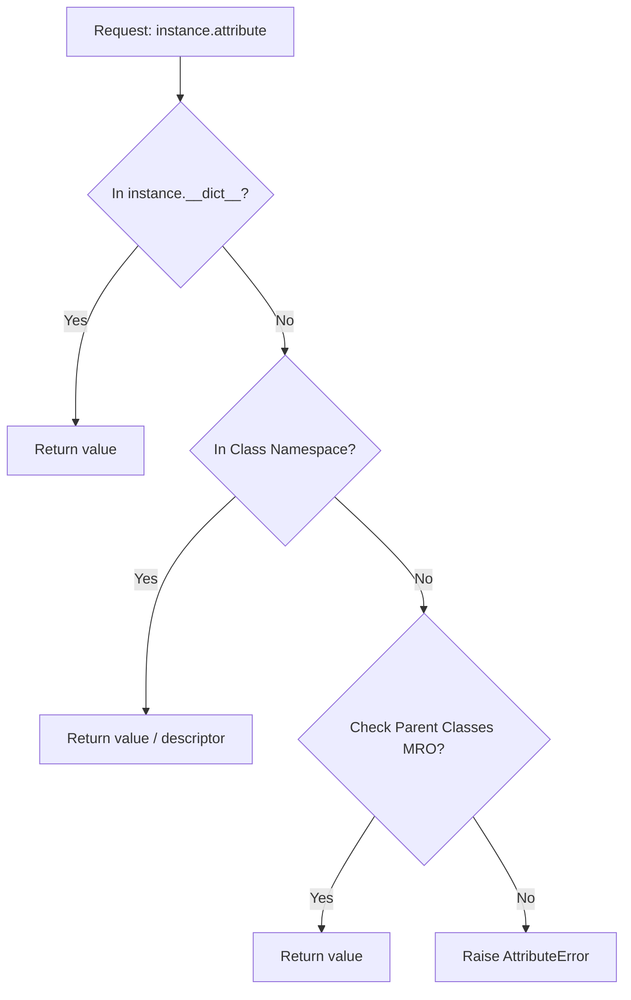

# Python Constructors: The Definitive Guide to Object Instantiation, Lifecycle, and Memory Management

---

# 1. Definition

In Python, the term **"Constructor"** refers to the mechanism responsible for both **allocating memory** for a new object and **initializing** its attributes. 

While languages like C++, Java, and C# use a single explicit constructor method (typically matching the class name), Python divides this process into two distinct stages using two special methods: `__new__` (the allocator) and `__init__` (the initializer). These are called **dunder methods** (double underscore methods) or **magic methods**.

### Official Python Documentation Definition
> "Class instantiation uses function notation. Just pretend that the class object is a parameterless function that returns a new instance of the class... The instantiation operation ('calling' a class object) creates an empty object. Many classes like to create objects with instances customized to a specific initial state. Therefore a class may define a special method named `__init__()`."

### Simple Explanation
Think of a class as a blueprint. A constructor is the automatic assembly line that starts the moment you order an item from that blueprint. It automatically takes your custom choices (like colors or sizes) and builds a real, physical object in memory with those properties already attached.

### Technical Explanation
When you call a class like `obj = MyClass()`, Python invokes its metaclass's `__call__` method. This method orchestrates the two-step instantiation process:
1. It calls `__new__(cls, *args, **kwargs)` to allocate memory for the object and return a raw, uninitialized instance.
2. It then calls `__init__(self, *args, **kwargs)` to initialize the attributes of the newly created instance.



---

# 2. Why Do We Need It?

### The Problem Before Constructors (Manual Initialization)
In simple procedural programming, or OOP without constructors, initializing objects is verbose and error-prone. If we want `material`, `zips`, and `pockets` from the user to create an object, doing it without a constructor requires manually setting the attributes after creation.

```python
# Code without a constructor
class Bag:
    pass

bag1 = Bag()
bag1.material = "Leather"
bag1.zips = 4
bag1.pockets = 3

bag2 = Bag()
# Developer forgot to add 'zips' or 'pockets'!
bag2.material = "Canvas"
```
* **Explanation**: This code creates empty objects of the `Bag` class and manually attaches attributes. It does not enforce a uniform schema.
* **Expected Output**: No output is produced directly, but accessing `bag2.zips` later will crash with an `AttributeError`.
* **Memory Explanation**: Python allocates a generic object namespace `__dict__` for `bag1` at address `0x100A` and `bag2` at `0x200B`. The attributes are bound dynamically at runtime, creating structural inconsistency.
* **Time Complexity**: $\mathcal{O}(1)$ for object creation and each assignment.
* **Space Complexity**: $\mathcal{O}(1)$ auxiliary space.
* **Common Mistakes**: Forgetting to initialize an attribute for a specific instance, leading to runtime failures.
* **Best Practices**: Avoid this pattern; always use a constructor to enforce a uniform schema.

#### Issues with Manual Initialization:
1. **Inconsistent Object State**: Some objects might be missing crucial attributes, leading to `AttributeError` runtime crashes.
2. **Boilerplate and Redundancy**: If you need to create 1,000 bags, you have to write 4,000 lines of code just to set up their attributes.
3. **No Encapsulation**: Internal data structure setup is exposed directly, violating core OOP principles.
4. **No Validation**: You cannot validate the input values before they are assigned to the object.

### The Solution: Python Constructors
A function allows us to ask the user for inputs using parameters, but in a class we cannot pass parameters directly to the class body. Instead, we use the constructor. The constructor solves all these issues by:
* **Guaranteeing Initialization**: Ensuring that every object starts its life in a valid, predictable state.
* **Encapsulating State Construction**: Hiding the setup logic inside the class.
* **Enabling Parameterized Creation**: Allowing users to pass initial data at the exact moment of instantiation.

---

# 3. Real-Life Analogies

### Analogy 1: The Bag Factory (From Original Notes)
Suppose you own a bag manufacturing factory. Customers can order bags with custom requirements: the **material** (leather, canvas), the number of **zips** (2, 4, 6), and the number of **pockets** (3, 5, 8).
* **The Class** is the factory blueprint for a bag.
* **The Constructor** is the automatic assembly machine. When a customer orders a bag, they send their specifications (`material`, `zips`, `pockets`).
* **`self`** is the unique **serial number/RFID tag** attached to a specific bag frame on the assembly line. Because multiple bags are being built at once, the machine uses `self` to ensure that it glues the leather to the *correct physical bag* and stitches 4 zips onto the *correct physical bag*, rather than crossing them over. It targets the object's specific location.

### Analogy 2: Opening a Bank Account
When you open a bank account, the bank requires your **Name**, **Social Security Number**, and an **Initial Deposit**. 
* The bank does not create an empty account and trust you to manually set your name later. 
* Instead, they run an initialization process (the constructor) that takes your credentials, creates the entry in their vault database, and associates your initial funds with your specific account number (`self`).

### Analogy 3: Car Assembly Line
* **`__new__`** is the heavy machinery that casts the metal chassis of the car. It physically allocates space on the factory floor (heap memory).
* **`__init__`** is the customization crew. They paint the chassis red, install a V8 engine, and fit leather seats as requested by the customer.

---

# 4. Syntax

### The Classic Instance Initialization (`__init__`)
```python
class ClassName:
    def __init__(self, parameter1, parameter2):
        self.attribute1 = parameter1
        self.attribute2 = parameter2
```
* **Explanation**: The template structure of a parameterized Python constructor.
* **Expected Output**: Syntax template (does not run directly).
* **Memory Explanation**: Python compiles this structure to create the `__init__` function inside the Class Namespace dictionary.
* **Time Complexity**: N/A
* **Space Complexity**: N/A
* **Common Mistakes**: Forgetting to put `self` as the first argument, or returning a value from `__init__`.
* **Best Practices**: Use type hints on parameters for better static checking.

### Explaining the Keywords, Parameters, and Symbols:
* **`class`**: The keyword used to define a new class namespace.
* **`def`**: The keyword used to define a method or function.
* **`__init__`**: The reserved identifier for the initializer method. The double underscores (dunder) tell Python's interpreter that this is a special hook.
* **`self`**: The conventional name for the first parameter of any instance method. It represents the specific object instance currently being created or operated on.
  > [!NOTE]
  > `self` is not a keyword in Python; you could name it `this` or `obj`, but PEP 8 strongly mandates `self` for readability.
* **`parameter1`, `parameter2`**: The arguments passed by the caller to customize the object.
* **`self.attribute1`**: Binds a variable (attribute) to the instance's dictionary (`__dict__`).
* **`=`**: The assignment operator that copies the reference of the parameter into the instance attribute.

---

# 5. Syntax Breakdown

Let's analyze a complete constructor definition line-by-line using our Bag Factory example:

```python
class Bag:
    # Line 2: The Initializer Method definition
    def __init__(self, material, zips, pockets):
        # Line 3: Assigning the material attribute to the instance
        self.material = material
        # Line 4: Assigning the zips attribute to the instance
        self.zips = zips
        # Line 5: Assigning the pockets attribute to the instance
        self.pockets = pockets
```
* **Explanation**: A concrete class `Bag` representing a factory that builds custom bags based on material, zips, and pockets.
* **Expected Output**: Defines the class ready for instantiation.
* **Memory Explanation**: Creates the class object `Bag` in Heap memory, adding `__init__` to `Bag.__dict__`.
* **Time Complexity**: $\mathcal{O}(1)$ for loading the class definition.
* **Space Complexity**: $\mathcal{O}(1)$ auxiliary space.
* **Common Mistakes**: Omitting `self.` on the left-hand side of assignments, e.g., `material = material`, which does not save the variable to the object.
* **Best Practices**: Ensure naming matches parameters to keep attribute initialization intuitive.

### Line-by-Line Breakdown:
* **Line 1: `class Bag:`**
  Creates a new class object named `Bag` in the current namespace.
* **Line 2: `def __init__(self, material, zips, pockets):`**
  Declares the initialization method. When you call `Bag("Leather", 4, 3)`, Python automatically passes the newly allocated object as the first argument (`self`), followed by `"Leather"` as `material`, `4` as `zips`, and `3` as `pockets`.
* **Line 3: `self.material = material`**
  This line evaluates the expression on the right (`material` parameter) and binds that value to the attribute `material` on the left (`self.material`). This writes the key-value pair `{"material": "Leather"}` directly into the object's instance dictionary (`self.__dict__`).
* **Lines 4 & 5: `self.zips = zips` and `self.pockets = pockets`**
  These execute identical operations, storing the remaining values into the object's internal dictionary.

---

# 6. Memory Diagram

When we execute:
```python
s1 = Bag("Leather", 4, 3)
s2 = Bag("Canvas", 2, 5)
```
Python allocates memory across two main areas: the **Stack** and the **Heap**.

### Stack vs. Heap Allocation
* **Stack**: Holds the names of variables (references) in the current execution scope (like `s1` and `s2`).
* **Heap**: Holds the actual class metadata and the instantiated objects with their attribute values.

```
STACK                                      HEAP
======================                     ===================================================
|  Name   | Reference|                     |  Address  | Object Type | Value (__dict__)      |
======================                     ===================================================
|   s1    |  0x100A  | ------------------> |  0x100A   | Bag Instance| {"material": "Leather"|
|         |          |                     |           |             |  "zips": 4,           |
----------------------                     |           |             |  "pockets": 3}        |
|   s2    |  0x200B  | ---------\          ===================================================
======================           \         |  0x800F   | Bag Class   | Class Metadata        |
                                  \        |           |             | (blueprint)           |
                                   \       ===================================================
                                    -----> |  0x200B   | Bag Instance| {"material": "Canvas",|
                                           |           |             |  "zips": 2,           |
                                           |           |             |  "pockets": 5}        |
                                           ===================================================
```

### Explaining the Components:
1. **Class Object (`Bag` at `0x800F`)**: When Python runs the `class Bag:` block, it creates a single class object on the Heap. This holds methods like `__init__`.
2. **References (`s1` and `s2`)**: These are pointers stored in Stack memory. They hold the memory addresses (`0x100A` and `0x200B`) of the actual instances on the Heap.
3. **Instance Objects**: When `__new__` is called, it allocates raw space on the heap (e.g., at `0x100A`). When `__init__` runs, it modifies `self.__dict__` at that address.
4. **Role of `self`**: During execution of `__init__` for `s1`, `self` points to `0x100A`. For `s2`, `self` points to `0x200B`. This ensures data separation and targets the specific locations of the objects.

---

# 7. Internal Working (Behind the Scenes)

Understanding the internal execution pipeline of Python when creating objects is essential for advanced development.

## The Python Compilation and Execution Pipeline



1. **Parser**: Reads the raw text and generates an Abstract Syntax Tree (AST).
2. **Compiler**: Translates the AST into Python bytecode (a low-level, platform-independent instruction set stored in memory or `.pyc` files).
3. **Python Virtual Machine (PVM)**: The interpreter loop that reads and executes bytecode instructions.

## Step-by-Step Object Instantiation Lifecycle

When the PVM encounters the statement `s = Bag("Leather", 4, 3)`, the following sequence occurs:

```
[User Code] s = Bag("Leather", 4, 3)
      │
      ▼
[PVM] Invokes Bag.__class__.__call__(Bag, "Leather", 4, 3)
      │
      ├─► Step 1: Call Bag.__new__(Bag, "Leather", 4, 3)
      │           (Allocates raw memory on Heap at address 0x100A)
      │           (Returns uninitialized instance object)
      │
      └─► Step 2: Check if instance is subclass of Bag
                  │
                  ├─► Yes: Call Bag.__init__(instance, "Leather", 4, 3)
                  │        (Binds "Leather", 4, 3 to instance namespace)
                  │
                  └─► No: Skip __init__
      │
      ▼
[PVM] Bind reference 's' to heap address 0x100A
```

### Detailed Steps:
1. **Metaclass Interception**: The class object `Bag` is itself an instance of the class `type` (its metaclass). Calling `Bag(...)` invokes `type.__call__(Bag, *args, **kwargs)`.
2. **Allocation (`__new__`)**:
   * `type.__call__` calls `Bag.__new__(Bag, *args, **kwargs)`.
   * `__new__` is a static method that must return a newly created object. By default, it delegates to `object.__new__(cls)`.
   * This is where the physical heap memory is allocated and the object identity (`id()`) is generated.
3. **Initialization (`__init__`)**:
   * `type.__call__` receives the new instance. It checks if the instance is indeed an instance of `Bag` (or its subclasses).
   * If yes, it calls `Bag.__init__(instance, *args, **kwargs)`, passing the new instance as `self`.
   * `__init__` populates the object's instance dictionary `self.__dict__`.
4. **Reference Assignment**:
   * The fully initialized object is returned and bound to the variable name `s` in the calling namespace.

---

## Memory Management and Garbage Collection

Python uses two primary mechanisms to manage object cleanup: **Reference Counting** and **Generational Garbage Collection**.

### Reference Counting
* Every Python object contains a header field called `ob_refcnt` (reference count).
* When you create `s = Bag("Leather", 4, 3)`, the object's reference count is set to `1`.
* If you assign `x = s`, the reference count becomes `2`.
* If you delete a reference using `del s` or variable reassignment, the reference count decreases by `1`.
* **Instant Destruction**: The moment an object's reference count hits `0`, Python immediately frees its allocated heap memory.

```python
import sys

class Bag:
    def __init__(self, material):
        self.material = material

b = Bag("Canvas")
print(sys.getrefcount(b) - 1)
```
* **Explanation**: Demonstrates retrieving the active reference count of an object using `sys.getrefcount`.
* **Expected Output**: `1` (since `sys.getrefcount` temporarily increments reference count by 1 during execution, subtracting 1 gets the true value).
* **Memory Explanation**: Object is created at address `0x100A` with variable `b` pointing to it (reference count 1).
* **Time Complexity**: $\mathcal{O}(1)$
* **Space Complexity**: $\mathcal{O}(1)$
* **Common Mistakes**: Relying on `sys.getrefcount` values without accounting for the temporary argument reference.
* **Best Practices**: Use weak references (`weakref` module) if you want to reference an object without increasing its count.

### Generational Garbage Collection
Reference counting cannot detect **cyclic references** (e.g., Object A references Object B, and Object B references Object A, but both are unreachable from the application stack).
* Python runs a background cycle detector that groups objects into three generations (Gen 0, Gen 1, Gen 2) based on survival age.
* Periodically, it scans these generations to break cycles and deallocate unreachable memory.

---

## Namespaces and the Attribute Lookup Chain

### The Namespace Dictionary (`__dict__`)
Namespaces in Python are implemented as dictionaries (`__dict__`). 
* **Class Namespace**: Accessible via `Bag.__dict__`. It holds methods, class variables, and static descriptors.
* **Instance Namespace**: Accessible via `s.__dict__`. It holds instance attributes unique to that object.

```python
s = Bag("Leather")
print(s.__dict__)
```
* **Explanation**: Accesses the instance dictionary namespace directly.
* **Expected Output**: `{'material': 'Leather'}`
* **Memory Explanation**: Reads from the `__dict__` attribute pointing to a dictionary hashmap stored inside the object space at heap memory.
* **Time Complexity**: $\mathcal{O}(1)$ lookup.
* **Space Complexity**: $\mathcal{O}(1)$ auxiliary space.
* **Common Mistakes**: Manually modifying `__dict__` directly, which bypassed safety checks.
* **Best Practices**: Use built-in functions like `getattr`, `setattr`, `hasattr` instead of raw `__dict__` manipulation.

### The Attribute Lookup Chain
When you access `s.material`, Python resolves the attribute name using this strict lookup sequence:
1. Search in the **Instance Namespace** (`s.__dict__`).
2. Search in the **Class Namespace** (`Bag.__dict__`).
3. Search in the **Parent Classes Namespaces** following the **Method Resolution Order (MRO)**.
4. If still not found, raise an `AttributeError`.

---

# 8. Rules of Constructors

### 1. Naming and Structure Rules
* The initializer must be named exactly `__init__` (case-sensitive, double underscores on both sides).
* The first parameter of `__init__` must receive the instance reference (by convention, named `self`).

### 2. Return Type Restriction
* `__init__` **must return `None`**. You cannot return any other data type (such as a string, integer, or list) from it.
* If you write a return statement inside `__init__`, it can only be an empty `return` or `return None`.
* **Reason**: Python's object creation flow implicitly expects `type.__call__` to return the new object instance, not a custom return value from the initializer. Returning a value triggers a `TypeError`.

```python
class BadConstructor:
    def __init__(self):
        return "Hello World"
```
* **Explanation**: Attempting to return a string value from the `__init__` method.
* **Expected Output**: `TypeError: __init__() should return None, not 'str'` (raises error on instantiation).
* **Memory Explanation**: Python interrupts instantiation immediately before returning the object, aborting allocation.
* **Time/Space Complexity**: N/A (raises exception at invocation).
* **Common Mistakes**: Trying to return status codes, created IDs, or self-references from `__init__`.
* **Best Practices**: Use attributes (e.g., `self.status = "Success"`) to communicate initialization state rather than returning values.

### 3. Argument Matching
* The arguments passed during instantiation must match the signature of `__init__` (excluding `self`). Failing to do so raises a `TypeError`.

### 4. Inheritance Rules
* If a child class defines its own `__init__` method, it **overrides** the parent class's `__init__`.
* To preserve the initialization logic of the parent class, you must explicitly call the parent constructor using `super().__init__(...)`.

```python
class Parent:
    def __init__(self, name):
        self.name = name

class Child(Parent):
    def __init__(self, name, age):
        super().__init__(name)
        self.age = age
```
* **Explanation**: A subclass constructor explicitly calling its parent constructor via `super()`.
* **Expected Output**: Compiles and allows subclass instance creation with parent attributes initialized.
* **Memory Explanation**: The `Parent.__init__` runs using the same `self` reference, updating `__dict__` with `name` before the subclass adds `age`.
* **Time Complexity**: $\mathcal{O}(1)$
* **Space Complexity**: $\mathcal{O}(1)$ auxiliary space.
* **Common Mistakes**: Forgetting to call `super().__init__(...)`, leaving parent attributes uninitialized.
* **Best Practices**: Always call `super().__init__()` as the first line of the child constructor unless you have specific initialization order constraints.

---

# 9. Naming Conventions (PEP 8)

* **Class Names**: Use **PascalCase** (CamelCase with capital first letter), e.g., `BagFactory`, `BankAccount`.
* **Method Names**: Use **snake_case** (lowercase words separated by underscores), e.g., `__init__`, `calculate_balance`.
* **Parameters**: Lowercase words separated by underscores, e.g., `material_type`, `zip_count`.
* **Private Instance Variables**:
  * Use a **single leading underscore** (e.g., `self._balance`) to indicate that an attribute is protected and intended for internal class use only.
  * Use a **double leading underscore** (e.g., `self.__vault_key`) to trigger **Name Mangling**. This modifies the attribute name internally to `_ClassName__vault_key` to prevent name clashes in inheritance.

### Comparison Table: Naming Convention Quality

| Type | Bad Example | Good Example | Industry Production Standard |
| :--- | :--- | :--- | :--- |
| **Class Name** | `class bag_factory:` | `class BagFactory:` | `class BagFactory:` |
| **Parameter** | `def __init__(s, M, Z):` | `def __init__(self, material, zips):` | `def __init__(self, material: str, zip_count: int) -> None:` |
| **Private Var** | `self.secret = "123"` | `self._secret = "123"` | `self.__secret_token = "123"` |

---

# 10. Common Mistakes & Bugs

### Mistake 1: Returning a value from `__init__`
```python
class User:
    def __init__(self, username):
        self.username = username
        return self.username
```
* **Explanation**: Returns value from initializer, which is invalid.
* **Expected Output**: `TypeError: __init__() should return None`
* **Memory Explanation**: Allocation fails at metaclass level.
* **Time/Space Complexity**: N/A
* **Common Mistakes**: Returning `self` or return value strings.
* **Best Practices**: Keep return statements out of `__init__`.

---

### Mistake 2: Forgetting `self` in the parameter list or attribute access
```python
class Student:
    def __init__(name, roll_no):
        name = name
```
* **Explanation**: Missing `self` in parameters, creating local variables instead of binding state.
* **Expected Output**: Reassigns parameter to itself locally, leaving the object uninitialized.
* **Memory Explanation**: Changes local function frame; does not affect heap object `__dict__`.
* **Time/Space Complexity**: $\mathcal{O}(1)$
* **Common Mistakes**: Writing `attribute = parameter` without `self.`.
* **Best Practices**: Always declare `self` and prefix target instance attributes with `self.`.

---

### Mistake 3: Modifying mutable class attributes inside class body
```python
class Bag:
    pockets = []  # Shared class-level variable!

    def __init__(self, material):
        self.material = material
```
* **Explanation**: Mutating a class-level variable inside instantiation affects all instances.
* **Expected Output**: Shared side effects between instances.
* **Memory Explanation**: `pockets` points to the class namespace memory block, not the individual instance dictionary.
* **Time/Space Complexity**: $\mathcal{O}(1)$
* **Common Mistakes**: Declaring lists/dictionaries directly under the class header.
* **Best Practices**: Declare dynamic structure lists inside the `__init__` method.

---

# 11. Best Practices & Pythonic Code

### 1. Keep Constructors Light
Avoid complex operations like database calls, API requests, or heavy computations inside the constructor.
* **Reason**: Instantiation should be fast and deterministic.
* **Solution**: Use class methods as alternative constructors or separate initialization methods for resource management.

### 2. Use Type Hints
Type annotations help static analyzers (like mypy) and IDEs catch type mismatches before runtime.
```python
class Bag:
    def __init__(self, material: str, zip_count: int, pocket_count: int) -> None:
        self.material: str = material
        self.zips: int = zip_count
        self.pockets: int = pocket_count
```
* **Explanation**: Standard class with type annotations.
* **Expected Output**: Code compiles; IDE validates argument data types.
* **Memory Explanation**: Standard instance dictionary allocations.
* **Time/Space Complexity**: $\mathcal{O}(1)$
* **Common Mistakes**: Omitting parameter types in large enterprise codebases.
* **Best Practices**: Consistently add types to constructors.

### 3. Leverage `@dataclass` (Python 3.7+)
```python
from dataclasses import dataclass

@dataclass
class Bag:
    material: str
    zips: int
    pockets: int
```
* **Explanation**: Using `@dataclass` to auto-generate constructor.
* **Expected Output**: Synthesized class behaves identically to manually defined `__init__`.
* **Memory Explanation**: Normal heap object instantiation.
* **Time/Space Complexity**: $\mathcal{O}(1)$
* **Common Mistakes**: Overusing dataclasses for objects that need complex initialization logic.
* **Best Practices**: Use for simple data containers.

---

# 12. Interview Questions

### Q1. What is the difference between `__new__` and `__init__`? (Advanced Theory)
* **`__new__`** is the allocator method. It is a static method responsible for creating the object instance and returning it. It controls the memory creation step.
* **`__init__`** is the initializer method. It is an instance method responsible for setting up the attributes once the object has been created. It does not return anything.

---

### Q2. Why does `__init__` not return a value? (Theory)
* **Answer**: If `__init__` returned a value, it would conflict with Python's object creation workflow managed by `type.__call__`. The instantiation expression `x = MyClass()` must evaluate to the new instance. If `__init__` returned something else, it would break this behavior.

---

### Q3. Tricky Output Question
**Analyze the code below. What will it print?**
```python
class Test:
    def __init__(self):
        print("Init called")

t = Test()
print(isinstance(t, Test))
```
* **Explanation**: Instantiation runs `__init__` printing `"Init called"`. The object `t` is bound to the instance, and `isinstance(t, Test)` resolves to `True`.
* **Expected Output**:
  ```
  Init called
  True
  ```
* **Memory Explanation**: Object instantiated at address, reference variable `t` points to it.
* **Time/Space Complexity**: $\mathcal{O}(1)$
* **Common Mistakes**: Expecting `isinstance` to return class-level strings.
* **Best Practices**: Use standard type checking libraries for verification.

---

### Q4. Tricky Coding Question (Name Mangling)
**How can you access a private attribute prefixed with `__` from outside the class?**
```python
class Vault:
    def __init__(self, code):
        self.__code = code

v = Vault(1010)
# Access here
print(v._Vault__code)
```
* **Explanation**: Accessing a mangled variable using the class prefix.
* **Expected Output**: `1010`
* **Memory Explanation**: The runtime lookup transforms `__code` to `_Vault__code` in the instance namespace dictionary.
* **Time/Space Complexity**: $\mathcal{O}(1)$
* **Common Mistakes**: Direct access using object name `v.__code` (raises `AttributeError`).
* **Best Practices**: Do not bypass encapsulation in production code.

---

# 13. Exam Points

* **One-Liner Definition**: A constructor is a special dunder method (`__init__`) that is executed automatically when a class object is instantiated to initialize instance state.
* **The `self` Parameter**: `self` represents the instance object being created and is used to bind properties to it.
* **Name Mangling Rule**: If an attribute starts with two leading underscores (e.g., `__attr`), Python rewrites it to `_ClassName__attr` to prevent name collision.
* **Default Constructor**: If you do not define an `__init__` method, Python provides a default parameterless `__init__` that does nothing.

---

# 14. Real-World Examples

## Example 1: The Bag Factory (Preserving Original Notes Concept)

This example implements a customized bag factory demonstrating how parameter input shapes dynamic object creation and uses `self` to write to independent memory namespaces.

```python
class Bag:
    def __init__(self, material: str, zip_count: int, pocket_count: int) -> None:
        # Set instance attributes
        self.material = material
        self.zips = zip_count
        self.pockets = pocket_count
        
    def describe(self) -> str:
        return f"Bag made of {self.material} with {self.zips} zips and {self.pockets} pockets."

# Execution
bag1 = Bag("Leather", 4, 3)
bag2 = Bag("Canvas", 2, 5)

print(bag1.describe())
print(bag2.describe())
```
* **Explanation**: Initiates two different bags, saving attributes to their specific instance namespaces.
* **Expected Output**:
  ```
  Bag made of Leather with 4 zips and 3 pockets.
  Bag made of Canvas with 2 zips and 5 pockets.
  ```
* **Memory Explanation**: `bag1` holds reference to `0x100A` where `__dict__` holds leather, 4, 3. `bag2` holds reference to `0x200B` where `__dict__` holds canvas, 2, 5. Calling `.describe()` resolves the attributes of the respective object address.
* **Time Complexity**: $\mathcal{O}(1)$ for initialization.
* **Space Complexity**: $\mathcal{O}(1)$ auxiliary space.
* **Common Mistakes**: Expecting both objects to modify the same properties.
* **Best Practices**: Use explicit instantiation syntax as shown.

---

## Example 2: E-Commerce Shopping Cart System

This production-grade example illustrates **Composition** (a Cart contains Items) and constructor validation.

```python
class Item:
    def __init__(self, name: str, price: float) -> None:
        if price < 0:
            raise ValueError("Price cannot be negative")
        self.name = name
        self.price = price

class ShoppingCart:
    def __init__(self, customer_id: str) -> None:
        self.customer_id = customer_id
        self.items: list[Item] = []  # Composition

    def add_item(self, item: Item) -> None:
        self.items.append(item)

    def calculate_total(self) -> float:
        return sum(item.price for item in self.items)

# Execution
cart = ShoppingCart("cust_9821")
cart.add_item(Item("Laptop", 1200.00))
cart.add_item(Item("Mouse", 25.50))

print(f"Customer {cart.customer_id} total: ${cart.calculate_total():.2f}")
```
* **Explanation**: High-quality shopping cart manager using list aggregation of internal Item objects.
* **Expected Output**: `Customer cust_9821 total: $1225.50`
* **Memory Explanation**: Cart instance at `0x120` holds reference array pointing to Item instances at `0x130` and `0x140` on the Heap.
* **Time Complexity**: $\mathcal{O}(1)$ to instantiate, $\mathcal{O}(N)$ to calculate total.
* **Space Complexity**: $\mathcal{O}(N)$ reference storage.
* **Common Mistakes**: Passing mutable default lists `items = []` inside method signature.
* **Best Practices**: Always initialize lists in the constructor body.

---

## Example 3: Secure Bank Account Management

This example demonstrates encapsulating state initialization, validation, and private attribute usage to prevent unauthorized access.

```python
class BankAccount:
    def __init__(self, owner: str, initial_deposit: float) -> None:
        if initial_deposit < 100.0:
            raise ValueError("Initial deposit must be at least $100.00")
        self.owner = owner
        self.__balance = initial_deposit

    def deposit(self, amount: float) -> None:
        if amount <= 0:
            raise ValueError("Deposit must be positive")
        self.__balance += amount

    def get_balance(self) -> float:
        return self.__balance

# Execution
account = BankAccount("Alice", 500.00)
account.deposit(150.00)
print(f"Account Owner: {account.owner}, Balance: ${account.get_balance():.2f}")
```
* **Explanation**: A secure account instantiation logic verifying deposits.
* **Expected Output**: `Account Owner: Alice, Balance: $650.00`
* **Memory Explanation**: Evaluates deposit and modifies mangled key `_BankAccount__balance` inside object namespace.
* **Time/Space Complexity**: $\mathcal{O}(1)$
* **Common Mistakes**: Trying to write directly to `account.__balance` from global scope (creates new dynamic property instead of modifying internal balance).
* **Best Practices**: Use getters and setter properties.

---

# 15. Mini Practice

### Easy (Custom Initialization)
Create a class `Book` with attributes `title`, `author`, and `pages`. Print a formatted description of the book object.

### Medium (User Profile Validation)
Create a `UserProfile` class that takes `username` and `email` as parameters. Raise a `ValueError` inside the constructor if the `email` does not contain an `@` symbol.

### Hard (Thread-Safe Database Connection Singleton)
Write a class `DatabaseConnection` that implements the **Singleton Pattern** using `__new__` to ensure that only a single instance of the connection is ever created in memory, regardless of how many times the class is instantiated.

```python
# Hard Practice Solution Preview
class DatabaseConnection:
    _instance = None

    def __new__(cls, *args, **kwargs):
        if not cls._instance:
            cls._instance = super(DatabaseConnection, cls).__new__(cls)
        return cls._instance

    def __init__(self, database_name: str) -> None:
        # Prevent re-initializing if instance already exists
        if not hasattr(self, "initialized"):
            self.database_name = database_name
            self.initialized = True
```
* **Explanation**: Singleton pattern implementation via custom static constructor overloading.
* **Expected Output**: Multiple calls to `DatabaseConnection("db")` return the identical heap object.
* **Memory Explanation**: Restricts allocation of secondary heap memory pointers, binding reference pointer to original address.
* **Time/Space Complexity**: $\mathcal{O}(1)$
* **Common Mistakes**: Not checking `initialized` state, which would reset properties during duplicate class calls.
* **Best Practices**: Wrap initialization logic inside condition blocks.

---

# 16. Summary Table

| Constructor Type | Invocation Style | Use Case | Returns |
| :--- | :--- | :--- | :--- |
| **Default Constructor** | `obj = MyClass()` | Standard default state with no input arguments. | `None` (from `__init__`) |
| **Parameterized Constructor** | `obj = MyClass(arg1, arg2)` | Creating instances with specific starting states. | `None` (from `__init__`) |
| **Alternative Constructor** | `obj = MyClass.from_dict(data)` | Custom instantiation formats (parsing JSON, strings). | Class Instance |

---

# 17. Cheat Sheet

### Essential Commands & Syntax
```python
# Defining a constructor
def __init__(self, name: str) -> None:
    self.name = name

# Defining alternative constructors
@classmethod
def from_string(cls, data_str: str):
    name = data_str.split(":")[0]
    return cls(name)
```
* **Explanation**: Standard and alternative method definitions.
* **Expected Output**: Defines methods.
* **Memory Explanation**: Stores functions inside Class Namespace.
* **Time/Space Complexity**: $\mathcal{O}(1)$
* **Common Mistakes**: Not returning `cls(...)` inside class method.
* **Best Practices**: Use `@classmethod` for alternative formats.

### Key Terms to Remember
* **`self`**: Pointer to the current object.
* **`__dict__`**: Key-value map of an object's variables.
* **`__new__`**: Memory allocator.
* **`__init__`**: Attribute initializer.

---

# 18. Flow Diagrams

### Lifecycle of Object Creation



### The Attribute Lookup Chain Flow



---

# 19. Comparison Tables

### `__new__` vs `__init__`

| Property | `__new__` | `__init__` |
| :--- | :--- | :--- |
| **Primary Job** | Memory Allocation | Attribute Initialization |
| **Method Type** | Static Method (implicit) | Instance Method |
| **Return Value** | Must return a new instance | Must return `None` |
| **Trigger Time** | First stage of creation | Second stage of creation |

### Class vs Object

| Feature | Class | Object (Instance) |
| :--- | :--- | :--- |
| **What is it?** | Blueprint / Structure definition | Realized instance of the class |
| **Memory footprint** | Small metadata descriptor | Allocated data segment |
| **Relationship** | One per type definition | Multiple instances can exist |

### Bound vs Unbound vs Static vs Class Methods

| Method Type | First Parameter | Decorator | Use Case |
| :--- | :--- | :--- | :--- |
| **Instance Method** | `self` (bound) | None | Modifying instance state |
| **Class Method** | `cls` (bound) | `@classmethod` | Factory patterns / Alt constructors |
| **Static Method** | None (unbound) | `@staticmethod` | Utility functions |

---

# 20. Things to Remember

> [!IMPORTANT]
> **The Golden Rules of Python Constructors**
> 1. **Do not return values from `__init__`**: It violates Python's runtime lifecycle design.
> 2. **Call the parent class constructor**: When inheriting, always execute `super().__init__(...)` to avoid missing attributes.
> 3. **Avoid mutable class variables**: Initialize arrays, dicts, and lists inside the `__init__` constructor scope to keep namespaces isolated.
> 4. **`self` is not a magic token**: It is a regular argument containing a reference to the Heap memory location where the instance resides.