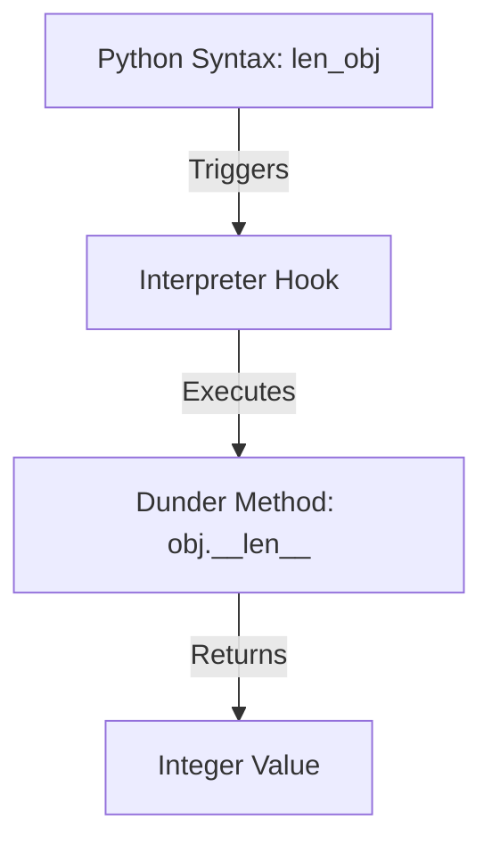
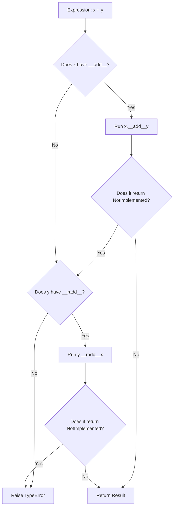

# Python OOP: Dunder Methods, Protocol hooks, & Operator Overloading

---

# 1. Definition

## Dunder Methods
**Dunder Methods** (short for **Double Underscore** methods, also referred to as **Magic Methods** or **Special Methods**) are predefined methods in Python that begin and end with double underscores (e.g., `__init__`, `__str__`, `__len__`).

## Protocol Integration
Dunder methods are not called directly by the programmer. Instead, they act as hooks that the Python interpreter invokes automatically under the hood when specific syntax operations (like addition `+`, list subscription `obj[0]`, printing, or length checking) are performed on custom objects.



---

# 2. Why Do We Need It?

### The Problem of Second-Class Custom Objects
Without dunder methods, custom class instances cannot integrate with Python's built-in operators and functions. You must write verbose, custom named methods for every basic operation.

```python
class Vector:
    def __init__(self, x: int, y: int):
        self.x = x
        self.y = y

    def add_vectors(self, other):
        return Vector(self.x + other.x, self.y + other.y)

v1 = Vector(1, 2)
v2 = Vector(3, 4)
v3 = v1.add_vectors(v2)  # Verbose, non-standard method call
```
* **Explanation**: Demonstrates how custom operations require custom-named methods instead of natural arithmetic operators.
* **Expected Output**: Compiles and runs, returning a new Vector instance.
* **Memory Explanation**: Instantiates Vector objects on the heap.
* **Time/Space Complexity**: $\mathcal{O}(1)$
* **Common Mistakes**: Naming arithmetic methods inconsistently across different classes (e.g., `add()`, `plus()`, `sum_val()`).
* **Best Practices**: Implement dunder methods like `__add__` to support standard operators.

#### Issues:
1. **Low Readability**: Mathematical operations become cluttered with chained method calls (e.g., `v1.add(v2).multiply(5)` instead of `(v1 + v2) * 5`).
2. **Standardization Failure**: Different developers use different names for common actions, making codebases hard to merge.
3. **Incompatibility with Built-in Functions**: You cannot pass custom objects to native functions like `len()`, `print()`, or list iterators.

---

# 3. Real-Life Analogies

### Analogy: The Universal Power Plug
Think of dunder methods as standard power sockets in a house:
* The house wiring (Python Interpreter) defines standard slots for 2-pin or 3-pin plugs (the Dunder Protocols).
* When you buy a television or a laptop (custom classes), they come with a standard plug interface (dunder methods like `__init__` or `__str__`).
* You do not need to rewrite the electrical grid of your house to plug in a new device; as long as the device implements the standard plug, it draws power immediately.

---

# 4. Syntax

```python
# 1. Custom Class with core Dunder methods
class Book:
    def __init__(self, title: str, pages: int):
        self.title = title
        self.pages = pages

    # 2. String representation for end-users
    def __str__(self) -> str:
        return f"'{self.title}' ({self.pages} pages)"

    # 3. Length query hook
    def __len__(self) -> int:
        return self.pages

    # 4. Addition operator overload
    def __add__(self, other) -> int:
        if isinstance(other, Book):
            return self.pages + other.pages
        return NotImplemented
```
* **Explanation**: A class implementing initializers, string formatting, length checks, and addition operations.
* **Expected Output**: Compiles and executes.
* **Memory Explanation**: Binds special dunder names in the `Book` class dictionary.
* **Time/Space Complexity**: $\mathcal{O}(1)$ operations.
* **Common Mistakes**: Returning a non-string type from `__str__`, which raises a `TypeError`.
* **Best Practices**: Use `isinstance` checks inside arithmetic dunders to handle mismatched operand types safely.

---

# 5. Syntax Breakdown

Let's dissect key dunder categories:

* **Initialization (`__init__`)**: Automatically invoked after `__new__` allocates memory for a new object.
* **String Casting (`__str__` / `__repr__`)**: Invoked by `print(obj)` or `str(obj)`.
* **Math Overloading (`__add__`, `__sub__`, `__mul__`)**: Intercepts arithmetic symbols.
* **Collections (`__len__`, `__getitem__`, `__setitem__`)**: Allows objects to behave like lists or dictionaries.

---

# 6. Memory Diagram

When we run `print(b)` where `b = Book("Python", 300)`:

```
CPython Method Resolution
=========================================================
| Syntax Operation   | Internal Interpreter Translation|
=========================================================
| print(b)           | sys.stdout.write(b.__str__())   |
| len(b)             | b.__len__()                     |
| b1 + b2            | b1.__add__(b2)                  |
=========================================================
```

* **Explanation**: The Python interpreter translates operators and built-in functions into calls to the corresponding dunder method in the object's class namespace dictionary.

---

# 7. Internal Working (Behind the Scenes)

## String Representation: `__str__` vs `__repr__`
Python has two different hooks to get a string representation of an object:
1. **`__str__` (Informal/User-friendly)**: Invoked by `print()` and `str()`. Focuses on readability for end-users.
2. **`__repr__` (Formal/Unambiguous)**: Invoked by debugging tools, interactive shells, and `repr()`. Focuses on being informative for developers (ideally showing valid Python code to recreate the object).
* **Fallback**: If `__str__` is not defined, Python falls back to calling `__repr__` as a default.

---

# 8. Rules

### Dunder Rules
1. **Strict Return Types**: Certain dunder methods enforce return types:
   * `__str__` and `__repr__` must return a string (`str`).
   * `__len__` must return a non-negative integer (`int`).
   * `__bool__` must return a boolean (`bool`).
2. **No Arbitrary Dunder Creation**: You should never invent custom names starting and ending with double underscores (e.g., `__my_custom_method__`); Python reserves all dunder namespaces for its own internal protocol changes.
3. **NotImplemented Fallback**: If an arithmetic dunder does not support the right-hand operand type, it should return `NotImplemented` instead of raising an error. This lets Python try fallback operations like `__radd__`.

---

# 9. Naming Conventions (PEP 8)

* Dunder methods must use lowercase letters with double underscores prefix and suffix.
* Never use single underscores as both prefix and suffix for special methods.

| Visibility Style | Bad Example | Good Example | Industry Standard |
| :--- | :--- | :--- | :--- |
| Magic Method | `__add_val__` | `__add__` | `__getitem__` |

---

# 10. Common Mistakes & Bugs

### Mistake 1: Returning Wrong Type from `__str__`
```python
# BUGGY CODE
class Test:
    def __str__(self):
        return 123  # Returns int instead of str!

t = Test()
print(t)  # Raises TypeError!
```
* **Expected Output**: `TypeError: __str__ returned non-string (type int)`
* **How to avoid**: Always cast the return value to a string: `return str(123)`.

---

### Mistake 2: Missing `isinstance` checks in operator overloading
```python
# BUGGY CODE
class Distance:
    def __init__(self, meters: float):
        self.meters = meters

    def __add__(self, other):
        return Distance(self.meters + other.meters)  # Assumes 'other' is always Distance

d = Distance(10)
print(d + 5)  # Raises AttributeError: 'int' object has no attribute 'meters'
```
* **Why it happens**: Adding an integer (`5`) fails because integers do not have a `.meters` attribute.
* **How to avoid**: Check operand types before processing:
```python
def __add__(self, other):
    if isinstance(other, Distance):
        return Distance(self.meters + other.meters)
    elif isinstance(other, (int, float)):
        return Distance(self.meters + other)
    return NotImplemented
```

---

# 11. Best Practices & Pythonic Code

* **Implement `__repr__` first**: Implementing `__repr__` ensures that both debugging printouts and standard `print()` calls work immediately.
```python
# Pythonic Representation
class Coordinate:
    def __init__(self, x: int, y: int):
        self.x = x
        self.y = y

    def __repr__(self) -> str:
        return f"Coordinate(x={self.x}, y={self.y})"
```

---

# 12. Interview Questions

### Q1. What is the difference between `__str__` and `__repr__`?
* **Answer**: 
  * `__str__` provides a readable, user-friendly representation of the object (informal string).
  * `__repr__` provides an unambiguous, detailed representation for debugging (formal string). It should ideally look like the Python code used to initialize the object. If `__str__` is omitted, Python falls back to `__repr__`.

---

### Q2. How can you make an object callable like a function?
* **Answer**: By implementing the `__call__` dunder method. When you write `obj()`, Python translates the call into `obj.__call__()`.
```python
class Greeter:
    def __call__(self, name):
         print(f"Hello, {name}!")
```

---

### Q3. Tricky Output Question
**What is the output of the following code?**
```python
class Vector:
    def __init__(self, val):
        self.val = val
    def __repr__(self):
        return f"Vector({self.val})"
    def __str__(self):
        return f"V:{self.val}"

v = Vector(10)
print([v])
```
* **Expected Output**: `[Vector(10)]`
* **Explanation**: When custom objects are displayed inside collection containers (like lists or tuples), Python uses `__repr__` to display them, even if `__str__` is defined.

---

# 13. Exam Points

* **`__init__`**: Object initializer method.
* **`__new__`**: Actual object creator method that returns a new instance.
* **`__del__`**: Destructor method invoked when reference count reaches 0.
* **`NotImplemented`**: Special constant returned to signal that an operator does not support a given type.

---

# 14. Real-World Examples

## Example 1: Bank Transaction Registry & Statement
```python
class Account:
    def __init__(self, owner: str, initial_balance: float):
        self.owner = owner
        self.balance = initial_balance
        self.transactions = []

    def add_transaction(self, amount: float) -> None:
        self.transactions.append(amount)
        self.balance += amount

    # 1. Clean end-user statement printout
    def __str__(self) -> str:
        return f"Account Statement: Owner={self.owner} | Balance=${self.balance:.2f}"

    # 2. Transaction count query via len()
    def __len__(self) -> int:
        return len(self.transactions)

    # 3. Retrieve transactions using index subscripts
    def __getitem__(self, index: int) -> float:
        return self.transactions[index]

# Execution
acc = Account("Saurabh Prakash", 1000.0)
acc.add_transaction(200.0)
acc.add_transaction(-50.0)

print(acc)
print(f"Total Transactions: {len(acc)}")
print(f"First Transaction: ${acc[0]}")
```
* **Explanation**: Integrates a custom bank account class with native Python functions and syntax operators.
* **Expected Output**:
  ```
  Account Statement: Owner=Saurabh Prakash | Balance=$1150.0
  Total Transactions: 2
  First Transaction: $200.0
  ```
* **Time Complexity**: $\mathcal{O}(1)$ operations.

---

# 15. Mini Practice

### Easy
Create a `Person` class with an `__init__` method, and implement `__str__` to print the person's name.

### Medium
Implement a class `Cart` containing a list of item prices. Overload `__len__` to return the number of items and `__add__` to merge two carts by combining their prices.

### Hard
Write a class `SecureConfig` that stores credentials in a dictionary. Implement `__getitem__` and `__setitem__` to allow reading and writing settings using dictionary subscript brackets, adding logging notifications to all access operations.

---

# 16. Summary Table

| Dunder Method | Target Operator / Function | Return Type Constraint | Key Use Case |
| :--- | :--- | :--- | :--- |
| **`__init__`** | Constructor call | `None` | Initializing attributes |
| **`__str__`** | `str()`, `print()` | `str` | Displaying user-friendly string |
| **`__repr__`** | `repr()`, container outputs | `str` | Displaying developer-friendly debug string |
| **`__len__`** | `len()` | Non-negative `int` | Querying item counts |
| **`__add__`** | Addition `+` | Any (or `NotImplemented`)| Operator overloading |

---

# 17. Cheat Sheet

```python
# String Representations
def __str__(self): return self.name
def __repr__(self): return f"Class({self.val})"

# Subscripts
def __getitem__(self, idx): return self.items[idx]
def __setitem__(self, idx, val): self.items[idx] = val
```

---

# 18. Flow Diagram



---

# 19. Comparison Table

| Feature | `__str__` | `__repr__` |
| :--- | :--- | :--- |
| **Intended Audience** | End Users (readable) | Developers / Debugging (unambiguous) |
| **Invocation Context**| `print(obj)`, `str(obj)` | `repr(obj)`, interactive shell prints, container displays |
| **Fallback Target** | Falls back to `__repr__` if missing | None (default output uses address memory) |

---

# 20. Things to Remember

> [!IMPORTANT]
> **Key takeaways on Dunder Methods:**
> 1. **Return correct types**: Dunder methods like `__str__` and `__len__` enforce strict type checking constraints.
> 2. **Never invent dunder names**: Avoid creating custom double-underscore method names to prevent conflicts with future Python releases.
