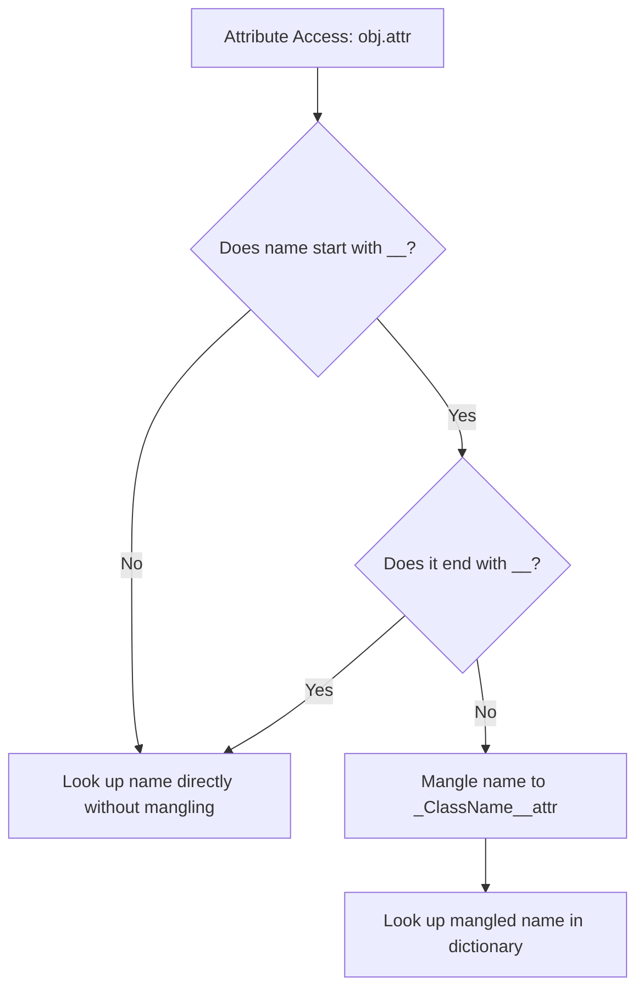

# Python OOP: Encapsulation, Access Modifiers, & Name Mangling

---

# 1. Definition

## Encapsulation
**Encapsulation** is the OOP mechanism of bundling data (attributes) and the code that operates on that data (methods) into a single logical unit called a **Class**. 

## Information Hiding
Encapsulation restricts direct access to some of an object's components. This is known as **Information Hiding**. It prevents the internal state of an object from being corrupted by external code, forcing all interactions to go through a well-defined public interface.

.png>)

---

# 2. Why Do We Need It?

### The Problem of Unvalidated Direct Modifications
Without encapsulation, any client code can access and modify an object's internal variables directly. This allows invalid or corrupt data to be set, breaking the object's internal rules.

```python
class BankAccount:
    def __init__(self, balance: float):
        self.balance = balance

account = BankAccount(100.0)
account.balance = -5000.0  # Invalid! Balance should not be negative
```
* **Explanation**: Demonstrates how unguarded public attributes permit illegal state transitions.
* **Expected Output**: Runs without raising errors, leaving the account in an invalid negative state.
* **Memory Explanation**: Directly updates the value of the float object reference at `self.balance` on the heap.
* **Time/Space Complexity**: $\mathcal{O}(1)$
* **Common Mistakes**: Leaving critical status variables public.
* **Best Practices**: Protect balance variables and enforce updates through validation methods.

#### Issues:
1. **Broken State Rules**: External code can bypass logical limits (like checking if a withdrawal exceeds the balance).
2. **Tight Coupling**: If you change the internal variable name or data structure (e.g., from a float to a dictionary list), all external code referencing that variable breaks.
3. **No Auditing**: You cannot log or intercept attribute access to monitor changes.

---

# 3. Real-Life Analogies

### Analogy: The Capsule Pill
* **Data and Code Packaging**: A medical capsule containing powder. The active ingredients (internal attributes and methods) are mixed and sealed inside the shell (the class).
* **The Public Interface**: You do not open the capsule and swallow the raw, bitter chemical powders directly. You swallow the sealed capsule as a single unit (public interface), which then dissolves and works internally.

### Analogy: The Bank ATM
* **Private State**: The cash vaults and ledger databases inside the ATM machine are private (`__cash_vault`).
* **Public Interface**: Customers cannot open the cabinet and take cash directly. They must use the public card reader and keypad interface. The ATM validates the card, checks the balance, and dispenses the cash securely.

---

# 4. Syntax

```python
# 1. Defining Public, Protected, and Private attributes
class Account:
    def __init__(self, owner: str, initial_balance: float):
        self.owner = owner                # Public
        self._routing_number = 12345       # Protected (convention)
        self.__balance = initial_balance   # Private (mangled)

    # 2. Getter property for read access
    @property
    def balance(self) -> float:
        return self.__balance

    # 3. Setter property for validated write access
    @balance.setter
    def balance(self, value: float) -> None:
        if value < 0:
            raise ValueError("Balance cannot be negative.")
        self.__balance = value
```
* **Explanation**: A class showcasing public, protected, and private access modifiers, along with Pythonic getter and setter properties.
* **Expected Output**: Compiles and executes.
* **Memory Explanation**: Python renames `__balance` to `_Account__balance` in the instance's dictionary namespace.
* **Time Complexity**: $\mathcal{O}(1)$ for lookup.
* **Space Complexity**: $\mathcal{O}(1)$ auxiliary space.
* **Common Mistakes**: Expecting protected attributes (`_routing_number`) to raise access errors at runtime.
* **Best Practices**: Use `@property` decorators to manage attribute read/write permissions.

---

# 5. Syntax Breakdown

Let's dissect Python's access modifiers:

* **`self.name` (No Prefix)**: **Public**. Accessible from inside the class, by inherited classes, and by external instances.
* **`self._age` (Single Underscore)**: **Protected**. Treats the variable as protected by convention. Python does not enforce this block; it serves as a warning to developers not to access it from outside class inheritance trees.
* **`self.__salary` (Double Underscore)**: **Private**. Triggers **Name Mangling**, making it inaccessible via its raw identifier name from outside the class.

---

# 6. Memory Diagram

When we run `acc = Account("Saurabh", 5000.0)`:

```
acc.__dict__ (Instance Namespace Dictionary)
===================================================
| Key String             | Value Pointer          |
===================================================
| 'owner'                | 0x100A ("Saurabh")     |
| '_routing_number'      | 0x200B (int: 12345)    |
| '_Account__balance'    | 0x300C (float: 5000.0) |
===================================================
```

* **Explanation**: The key `'__balance'` does not exist in the dictionary. It is renamed to `'_Account__balance'` (mangled), preventing direct access via `acc.__balance`.

---

# 7. Internal Working (Behind the Scenes)

## Name Mangling Mechanics
When Python compiles a class definition:
1. It scans identifier names. Any name starting with two underscores and not ending with two underscores (e.g., `__private_val`) is processed.
2. The compiler prepends the class name with a single underscore to the variable name: `_ClassName__private_val`.
3. This is done to prevent name clashes in inheritance hierarchies. If a child class also defines a private variable with the same name, they map to separate mangled keys: `_Child__private_val` vs `_Parent__private_val`.

---

# 8. Rules

### Encapsulation Rules
1. **Dunder Names Exclusion**: Special double-underscore identifiers that both start and end with two underscores (like `__init__`, `__str__`, `__dict__`) are **not** mangled.
2. **Accessing Mangled Names**: You can still access a private variable from outside the class using its mangled name (e.g., `obj._ClassName__variable`). Python does not guarantee absolute security; it prevents accidental access.
3. **Protected Convention**: Always respect single-underscore attributes; do not read or write to them directly from external client scripts.

---

# 9. Naming Conventions (PEP 8)

* Private attributes: Use lowercase snake_case prefixed with double underscores (e.g., `__account_pin`).
* Protected attributes: Use lowercase snake_case prefixed with a single underscore (e.g., `_connection_status`).

| Attribute Type | Bad Example | Good Example | Industry Standard |
| :--- | :--- | :--- | :--- |
| Private | `self.pin__` | `self.__pin` | `self.__user_password_hash` |

---

# 10. Common Mistakes & Bugs

### Mistake 1: Accessing Private Variables Directly
```python
# BUGGY CODE
class Demo:
    def __init__(self):
        self.__secret = 42

d = Demo()
print(d.__secret)  # Raises AttributeError!
```
* **Expected Output**: `AttributeError: 'Demo' object has no attribute '__secret'`
* **How to avoid**: Access it using a getter method or the property decorator.

---

### Mistake 2: Declaring Pseudo-Private Variables with Trailing Underscores
```python
# BUGGY CODE
class User:
    def __init__(self):
        self.__role__ = "Admin"  # Trailing double underscores!

u = User()
print(u.__role__)  # Works! No mangling applied
```
* **Why it happens**: Python ignores names ending with double underscores to reserve them for built-in magic methods.
* **How to avoid**: Ensure there are no trailing double underscores (e.g., use `self.__role`).

---

# 11. Best Practices & Pythonic Code

* **Use `@property` for Read-Only State**: Omit the `.setter` definition to make an attribute read-only.
```python
# Pythonic Read-Only Property
class Circle:
    def __init__(self, radius: float):
        self.__radius = radius

    @property
    def radius(self) -> float:
        return self.__radius  # Read-only; cannot be reassigned externally
```

---

# 12. Interview Questions

### Q1. What is Name Mangling in Python?
* **Answer**: Name mangling is an automatic compiler transformation that renames variables starting with double underscores (and no trailing double underscores) to include a single underscore and the class name prefix (e.g., `__val` becomes `_ClassName__val`). This prevents naming collisions in inheritance hierarchies.

---

### Q2. Does Python support true private variables?
* **Answer**: No. Python's private attributes are only obfuscated through name mangling. Any external code can still access or modify a private variable by referencing its mangled name (e.g., `obj._ClassName__variable`). Python prioritizes developer responsibility over strict runtime restrictions.

---

### Q3. Tricky Output Question
**What is the output of the following code?**
```python
class Parent:
    def __init__(self):
        self.__value = 10

class Child(Parent):
    def __init__(self):
        super().__init__()
        self.__value = 20

c = Child()
print(c._Parent__value, c._Child__value)
```
* **Expected Output**: `10 20`
* **Explanation**: Because of name mangling, the private variables do not overwrite each other. They are stored as separate keys `_Parent__value` and `_Child__value` in the object's instance dictionary.

---

# 13. Exam Points

* **Encapsulation**: Bundling data and methods into a single class unit.
* **Getter/Setter**: Methods used to inspect and modify private variables safely.
* **`_` prefix**: Signifies protected visibility by convention.
* **`__` prefix**: Triggers name mangling for private visibility.

---

# 14. Real-World Examples

## Example 1: ATM Balance Protection System
```python
class BankAccount:
    def __init__(self, owner: str, balance: float):
        self.owner = owner
        self.__balance = balance  # Private attribute

    def deposit(self, amount: float) -> None:
        if amount <= 0:
            raise ValueError("Deposit amount must be positive.")
        self.__balance += amount

    def withdraw(self, amount: float) -> None:
        if amount <= 0:
            raise ValueError("Withdrawal must be positive.")
        if amount > self.__balance:
            raise ValueError("Insufficient funds.")
        self.__balance -= amount

    @property
    def check_balance(self) -> float:
        return self.__balance

# Execution
account = BankAccount("Saurabh Prakash", 1000.0)
account.deposit(500.0)
account.withdraw(200.0)
print(f"Current Balance: ${account.check_balance}")
```
* **Explanation**: Protects the account balance using validation rules in deposit and withdrawal methods.
* **Expected Output**:
  ```
  Current Balance: $1300.0
  ```
* **Time Complexity**: $\mathcal{O}(1)$ operations.

---

# 15. Mini Practice

### Easy
Create a class `Student` with a private attribute `__name`. Write a getter method to retrieve it.

### Medium
Create a class `Employee` with a private attribute `__salary`. Use the `@property` decorator to implement a getter and a setter that rejects negative values.

### Hard
Write a class hierarchy where both the parent and child define a private variable with the same name. Print the instance's `__dict__` to show how name mangling separates them.

---

# 16. Summary Table

| Access Modifier | Prefix | Accessible Outside Class | Enforced by Interpreter |
| :--- | :--- | :--- | :--- |
| **Public** | None | Yes | No |
| **Protected** | `_` (Single Underscore) | Yes (By convention: No) | No |
| **Private** | `__` (Double Underscore)| No (Accessible via mangled name)| Yes (via name mangling) |

---

# 17. Cheat Sheet

```python
# Declare modifiers
self.public = 1
self._protected = 2
self.__private = 3

# Mangled access (avoid in production)
print(obj._ClassName__private)
```

---

# 18. Flow Diagram



---

# 19. Comparison Table

| Feature | Python Encapsulation | Java/C++ Encapsulation |
| :--- | :--- | :--- |
| **Access Control** | Convention & name mangling | Strict compiler enforcement |
| **Security** | Accessible via mangled name | Inaccessible outside class bounds |

---

# 20. Things to Remember

> [!IMPORTANT]
> **Key takeaways on Encapsulation:**
> 1. **No true private variables**: Name mangling renames variables but does not lock them down.
> 2. **Use properties**: Use the `@property` decorator to control read and write access to class attributes.