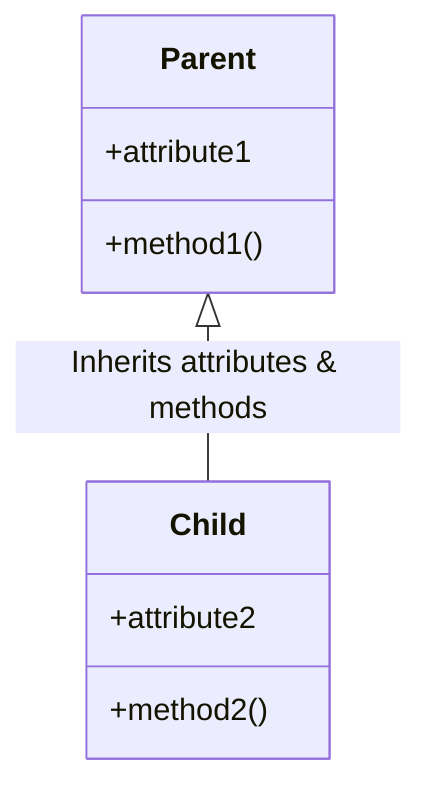
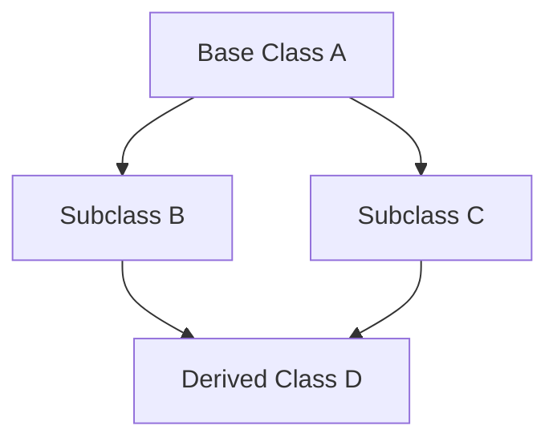
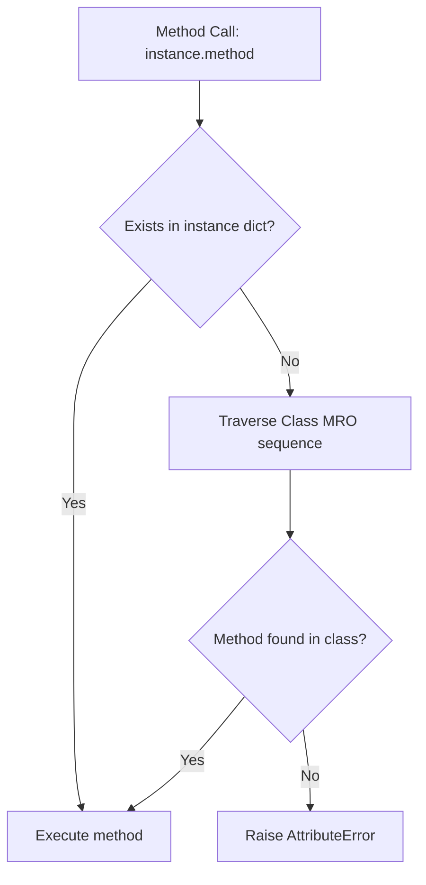

# Python OOP: Inheritance, MRO, & Class Hierarchies

---

# 1. Definition

## Inheritance
**Inheritance** is a fundamental mechanism of Object-Oriented Programming (OOP) that allows a new class (known as the **Child**, **Subclass**, or **Derived Class**) to acquire the attributes and methods of an existing class (known as the **Parent**, **Superclass**, or **Base Class**).

## Purpose
Inheritance creates a logical relationship hierarchy between classes. By deriving new classes from existing ones, you establish an **"is-a" relationship** (e.g., a `Manager` **is-a** `Employee`).



---

# 2. Why Do We Need It?

### The Problem of Redundant Class Definitions
Without inheritance, defining similar but specialized entities requires copying and pasting identical code blocks across multiple class schemas.

```python
class Developer:
    def __init__(self, name: str, salary: float, language: str):
        self.name = name
        self.salary = salary
        self.language = language

class Manager:
    def __init__(self, name: str, salary: float, department: str):
        self.name = name
        self.salary = salary
        self.department = department
```
* **Explanation**: Demonstrates redundant declarations of `name` and `salary` attributes in separate classes.
* **Expected Output**: Compiles and executes.
* **Memory Explanation**: Instantiates duplicate string and float attribute references on the heap for both classes.
* **Time Complexity**: $\mathcal{O}(1)$ allocation.
* **Space Complexity**: $\mathcal{O}(1)$ per instance.
* **Common Mistakes**: Copy-pasting code and forgetting to update self-references or types.
* **Best Practices**: Refactor shared attributes into a common base class.

#### Issues:
1. **Code Duplication**: Shared behaviors (like calculation methods) must be rewritten for each class.
2. **Maintenance Overhead**: Modifying a shared behavior requires editing every separate class.
3. **No Polymorphic Typing**: The program cannot treat managers and developers under a single unified class label (e.g., `Employee`).

---

# 3. Real-Life Analogies

### Analogy: The Vehicle Registry
* **Base Class (`Vehicle`)**: Defines properties that *all* vehicles share: engine type, speed, capacity, and the action `drive()`.
* **Derived Class (`Car`)**: Inherits all vehicle properties but adds car-specific features: trunk volume and the action `open_trunk()`.
* **Derived Class (`Truck`)**: Inherits vehicle properties but adds truck-specific features: towing capacity and cargo bed dimensions.
* **Benefits**: You do not have to redefine what an engine or a steering wheel is for every new vehicle type; you inherit them from the base `Vehicle` class.

---

# 4. Syntax

```python
# 1. Base Parent Class
class Parent:
    def speak(self) -> None:
        print("I can speak!")

# 2. Single Level Child Class
class Child(Parent):
    pass

# 3. Execution
c = Child()
c.speak()
```
* **Explanation**: A basic single-inheritance syntax where the child class inherits all methods of the parent.
* **Expected Output**:
  ```
  I can speak!
  ```
* **Memory Explanation**: Object `c` points to the `Child` class dictionary, which points to the `Parent` class dictionary to resolve the `speak` method.
* **Time Complexity**: $\mathcal{O}(1)$ method lookup.
* **Space Complexity**: $\mathcal{O}(1)$ auxiliary space.
* **Common Mistakes**: Passing self as an argument to class parameters in the class header.
* **Best Practices**: Keep base classes generic and focused.

---

# 5. Syntax Breakdown

Let's dissect subclass syntax:

```python
class Child(Parent):
```
* **`class Child`**: Declares the new subclass identifier.
* **`(Parent)`**: The parameter-like slot in the class header. This instructs Python to set `Parent` as the base class for `Child` (stored in the child's `__bases__` tuple).

---

# 6. Memory Diagram

When you instantiate `c = Child()`:

```
STACK                                      HEAP (Class Definitions & Objects)
======================                     ============================================
|  Name   | Reference|                     | Address  | Object Type   | Target / bases|
======================                     ============================================
|   c     |  0x500A  | ------------------> |  0x500A  | Child Instance| class: 0x200B |
======================                     --------------------------------------------
                                           |  0x200B  | Child Class   | bases: 0x100A |
                                           --------------------------------------------
                                           |  0x100A  | Parent Class  | bases: object |
                                           ============================================
```

* **Explanation**: The instance `c` contains its instance attributes. If a method is not found in `c`'s instance namespace or the `Child` class namespace, Python follows the base class pointer `0x100A` to locate the method in the `Parent` class namespace.

---

# 7. Internal Working (Behind the Scenes)

## Method Resolution Order (MRO)
Python resolves method calls using a sequence called the **Method Resolution Order (MRO)**, calculated using the **C3 Linearization Algorithm**.

1. When you call `c.speak()`, Python looks up the method in `c.__dict__`.
2. If it is missing, Python checks the classes in the order defined by the class's MRO.
3. You can inspect this order using the `__mro__` attribute or `.mro()` method:

```python
print(Child.__mro__)
# Output: (<class '__main__.Child'>, <class '__main__.Parent'>, <class 'object'>)
```

---

# 8. Rules

### Inheritance Rules
1. **Constructor Inheritance**: If a child class does not define its own `__init__` constructor, it automatically inherits the parent class's constructor.
2. **`super()` Function**: If a child defines its own constructor, it **must** call `super().__init__()` to initialize the parent class attributes.
3. **MRO Precedence**: Multiple inheritance searches parents in left-to-right order as defined in the class header.

---

# 9. Naming Conventions (PEP 8)

* Parent and Child classes must be written in **PascalCase**.
* Choose subclass names that show their specialization relationship (e.g., `SavingsAccount` is derived from `Account`).

| Class Type | Bad Example | Good Example | Industry Standard |
| :--- | :--- | :--- | :--- |
| Subclass | `saving_account` | `SavingsAccount` | `SavingsBankAccount` |

---

# 10. Common Mistakes & Bugs

### Mistake 1: Forgotten Parent Constructor Initialization
```python
# BUGGY CODE
class Parent:
    def __init__(self, name: str):
        self.name = name

class Child(Parent):
    def __init__(self, name: str, age: int):
        self.age = age  # Missing super().__init__(name)

c = Child("Saurabh", 21)
print(c.name)  # Raises AttributeError!
```
* **Expected Output**: `AttributeError: 'Child' object has no attribute 'name'`
* **How to avoid**: Always call `super().__init__(args)` inside the child constructor before setting child-specific attributes.

---

### Mistake 2: The Diamond Problem in Multiple Inheritance
The Diamond problem occurs when two classes inherit from a common base class, and a fourth class inherits from both of them.



In Python, the C3 Linearization algorithm handles this safely by ensuring:
* Subclasses are checked before parents.
* The original ordering of base classes is preserved.
* Duplicate base classes are visited only after checking all their subclasses.

---

# 11. Best Practices & Pythonic Code

* **Use `super()`** instead of hardcoded class calls to allow dynamic MRO resolution.
```python
# Pythonic super() call
class Child(Parent):
    def __init__(self, name: str, age: int):
        super().__init__(name)  # Resolved dynamically via MRO
        self.age = age
```

---

# 12. Interview Questions

### Q1. What is the difference between `super().__init__()` and `Parent.__init__(self)`?
* **Answer**: 
  * `super().__init__()` dynamically resolves the parent constructor call order based on the current class's MRO. This is essential for cooperative multiple inheritance and avoiding duplicate calls.
  * `Parent.__init__(self)` explicitly binds the call to a specific parent class, bypassing the MRO. This can lead to duplicate initializations in complex inheritance trees.

---

### Q2. How does Method Resolution Order (MRO) work in multiple inheritance?
* **Answer**: Python uses the C3 Linearization algorithm to build a flat list of classes representing the search order. It ensures that child classes are searched before parent classes, and multiple parent classes are searched in the left-to-right order they are listed in the class header.

---

### Q3. Tricky Output Question
**What is the output of the following cooperative multiple inheritance code?**
```python
class A:
    def speak(self):
        print("A")

class B(A):
    def speak(self):
        print("B")
        super().speak()

class C(A):
    def speak(self):
        print("C")
        super().speak()

class D(B, C):
    def speak(self):
        print("D")
        super().speak()

d = D()
d.speak()
```
* **Expected Output**:
  ```
  D
  B
  C
  A
  ```
* **Explanation**: The MRO of class `D` is `[D, B, C, A, object]`. When `B` calls `super().speak()`, Python looks up the next class in `D`'s MRO, which is `C`, rather than jumping directly to `A`.

---

# 13. Exam Points

* **Subclass**: A class derived from another class.
* **`super()`**: A proxy object that delegates method calls to a parent or sibling class in the MRO.
* **`isinstance(obj, Class)`**: Returns `True` if `obj` is an instance of `Class` or any subclass derived from it.
* **`issubclass(Sub, Base)`**: Returns `True` if class `Sub` is a subclass of `Base`.

---

# 14. Real-World Examples

## Example 1: Multilevel Inheritance Configuration System
```python
class DatabaseConfig:
    def __init__(self, host: str, port: int):
        self.host = host
        self.port = port

class PostgresConfig(DatabaseConfig):
    def __init__(self, host: str, port: int, schema: str):
        super().__init__(host, port)
        self.schema = schema

class ProductionPostgresConfig(PostgresConfig):
    def __init__(self, host: str, port: int, schema: str, ssl_mode: bool):
        super().__init__(host, port, schema)
        self.ssl_mode = ssl_mode

# Execution
prod_db = ProductionPostgresConfig("localhost", 5432, "users_schema", True)
print(f"Db Host: {prod_db.host}, SSL: {prod_db.ssl_mode}")
```
* **Explanation**: Reuses constructor logic across three levels of class specialization.
* **Expected Output**:
  ```
  Db Host: localhost, SSL: True
  ```
* **Time Complexity**: $\mathcal{O}(1)$ construction.
* **Space Complexity**: $\mathcal{O}(1)$ auxiliary space.

---

# 15. Mini Practice

### Easy
Create a `Person` class with a `speak` method, and inherit it in a `Student` class. Verify that the student instance can call the `speak` method.

### Medium
Create a base class `Employee` with dynamic attribute initialization, and subclass it as `Developer` using `super().__init__()` to add a specialization language attribute.

### Hard
Write a cooperative multiple inheritance system with classes `Father`, `Mother`, and `Child` that demonstrates how the Method Resolution Order resolves method calls with the same name.

---

# 16. Summary Table

| Inheritance Type | Base Class Count | Derived Class Count | Key Use Case |
| :--- | :--- | :--- | :--- |
| **Single** | 1 | 1 | Simple specialization |
| **Multiple** | 2+ | 1 | Combining independent features |
| **Multilevel** | 1 (per level) | 1 (per level) | Deep conceptual hierarchies |

---

# 17. Cheat Sheet

```python
# Single inheritance
class Child(Parent):
    pass

# Superclass constructor call
class Child(Parent):
    def __init__(self, val1, val2):
        super().__init__(val1)
        self.val2 = val2

# Inspect Class Search Sequence
print(Child.mro())
```

---

# 18. Flow Diagram



---

# 19. Comparison Table

| Feature | Inheritance ("is-a") | Composition ("has-a") |
| :--- | :--- | :--- |
| **Relationship** | Child class extends Parent class | Class references instance of another class |
| **Coupling** | High coupling (changes propagate down) | Loose coupling (components are swap-ready) |

---

# 20. Things to Remember

> [!IMPORTANT]
> **Key takeaways on Inheritance:**
> 1. **Always call `super()`**: Failing to call parent constructors leaves inherited attributes uninitialized.
> 2. **Check the MRO**: Use `Class.mro()` to trace how Python resolves method calls in multiple inheritance.