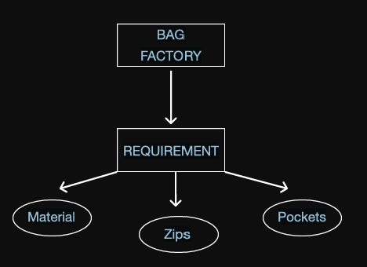

# 🐍 Python OOPs - Lecture 03: Understanding Objects & Instantiation

Welcome to Lecture 03, class! 🎓

Now that we understand **Classes** (the blueprints), it is time to look at **Objects**—the actual concrete entities created from those blueprints. Let's explore how they are formed and how they use the "powers" of the class.

---

## 🎒 The Bag Factory Analogy

To understand what an object is, let's use the bag manufacturing example we drew on the board today:



### The Concept:
1.  **The Blueprint (Class):** The bag factory defines a set of **requirements**—every bag must specify its *Material*, number of *Zips*, and number of *Pockets*.
2.  **The Objects:** Brands like **Reebok** or **Campus** send in their specific specifications to build physical bags:
    *   **Reebok Bag:** Material = Polyester, Zips = 4, Pockets = 3.
    *   **Campus Bag:** Material = Canvas, Zips = 3, Pockets = 2.
    
Both bags are made using the same factory blueprint, but they are separate physical **objects** with their own unique attributes.

---

## ⚙️ Object Syntax: Creating an Object (Instantiation)

Creating an object in Python is simple. You call the class name followed by parentheses `()` and assign it to a variable. That variable becomes your object (or instance).

> [!IMPORTANT]
> **Accessing Class Powers:**
> Once instantiated, the object inherits all the attributes (variables) and methods (functions) defined inside its class. We access them using the **dot (`.`) operator**.

---

## 🍎 Classroom Code Example

Here is the code snippet we analyzed in class today:

```python
class Fruit:
    name = "Apple" # Attribute defined in the class

# 1. Creating an object of class Fruit
f = Fruit()

# 2. Accessing the attribute using the object and printing it
print(f.name) # Output: Apple
```

### Professor's Code Breakdown:
*   `f = Fruit()`: We created a new object named `f` from the `Fruit` class template.
*   `f.name`: We used the dot operator to query the `name` attribute belonging to the object `f`.

---

## 💡 Key Takeaway: Independence of Objects

When we create multiple objects from the same class, each object is independent. If you change the attribute of one object, it does not affect the other:

```python
# Creating two different fruit objects
fruit1 = Fruit()
fruit2 = Fruit()

# Modifying the attribute of fruit2
fruit2.name = "Mango"

print(fruit1.name) # Output: Apple (unchanged)
print(fruit2.name) # Output: Mango (changed)
```

---

> [!TIP]
> **Recommended Reference:**
> To learn more about memory allocation of objects, check out standard tutorials on **Sheryians Coding School** or check python visualizer tools online.

---

## 📝 Professor's Homework Challenge
1. Write a class named `Laptop` with attributes `brand` and `ram` (e.g., `8GB`).
2. Create two objects: `laptop1` (brand = `"Dell"`) and `laptop2` (brand = `"HP"`).
3. Print the specifications of both laptops using the dot notation.

See you in the next session where we will introduce the **Constructor (`__init__`)** method in depth! 🚀

---

# 🔥 Missing Object Concepts

## What is an Object?
An **object (instance)** is the real implementation of a class.

## Object Creation
```python
obj1 = Car()
obj2 = Car()
obj3 = Car()
```
A single class can create **unlimited objects**.

## Memory
Every object has its own memory.
Changing one object's instance attribute doesn't affect another.

## Accessing Members
```python
obj.attribute
obj.method()
```

## Identity
```python
id(obj)
type(obj)
```

## Multiple Objects Example
```python
class Student:
    college = "GIET"

s1 = Student()
s2 = Student()

print(s1.college)
print(s2.college)
```

## Important Points
- Objects communicate through methods.
- Objects are independent.
- `obj = ClassName()` is called **Instantiation**.
