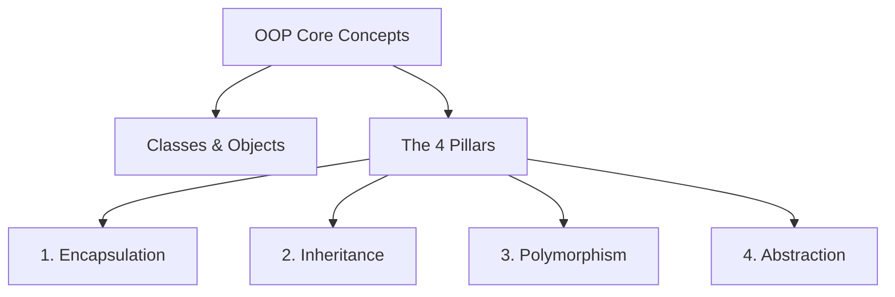

# 🐍 Python OOPs - Lecture 01: Introduction to Object-Oriented Programming

Welcome, class! 🎓 

Below are the upgraded and structured notes from our first session on **Object-Oriented Programming (OOP)** in Python. A special thanks to our student coordinator for compiling the rough draft. 

This guide will walk you through the evolution of programming paradigms—from simple commands to objects—and lay down the foundation for the rest of this chapter.

---

## 🏛️ The Evolution of Programming Paradigms

Before we jump into OOP, we must understand *why* it exists. Let's look at the three major programming approaches we use in Python by solving a simple problem: **Adding two numbers and managing data.**

### 1. The Imperative (Procedural) Approach
In the beginning, we wrote code line-by-line, executing instruction after instruction.

*   **How it works:** We declare variables directly and perform operations on them.
*   **Code Example:**
    ```python
    # Adding two numbers
    num1 = 5
    num2 = 10
    result1 = num1 + num2
    print(f"Result 1: {result1}")

    # What if we need to add two different numbers? We must declare new variables!
    num3 = 20
    num4 = 30
    result2 = num3 + num4
    print(f"Result 2: {result2}")
    ```
*   **The Limitation:** ⚠️ **Redundancy.** If we have 100 pairs of numbers, we would end up writing 200 variables and repetitive arithmetic statements. It becomes highly unmanageable as the program grows.

---

### 2. The Functional Approach
To solve the redundancy of the imperative approach, we introduced **Functions**. This is the functional (or modular) programming paradigm.

*   **How it works:** We wrap the logic inside a reusable block of code (a function) that accepts inputs (arguments) and returns an output.
*   **Code Example:**
    ```python
    # Defining a reusable function
    def add_numbers(a, b):
        return a + b

    # Now we can add multiple pairs easily without duplicating the logic
    print(f"Result 1: {add_numbers(5, 10)}")
    print(f"Result 2: {add_numbers(20, 30)}")
    print(f"Result 3: {add_numbers(100, 200)}")
    ```
*   **The Advantage:** Reusability! We no longer need new variables or code blocks for every execution.
*   **The Limitation:** While functions are great, they keep **data** (variables) and **behavior** (functions) separate. As applications grow complex (e.g., building a game, a banking system, or a database application), managing which function modifies which data becomes a chaotic web of code.

---

### 3. The Object-Oriented Programming (OOP) Approach
This brings us to **OOP**. Instead of treating a program as a list of instructions or a series of functions, OOP models programs after **real-world entities (objects)**.

> [!NOTE]
> **What is OOP?**
> Object-Oriented Programming System (OOPS) is a programming paradigm based on the concept of **"objects"**, which bundle both **data** (referred to as *attributes/properties*) and **behavior** (referred to as *methods/functions*) together.

By grouping related data and behaviors into a single unit, our code becomes much more modular, self-contained, and easier to scale.

*   **How it works:** We define a `class` (a blueprint) and then create an `object` (an instance) of that class. Let's look at the actual code snippet we wrote on the blackboard in class:
*   **Code Example:**
    ```python
    # Classroom Example: Adding numbers using OOP
    class Addition:
        def __init__(self, a, b):
            # This constructor is called automatically when we instantiate the class
            print(a + b)

    # Creating an object of class Addition (instantiation)
    obj = Addition(12, 12)
    ```
*   **Professor's Lecture Note:** 💡 When `Addition(12, 12)` is called, Python automatically invokes the special `__init__` method (the constructor). It takes `12` and `12` as arguments and prints their sum (`24`). We will discuss constructors, `__init__`, and the `self` keyword in detail next class.

---

## 🧭 The Core Concepts of OOP (A Quick Road Map)

Don't worry if this feels a bit abstract right now! We will cover each of these in detail over the next few classes. Here is a high-level map of what we are going to learn:



### 1. Classes and Objects
*   **Class:** A blueprint or template for creating objects. (e.g., A general blueprint of a `Car`).
*   **Object:** A specific instance of a class. (e.g., Your specific red `Tesla` car with its own speed, battery level, etc.).

### 2. The Four Pillars of OOP
1.  **Encapsulation:** Binding data and methods that operate on that data inside a single unit (class) and restricting direct access to some of the object's components.
2.  **Inheritance:** Allowing a new class (child) to adopt attributes and methods of an existing class (parent), promoting code reuse.
3.  **Polymorphism:** The ability of different classes to respond to the same method call in their own unique way (e.g., both a `Dog` and a `Cat` have a `make_sound()` method, but one barks and the other meows).
4.  **Abstraction:** Hiding complex implementation details and showing only the essential features to the user.

---

## 📊 Paradigm Comparison

Here is a quick summary table to help you study for the exams:

| Feature | Imperative Approach | Functional Approach | Object-Oriented Approach |
| :--- | :--- | :--- | :--- |
| **Focus** | Step-by-step instructions | Functions and expressions | Real-world entities (Objects) |
| **Data & Logic** | Scattered throughout | Kept separate | Bundled together (Attributes & Methods) |
| **Reusability** | Very low | High (via functions) | Excellent (via inheritance and objects) |
| **Scalability** | Hard to maintain for large apps | Moderate | Highly scalable for complex enterprise systems |

---

> [!TIP]
> **Recommended Resource:**
> During class, some of you mentioned learning resources. If you want visual walkthroughs, check out channels like **Sheryians Coding School** or official Python documentation for extra reading!

---

## 📝 Professor's Homework Challenge
To prepare for Class 2, write a simple Python script containing a class called `Student`. Give it two attributes: `name` and `grade`, and a method `display_info()` that prints them. We will start the next lecture by reviewing your code!

See you in the next lecture! 🚀

---

# 🔥 Must Know Basics Missing

## Why OOP Exists
- Better code organization
- Reusability
- Scalability
- Security
- Easy maintenance

## Real World Mapping
Object → Real thing

Attribute → Properties

Method → Behaviour

Class → Blueprint

## OOP Flow

Problem → Class Design → Create Objects → Objects interact

## Advantages
- Code Reuse
- Easy Debugging
- Team Collaboration
- Better Project Structure

## Disadvantages
- Slightly more memory
- Learning curve
- Overkill for tiny scripts

## OOP Terminology
- Class
- Object
- Instance
- Attribute
- Method
- Constructor
- Encapsulation
- Inheritance
- Polymorphism
- Abstraction

## Interview Questions
- Why OOP over functions?
- Is Python fully OOP?
- Can Python work without OOP?
