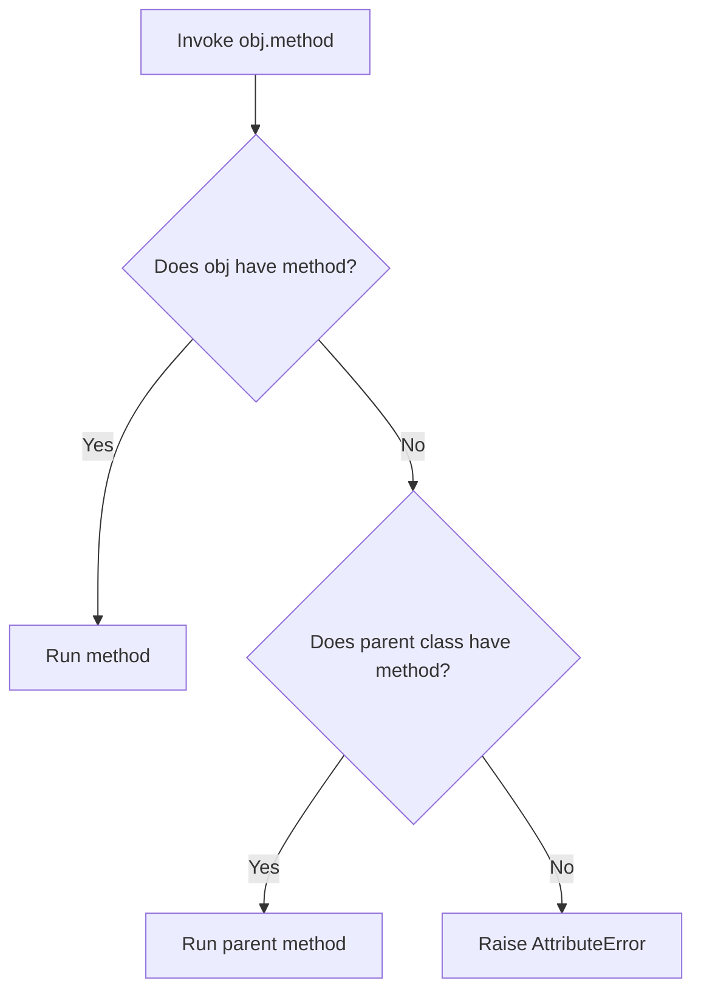

# Python OOP: Polymorphism, Late Binding, & Duck Typing

---

# 1. Definition

## Polymorphism
**Polymorphism** (from the Greek words *poly* meaning "many" and *morphe* meaning "form") is an Object-Oriented Programming (OOP) concept that allows different object classes to be accessed through the same interface or method name, with each object class implementing its own unique behavior.

## Types of Polymorphism
1. **Compile-Time Polymorphism (Static Binding)**: Resolved during compile time. Examples include Method Overloading and Operator Overloading. *Python does not support traditional compile-time method overloading natively.*
2. **Run-Time Polymorphism (Dynamic Binding)**: Resolved during execution time. The primary mechanism is **Method Overriding**.
3. **Duck Typing**: A dynamic typing paradigm where an object's suitability is determined by the presence of certain methods and properties, rather than its inheritance pedigree.

.png>)

---

# 2. Why Do We Need It?

### The Problem of Rigid Type Conditional Checks
Without polymorphism, write operations that manage different object types must rely on complex conditional checks (`if-elif-else` or `isinstance`) to execute type-specific logic.

```python
class Dog:
    def bark(self):
        print("Bark!")

class Cat:
    def meow(self):
        print("Meow!")

def make_sound(animal):
    if isinstance(animal, Dog):
        animal.bark()
    elif isinstance(animal, Cat):
        animal.meow()
```
* **Explanation**: Demonstrates rigid conditional checking to execute methods, violating the Open-Closed Principle.
* **Expected Output**: Compiles and executes.
* **Memory Explanation**: Conditional checks read class pointers on the heap.
* **Time Complexity**: $\mathcal{O}(N)$ where $N$ is type count.
* **Space Complexity**: $\mathcal{O}(1)$
* **Common Mistakes**: Forgetting to update the conditional check when adding a new class.
* **Best Practices**: Refactor to use a common interface.

#### Issues:
1. **Violation of Open-Closed Principle**: Adding a new animal class (e.g., `Cow`) requires modifying the `make_sound` checker function.
2. **Tight Coupling**: The caller function must know the internal method names (`bark`, `meow`) of every class.
3. **Brittle Code**: Renaming a method in one class crashes the conditional lookup.

---

# 3. Real-Life Analogies

### Analogy: The Power Button
Think of a standard electrical power button switch on a wall:
* The action is identical: you press the button (Single interface).
* If a light bulb is connected, pressing the button turns on light (Form 1).
* If a ceiling fan is connected, pressing the button spins the blades (Form 2).
* If a phone charger is connected, pressing the button charges the battery (Form 3).
* The button does not need to know *what* is connected to it; it only sends the power signal, and the connected device executes its own behavior.

---

# 4. Syntax

```python
# 1. Method Overriding (Run-time Polymorphism)
class Animal:
    def sound(self) -> None:
        print("Animal makes a sound")

class Dog(Animal):
    def sound(self) -> None:
        print("Dog barks")

# 2. Duck Typing (No Inheritance Required)
class Duck:
    def talk(self) -> None:
        print("Quack!")

class Human:
    def talk(self) -> None:
        print("Hello!")

def make_it_talk(obj) -> None:
    obj.talk()  # Doesn't care about type, only that talk() exists
```
* **Explanation**: Demonstrates both inheritance-based method overriding and structural duck typing.
* **Expected Output**: Compiles and executes.
* **Memory Explanation**: Python looks up method bindings dynamically at runtime via the object's type reference pointer.
* **Time Complexity**: $\mathcal{O}(1)$ lookup.
* **Space Complexity**: $\mathcal{O}(1)$ auxiliary space.
* **Common Mistakes**: Assuming subclasses must inherit from a common base class to achieve polymorphic behavior in Python.
* **Best Practices**: Use structural duck typing for simple interfaces and inheritance for code reuse.

---

# 5. Syntax Breakdown

Let's dissect the Duck Typing execution:

```python
def make_it_talk(obj):
    obj.talk()
```
* **`obj`**: An un-typed parameter reference. Can accept an instance of *any* class.
* **`obj.talk()`**: Python attempts to resolve the name `"talk"` in the object's namespace at runtime. If the method exists, it runs; otherwise, it raises an `AttributeError`.

---

# 6. Memory Diagram

When we invoke `make_it_talk(d)` (where `d` is a `Duck`) vs `make_it_talk(h)` (where `h` is a `Human`):

```
CALL STACK (make_it_talk)                  HEAP (Object Lookup Tables)
=========================                  ===================================
| Param  | Target Address|                 | Address | Class Type | Namespace|
=========================                  ===================================
|  obj   | 0x500A (Duck) | --------------> | 0x500A  | Duck       | talk()   |
-------------------------                  -----------------------------------
|  obj   | 0x600B (Human)| --------------> | 0x600B  | Human      | talk()   |
=========================                  ===================================
```

* **Explanation**: Python uses **Late Binding**. It does not check if the method is valid at compile-time; it looks up the address of the target object on the heap at runtime and queries its class namespace directory.

---

# 7. Internal Working (Behind the Scenes)

## Why Python Lacks Native Method Overloading
In languages like Java or C++, you can define multiple methods with the same name if they have different parameter signatures (types or counts):

```java
// Java Overloading (Compile-Time)
void play(int x) {}
void play(String s) {}
```

In Python, class namespaces are implemented as standard dictionaries (`__dict__`). A dictionary cannot contain duplicate keys.
* If you define `play(self, x)` and then write `play(self, s)` inside the same class, the second definition overwrites the first key entry in the class dictionary.
* **Python's Solution**: Simulate overloading using default parameters (`param=None`), variable arguments (`*args`, `**kwargs`), or the `@singledispatch` decorator from the `functools` module.

---

# 8. Rules

### Polymorphism Rules
1. **Method Overriding Constraints**: Overriding methods in subclasses should maintain parameter compatibility with the parent method to prevent runtime errors during polymorphic calls.
2. **Duck Typing Principle**: *“If it walks like a duck and quacks like a duck, it must be a duck.”* The interpreter only checks for structural compatibility (the presence of methods/attributes) during method invocation.
3. **Fallback Resolution**: If a child class overrides a method but needs to run the parent's base logic as well, it must call `super().method_name()`.

---

# 9. Naming Conventions (PEP 8)

* Methods intended for overriding should share identical signatures and use snake_case.
* For custom operator overloading, use double underscore methods (dunder methods like `__add__`, `__str__`).

| Method Type | Bad Example | Good Example | Industry Standard |
| :--- | :--- | :--- | :--- |
| Overriding Method | `dog_sound()` | `sound()` | `process_transaction()` |

---

# 10. Common Mistakes & Bugs

### Mistake 1: Overwriting Methods (Attempting Native Overloading)
```python
# BUGGY CODE
class Calculator:
    def add(self, a: int, b: int):
        return a + b

    def add(self, a: int, b: int, c: int):  # Overwrites the previous definition!
        return a + b + c

calc = Calculator()
calc.add(5, 10)  # Raises TypeError: missing 1 required positional argument: 'c'
```
* **Expected Output**: `TypeError: add() missing 1 required positional argument: 'c'`
* **How to avoid**: Use default arguments:
```python
def add(self, a: int, b: int, c: int = 0):
    return a + b + c
```

---

### Mistake 2: Missing Attribute crash in Duck Typing
```python
# BUGGY CODE
class Rock:
    pass

make_it_talk(Rock())  # Crashes at runtime!
```
* **Why it happens**: The `Rock` object does not implement a `talk()` method.
* **How to avoid**: Use `hasattr(obj, "talk")` or static type protocols.

---

# 11. Best Practices & Pythonic Code

* **Use `typing.Protocol`** to implement static duck typing (structural subtyping) for IDE auto-completion and static analysis checks.
```python
from typing import Protocol

class Talker(Protocol):
    def talk(self) -> None: ...

def make_it_talk(obj: Talker) -> None:
    obj.talk()
```

---

# 12. Interview Questions

### Q1. How does Python implement dynamic polymorphism under the hood?
* **Answer**: Python implements polymorphism through late binding (dynamic dispatch). When a method is called on an object, the interpreter defers name resolution until runtime, looking up the method name in the object's instance dictionary and tracing up its class MRO hierarchy.

---

### Q2. How can you implement method overloading in Python?
* **Answer**: While Python does not support compile-time signature-based overloading, it can be achieved by:
  1. Using default parameters (`def func(a, b=None)`).
  2. Using variable-length arguments (`*args`, `**kwargs`).
  3. Using the `@singledispatch` decorator from the `functools` module for type-based dispatching.

---

### Q3. Tricky Output Question
**What is the output of the following code?**
```python
class A:
    def show(self):
        print("A")

class B(A):
    def show(self):
        super().show()
        print("B")

b = B()
b.show()
```
* **Expected Output**:
  ```
  A
  B
  ```
* **Explanation**: The subclass `B` overrides `show` but cooperatively calls the parent class's `show` method using `super().show()` before printing its own output.

---

# 13. Exam Points

* **Late Binding**: Name lookup occurs at runtime, not compile-time.
* **Operator Overloading**: Implementing methods like `__add__` to define how operators behave with custom objects.
* **Duck Typing**: Structural lookup that prioritizes interfaces over inheritance.

---

# 14. Real-World Examples

## Example 1: E-Commerce Payment Processing System
```python
from typing import Protocol

class PaymentProcessor(Protocol):
    def process_payment(self, amount: float) -> None: ...

class StripePayment:
    def process_payment(self, amount: float) -> None:
        print(f"Stripe processed payment of ${amount}")

class PayPalPayment:
    def process_payment(self, amount: float) -> None:
        print(f"PayPal processed payment of ${amount}")

def checkout(processor: PaymentProcessor, amount: float) -> None:
    # Polymorphic call to payment engine
    processor.process_payment(amount)

# Execution
checkout(StripePayment(), 99.99)
checkout(PayPalPayment(), 49.50)
```
* **Explanation**: The checkout system can accept any payment processor that implements the `process_payment` method.
* **Expected Output**:
  ```
  Stripe processed payment of $99.99
  PayPal processed payment of $49.5
  ```
* **Time Complexity**: $\mathcal{O}(1)$ dynamic lookup.

---

# 15. Mini Practice

### Easy
Create two classes `Car` and `Bicycle`, both implementing a `ride` method. Write a function `start_journey` that calls `ride` on either object.

### Medium
Implement a custom class that overloads the addition `+` operator using the `__add__` dunder method to combine properties of two instances.

### Hard
Write a class validator program that implements a `Protocol` for an database connector (requires `connect` and `disconnect` methods), and verifies structural conformity at runtime.

---

# 16. Summary Table

| Property | Method Overriding | Method Overloading (Simulated) |
| :--- | :--- | :--- |
| **Binding Type** | Runtime (Late binding) | Compile-time / Dispatch |
| **Inheritance Needed** | Yes | No |
| **Method Name** | Identical across classes | Identical within same class |
| **Signatures** | Must be compatible | Different parameters |

---

# 17. Cheat Sheet

```python
# Overriding
class Child(Parent):
    def method(self):
        super().method()  # Optional parent call

# Operator overload (addition)
def __add__(self, other):
    return self.value + other.value
```

---

# 18. Flow Diagram



---

# 19. Comparison Table

| Feature | Duck Typing (Structural) | Inheritance-based Polymorphism (Nominal) |
| :--- | :--- | :--- |
| **Type Check** | Looks for method presence | Looks for class hierarchy match |
| **Coupling** | Loose coupling | Tight coupling |

---

# 20. Things to Remember

> [!IMPORTANT]
> **Key takeaways on Polymorphism:**
> 1. **No native overloading**: Writing duplicate method names in a class overwrites the previous definition.
> 2. **Leverage Protocols**: Use `typing.Protocol` to add type safety to duck-typed interfaces.