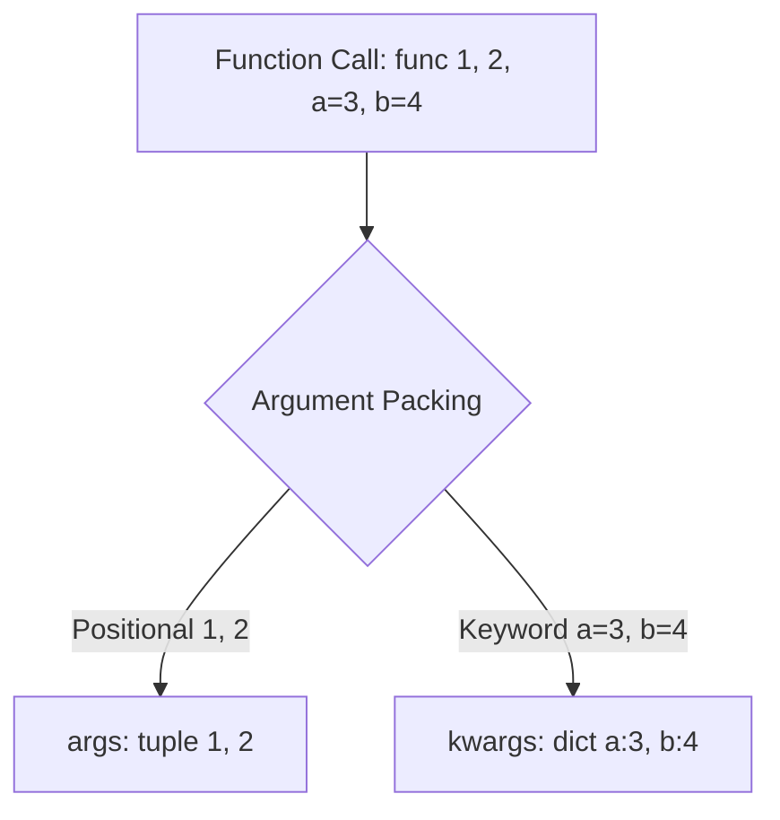
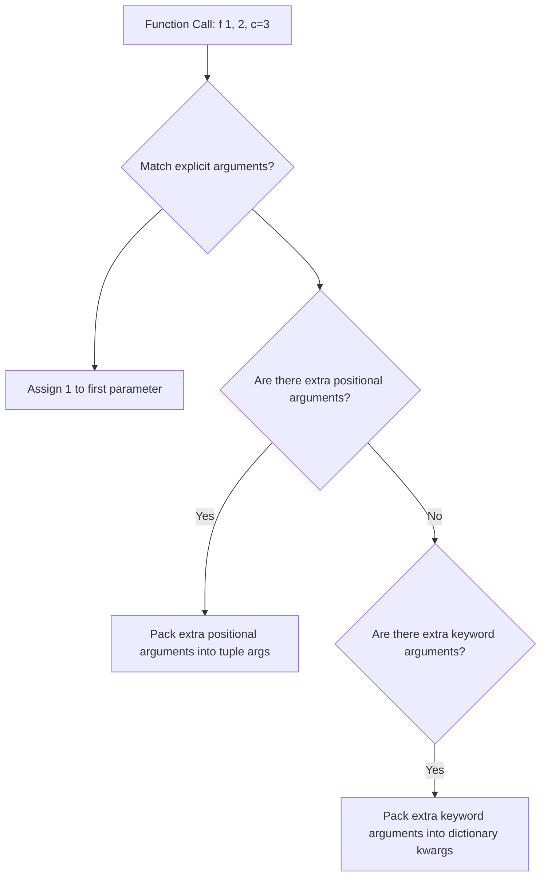

# Python Advanced: *args & **kwargs (Variable Arguments)

---

# 1. Definition

## Variable-Length Arguments
In Python, **`*args`** and **`**kwargs`** are special syntax identifiers used in function signatures to allow the function to accept a variable (flexible) number of arguments at call time.

* **`*args` (Non-Keyword Arguments)**: Gathers any overflowing positional arguments passed to the function into a single **Tuple**.
* **`**kwargs` (Keyword Arguments)**: Gathers any overflowing keyword arguments passed to the function into a single **Dictionary**.



---

# 2. Why Do We Need It?

### The Problem of Inflexible Function Signatures
Without variable-length arguments, functions must declare a fixed number of parameters. If the number of inputs varies, you are forced to pass them wrapped in lists or tuples, making function call syntax verbose.

```python
def sum_numbers(numbers: list[float]) -> float:
    total = 0.0
    for num in numbers:
        total += num
    return total

# Caller must wrap arguments in a list
result = sum_numbers([10.0, 20.0, 30.0])
```
* **Explanation**: Demonstrates forcing callers to wrap simple numbers inside lists for evaluation.
* **Expected Output**: Returns `60.0`.
* **Memory Explanation**: Allocates a temporary list on the heap to pass arguments.
* **Time/Space Complexity**: $\mathcal{O}(N)$ items.
* **Common Mistakes**: Forgetting the list brackets `[]` in the call, raising a `TypeError`.
* **Best Practices**: Use `*args` to allow natural comma-separated arguments.

#### Issues:
1. **Clunky Call Syntax**: Forcing callers to build collection list structures for simple arguments reduces code readability.
2. **Inflexible APIs**: Modifying functions to accept optional options requires rewriting the signature and breaking backwards compatibility.
3. **Decorator Blockers**: Building generic wrapper decorators is impossible if you cannot forward arguments dynamically.

---

# 3. Real-Life Analogies

### Analogy: The Buffet Box
* **Fixed Parameters**: A standard meal delivery plate with fixed partitions for rice, vegetables, and bread. You cannot put extra items on it without spilling.
* **`*args` (The Buffet Plate)**: A flat plate at an all-you-can-eat buffet. You can add as many individual food items as you want. Python packs them into a single pile (tuple) for your meal.

### Analogy: The Tagged Storage Box
* **`**kwargs` (Labeled Boxes)**: A shipping cargo box where every item you place inside has a tag label stating what it is (e.g., `"item_1": "shoes"`, `"item_2": "clothes"`). Python packs these labeled items into a labeled inventory system (dictionary).

---

# 4. Syntax

```python
# 1. Defining a function with packed arguments
def display_info(*args: Any, **kwargs: Any) -> None:
    print("Positional (tuple):", args)
    print("Keyword (dict):", kwargs)

# 2. Invoking the function
display_info(1, 2, 3, user="Saurabh", role="Admin")

# 3. Unpacking collection containers
numbers = [10, 20]
details = {"age": 21, "city": "Delhi"}
display_info(*numbers, **details)  # Unpacks list and dict
```
* **Explanation**: Showcases defining a function to pack arguments, invoking it with values, and utilizing `*` and `**` operators to unpack existing lists/dicts directly.
* **Expected Output**:
  ```
  Positional (tuple): (1, 2, 3)
  Keyword (dict): {'user': 'Saurabh', 'role': 'Admin'}
  Positional (tuple): (1, 2)
  Keyword (dict): {'age': 21, 'city': 'Delhi'}
  ```
* **Memory Explanation**: Positional inputs are packed into an immutable tuple object, and keyword inputs are packed into a standard dictionary object on the heap.
* **Time/Space Complexity**: $\mathcal{O}(N)$ packing/unpacking speed.
* **Common Mistakes**: Passing keyword arguments before positional arguments during invocation.
* **Best Practices**: Use conventional naming (`args` and `kwargs`), though only the asterisks (`*`, `**`) are required by syntax.

---

# 5. Syntax Breakdown

Let's dissect the packing operators:

* **`*` (Single Asterisk)**: Marks positional packing in parameters, or positional unpacking in function calls.
* **`**` (Double Asterisk)**: Marks keyword packing in parameters, or keyword unpacking in function calls.
* **`args`**: The variable bound to the packed tuple.
* **`kwargs`**: The variable bound to the packed dictionary.

---

# 6. Memory Diagram

When you run `display_info(1, 2, user="Arin")`:

```
STACK FRAME (display_info)                 HEAP (Packed Objects)
==========================                 ===================================
| Variable  | Reference  |                 | Address | Object Type | Value   |
==========================                 ===================================
|   args    |  0x800T    | --------------> |  0x800T | Tuple       | (1, 2)  |
--------------------------                 -----------------------------------
|  kwargs   |  0x900D    | --------------> |  0x900D | Dictionary  | {'user':|
==========================                 |         |             | 'Arin'} |
                                           ===================================
```

* **Explanation**: The parameters `args` and `kwargs` point to tuple and dictionary container structures dynamically allocated on the heap during the execution of the call frame.

---

# 7. Internal Working (Behind the Scenes)

## Function Parameter Resolution Order
Python matches incoming arguments to parameters inside the local namespace in a strict sequence:
1. **Positional arguments**: Matched to explicit parameters first.
2. **`*args`**: Captures any remaining positional arguments.
3. **Keyword-only parameters**: Match explicit parameters after `*args`.
4. **`**kwargs`**: Captures any remaining keyword arguments.

```python
# Valid Signature Order
def func(a, b, *args, c, **kwargs):
    pass
```

---

# 8. Rules

### Variable Argument Rules
1. **Signature Ordering**: The sequence in function definitions **must** be: positional parameters, `*args`, keyword-only parameters, and then `**kwargs`.
2. **Single Occurrence**: You can declare only one `*args` and one `**kwargs` parameter in a function definition.
3. **Tuple Immutability**: The packed `args` object is a tuple, meaning its elements cannot be modified at runtime.

---

# 9. Naming Conventions (PEP 8)

* Always use `*args` and `**kwargs` for general variable arguments.
* If the variable arguments have a specific meaning, you can rename them accordingly (e.g., `*names`, `**settings`), but keep the asterisks.

| Parameter Type | Bad Example | Good Example | Industry Standard |
| :--- | :--- | :--- | :--- |
| Variable Positional | `*list_vals` | `*args` | `*args` |
| Variable Keyword | `**dict_vals` | `**kwargs` | `**kwargs` |

---

# 10. Common Mistakes & Bugs

### Mistake 1: SyntaxError due to Wrong Parameter Order
```python
# BUGGY CODE
def show(a, **kwargs, *args):  # SyntaxError: invalid syntax
    pass
```
* **Expected Output**: `SyntaxError: invalid syntax`
* **How to avoid**: Always place `*args` before `**kwargs`.

---

### Mistake 2: Passing Keyword Arguments Before Positional Arguments
```python
# BUGGY CODE
def display(a, b):
    print(a, b)

display(a=1, 2)  # Raises SyntaxError!
```
* **Expected Output**: `SyntaxError: positional argument follows keyword argument`
* **How to avoid**: Ensure all positional values are passed before any keyword name assignments in your calls.

---

# 11. Best Practices & Pythonic Code

* **Use Unpacking to Forward Arguments**: Use unpacking inside decorators or wrappers to forward calls clean and securely.
```python
# Pythonic Argument Forwarding
def logger(func):
    def wrapper(*args, **kwargs):
        print(f"Calling {func.__name__}")
        return func(*args, **kwargs)  # Unpacks and forwards
    return wrapper
```

---

# 12. Interview Questions

### Q1. What is the difference between packing and unpacking using `*`?
* **Answer**: 
  * **Packing** occurs in function definitions where individual parameters are gathered into a tuple (`*args`) or a dictionary (`**kwargs`).
  * **Unpacking** occurs in function calls where elements of a list/tuple (`*list`) or dictionary (`**dict`) are spread out and passed as individual arguments.

---

### Q2. Can you modify `args` inside a function?
* **Answer**: No directly. `args` is packed as a tuple, which is immutable. Attempts to assign new values to its elements (e.g., `args[0] = 10`) raise a `TypeError`. You can, however, convert it to a list if you need to modify it: `args_list = list(args)`.

---

### Q3. Tricky Output Question
**What is the output of the following code?**
```python
def compute(x, *args, y=10):
    return x + sum(args) + y

print(compute(1, 2, 3))
```
* **Expected Output**: `16`
* **Explanation**: `x` binds to `1`. The remaining positional values `(2, 3)` are packed into `args`. `y` defaults to `10` because it is a keyword-only parameter located after `*args`. The calculation is: $1 + (2 + 3) + 10 = 16$.

---

# 13. Exam Points

* **`*`**: Unpacks lists/tuples/sets.
* **`**`**: Unpacks dictionaries.
* **Tuple**: The type of the packed `args` object.
* **Dict**: The type of the packed `kwargs` object.

---

# 14. Real-World Examples

## Example 1: Database Query Builder with Dynamic Filters
```python
from typing import Any

def build_query(table: str, *columns: str, **filters: Any) -> str:
    # 1. Select specific columns
    col_clause = ", ".join(columns) if columns else "*"
    query = f"SELECT {col_clause} FROM {table}"
    
    # 2. Add dynamic WHERE clauses from filters
    if filters:
        filter_clauses = [f"{key} = '{val}'" if isinstance(val, str) else f"{key} = {val}" 
                          for key, val in filters.items()]
        query += " WHERE " + " AND ".join(filter_clauses)
        
    return query

# Execution
sql = build_query("users", "id", "name", "email", status="active", role_id=2)
print(sql)
```
* **Explanation**: Uses `*columns` to accept column names and `**filters` to build custom dynamic where conditions.
* **Expected Output**:
  ```
  SELECT id, name, email FROM users WHERE status = 'active' AND role_id = 2
  ```
* **Time Complexity**: $\mathcal{O}(C + F)$ where $C$ is columns and $F$ is filter count.

---

# 15. Mini Practice

### Easy
Write a function `multiply_all(*args)` that accepts any number of numbers and returns their product.

### Medium
Create a function `user_profile(first_name, last_name, **kwargs)` that prints the name and loops through the keyword arguments to print additional user details.

### Hard
Write a decorator `validate_kwargs(required_keys)` that intercepts a function call and checks if the keys passed to `**kwargs` contain all specified required keys, raising a `ValueError` if any are missing.

---

# 16. Summary Table

| Parameter / Symbol | Type of Packed Object | Primary Purpose | Call Time Behavior |
| :--- | :--- | :--- | :--- |
| **`*args`** | Tuple | Accepts arbitrary positional parameters | Gathers extra inputs |
| **`**kwargs`** | Dictionary | Accepts arbitrary keyword parameters | Gathers extra named inputs |

---

# 17. Cheat Sheet

```python
# Definition
def func(*args, **kwargs):
    pass

# Unpacking Call
lst = [1, 2]
dct = {'a': 3}
func(*lst, **dct)
```

---

# 18. Flow Diagram



---

# 19. Comparison Table

| Feature | Packing (`*` in signature) | Unpacking (`*` in call) |
| :--- | :--- | :--- |
| **Purpose** | Gathers arguments into a collection | Spreads a collection into individual arguments |
| **Location** | Function definition parameter headers | Function invocation parameters |

---

# 20. Things to Remember

> [!IMPORTANT]
> **Key takeaways on Variable Arguments:**
> 1. **Order is critical**: Always place `*args` before `**kwargs` in your function signatures.
> 2. **Unpack to forward**: Use `*args` and `**kwargs` inside decorator wrappers to forward calls cleanly and securely.
