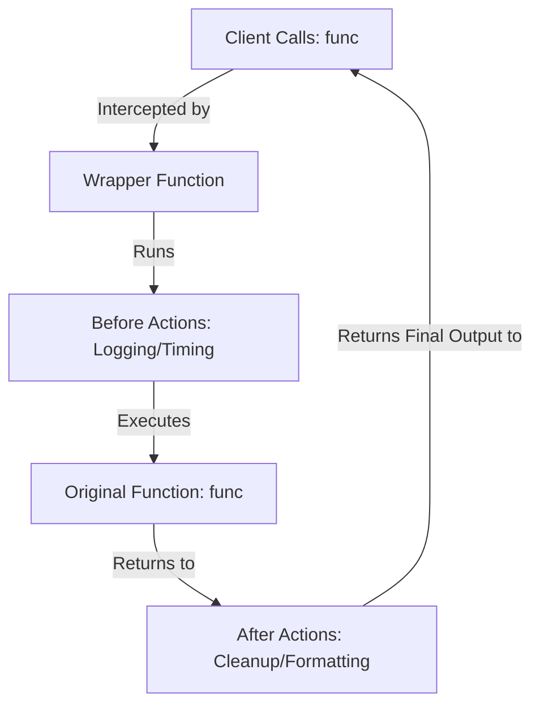
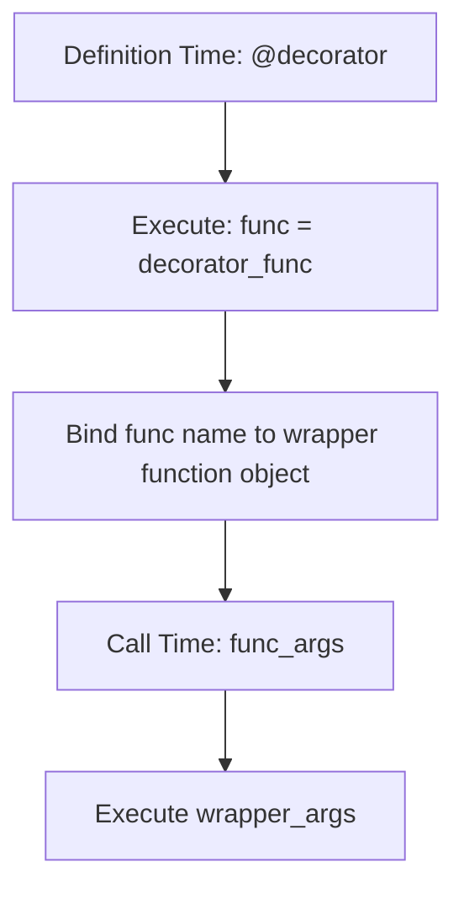

# Python Advanced: Decorators, Closures, & Metaprogramming Hooks

---

# 1. Definition

## Decorator
A **Decorator** is a design pattern and a language feature in Python that allows you to modify or extend the behavior of a function or method without directly modifying its source code. 

## Higher-Order Function & Syntactical Sugar
Decorators are built on Python's support for **First-Class Functions** (functions treated as objects that can be passed as arguments, assigned to variables, and returned). Syntactically, a decorator is represented by the `@decorator_name` symbol prefix placed above a function definition header.



---

# 2. Why Do We Need It?

### The Problem of Cross-Cutting Concerns
In software engineering, tasks like logging, access authorization, performance timing, and caching are **cross-cutting concerns**. If you implement them inside every business logic function directly, your codebase suffers from high duplication.

```python
import time

def calculate_factorial(n: int) -> int:
    start_time = time.time()  # Duplicated timing logic
    result = 1
    for i in range(1, n + 1):
        result *= i
    end_time = time.time()
    print(f"Execution time: {end_time - start_time}s")
    return result
```
* **Explanation**: Demonstrates timing logic mixed directly into a core calculation function.
* **Expected Output**: Prints execution time and returns calculation result.
* **Memory Explanation**: Binds timing variables to the local frame of `calculate_factorial`.
* **Time/Space Complexity**: $\mathcal{O}(N)$ calculations.
* **Common Mistakes**: Copy-pasting timing code into every target function.
* **Best Practices**: Move timing out of the business logic using a reusable decorator.

#### Issues:
1. **Violates Single Responsibility Principle**: The calculation function is now responsible for both math operations and performance tracking.
2. **Code Duplication**: If you have 100 API endpoints, you must copy-paste the timing logic 100 times.
3. **High Refactoring Cost**: Changing the logging framework requires modifying every timed function individually.

---

# 3. Real-Life Analogies

### Analogy: The Phone Case
* **The Original Function**: A smartphone. It makes calls, plays media, and browses web pages.
* **The Decorator**: A phone case with an integrated kickstand. 
* **The Modification**: You wrap the phone inside the case. The phone's internal electronics and code remain untouched, but it now has a new feature (standing upright on a table).

### Analogy: Icing on a Cake
* **The Original Function**: A plain sponge cake.
* **The Decorator**: Frosting and sprinkles. It adds color, sweetness, and toppings to the cake without changing the underlying sponge recipe.

---

# 4. Syntax

```python
import functools
from typing import Callable, Any

# 1. Base Decorator Definition
def my_decorator(func: Callable[..., Any]) -> Callable[..., Any]:
    @functools.wraps(func)  # 2. Preserves original metadata
    def wrapper(*args: Any, **kwargs: Any) -> Any:
        print("Something before the function runs.")
        result = func(*args, **kwargs)  # 3. Runs original function
        print("Something after the function runs.")
        return result
    return wrapper

# 4. Applying the decorator via @ syntactical sugar
@my_decorator
def say_hello(name: str) -> None:
    print(f"Hello, {name}!")
```
* **Explanation**: Demonstrates standard decorator construction using closures, `*args`/`**kwargs` argument forwarding, and metadata preservation.
* **Expected Output**: Compiles and executes.
* **Memory Explanation**: `say_hello` is bound to the `wrapper` function object on the heap, which holds a reference to the original `say_hello` function in its closure namespace.
* **Time Complexity**: $\mathcal{O}(1)$ wrapper dispatch overhead.
* **Space Complexity**: $\mathcal{O}(1)$ auxiliary space.
* **Common Mistakes**: Forgetting to use `functools.wraps`, which overwrites the decorated function's name and documentation attributes.
* **Best Practices**: Always return the result of the inner function call from the wrapper.

---

# 5. Syntax Breakdown

Let's dissect the decorator structure:

* **`def my_decorator(func)`**: Receives the target function object as an argument.
* **`def wrapper(*args, **kwargs)`**: The inner closure function. Using `*args` and `**kwargs` allows it to accept and forward any parameters passed to the decorated function.
* **`return wrapper`**: The outer decorator returns the wrapper function object, replacing the original function binding.
* **`@my_decorator`**: Syntactical sugar for writing:
  ```python
  say_hello = my_decorator(say_hello)
  ```

---

# 6. Memory Diagram

When Python processes `@my_decorator` above `say_hello`:

```
STACK                                      HEAP (Closures & Namespaces)
======================                     ============================================
|  Name   | Reference|                     | Address  | Object Type   | Scope Values  |
======================                     ============================================
|say_hello|  0x900W  | ------------------> |  0x900W  | wrapper()     | closure: func |
======================                     --------------------------------------------
                                           |  0x100F  | say_hello()   | code object   |
                                           ============================================
```

* **Explanation**: The variable name `say_hello` now points to the wrapper function object at address `0x900W`. The wrapper maintains a reference to the original function at address `0x100F` inside its enclosing lexical scope (closure).

---

# 7. Internal Working (Behind the Scenes)

## Closures: The Engine of Decorators
A **Closure** is an inner function that retains access to variables from its outer enclosing scope even after the outer function has finished executing.
1. When `my_decorator(func)` executes, it binds `func` to its local namespace.
2. The inner `wrapper` references `func`.
3. When `my_decorator` returns, its local scope is destroyed, but the compiler keeps the namespace containing `func` alive in heap memory because `wrapper` retains a reference hook to it.

---

# 8. Rules

### Decorator Rules
1. **Metadata Preservation**: Always use `@functools.wraps(func)` on the wrapper definition to prevent losing the original function's `__name__` and `__doc__` attributes.
2. **Forwarding Arguments**: Use `*args` and `**kwargs` in the wrapper signature to ensure the decorator can wrap functions with any arguments.
3. **Return Transmission**: The wrapper function **must** return the result of the decorated function call, otherwise the decorated function will return `None`.

---

# 9. Naming Conventions (PEP 8)

* Decorators should be named using lowercase snake_case.
* Avoid naming wrapper functions with generic names that shadow outer scope variables.

| Decorator Type | Bad Example | Good Example | Industry Standard |
| :--- | :--- | :--- | :--- |
| Timing | `TimeItDecorator` | `timer` | `time_execution` |

---

# 10. Common Mistakes & Bugs

### Mistake 1: Forgetting to Return the Wrapper Function
```python
# BUGGY CODE
def my_decorator(func):
    def wrapper():
        print("Running...")
        func()
    # Missing: return wrapper

@my_decorator
def run():
    print("Go!")

run()  # Raises TypeError: 'NoneType' object is not callable!
```
* **Expected Output**: `TypeError: 'NoneType' object is not callable`
* **How to avoid**: Ensure the outer decorator function ends with `return wrapper`.

---

### Mistake 2: Swallowing Return Values
```python
# BUGGY CODE
def logger(func):
    def wrapper(*args, **kwargs):
        print("Logged call.")
        func(*args, **kwargs)  # Calls function but discards return value!
    return wrapper

@logger
def get_status():
    return "OK"

status = get_status()
print(status)  # Prints: None
```
* **Why it happens**: The wrapper fails to return the result of `func(*args, **kwargs)`.
* **How to avoid**: Assign the function call to a variable and return it from the wrapper.

---

# 11. Best Practices & Pythonic Code

* **Use `@functools.wraps`**: This keeps your decorated functions introspectable for debugging tools and automated documentation generators.
```python
from functools import wraps

def debug_logger(func):
    @wraps(func)
    def wrapper(*args, **kwargs):
        return func(*args, **kwargs)
    return wrapper
```

---

# 12. Interview Questions

### Q1. What is the purpose of `functools.wraps` in Python?
* **Answer**: `functools.wraps` is a helper decorator that copies the metadata (such as `__name__`, `__doc__`, and `__annotations__`) of the original function to the wrapper function. Without it, the decorated function appears to external tools as `wrapper` instead of its original name.

---

### Q2. How do you write a decorator that accepts parameters?
* **Answer**: By creating a decorator factory (a function that returns a decorator).
```python
def repeat(num_times):
    def decorator_repeat(func):
        def wrapper(*args, **kwargs):
            for _ in range(num_times):
                result = func(*args, **kwargs)
            return result
        return wrapper
    return decorator_repeat
```

---

### Q3. Tricky Output Question
**What is the output of the following chained decorator execution?**
```python
def dec1(func):
    def wrapper():
        print("dec1")
        func()
    return wrapper

def dec2(func):
    def wrapper():
        print("dec2")
        func()
    return wrapper

@dec1
@dec2
def run():
    print("Action")

run()
```
* **Expected Output**:
  ```
  dec1
  dec2
  Action
  ```
* **Explanation**: Chained decorators evaluate from bottom to top at definition time, which wraps the function in a nested structure: `dec1(dec2(run))`. At call time, they execute from top to bottom.

---

# 13. Exam Points

* **First-Class Functions**: Functions that can be treated like any other data type.
* **Closure**: An inner function that references variables from its enclosing scope.
* **Syntactical Sugar**: `@decorator` is an alternative, cleaner syntax for `func = decorator(func)`.

---

# 14. Real-World Examples

## Example 1: Execution Timer Decorator
```python
import time
from functools import wraps
from typing import Callable, Any

def timer(func: Callable[..., Any]) -> Callable[..., Any]:
    @wraps(func)
    def wrapper(*args: Any, **kwargs: Any) -> Any:
        start_time = time.perf_counter()
        result = func(*args, **kwargs)
        end_time = time.perf_counter()
        print(f"Function {func.__name__!r} finished in {end_time - start_time:.6f} seconds")
        return result
    return wrapper

@timer
def process_data(limit: int) -> int:
    total = 0
    for i in range(limit):
        total += i
    return total

# Execution
process_data(1000000)
```
* **Explanation**: Measures the execution time of any function without modifying its internal logic.
* **Expected Output**:
  ```
  Function 'process_data' finished in 0.038421 seconds (output speeds will vary)
  ```
* **Time Complexity**: $\mathcal{O}(N)$ where $N$ is limit.

---

# 15. Mini Practice

### Easy
Create a decorator `loud` that prints `"STARTING"` before calling the function and `"FINISHED"` after it.

### Medium
Create a decorator `ensure_integer` that checks if the first argument passed to the decorated function is an integer, raising a `TypeError` if it is not.

### Hard
Write a decorator factory `cache_results(max_size)` that caches the results of function calls in a local dictionary, returning the cached result if the same arguments are passed again.

---

# 16. Summary Table

| Decorator Type | Scope Parameters | Key Use Case | Syntax Signature |
| :--- | :--- | :--- | :--- |
| **Basic** | No parameters | Simple logging/timing | `@my_decorator` |
| **Parameterized** | Accepts arguments | Caching, dynamic limits | `@repeat(num=3)` |
| **Class Decorator**| Wraps entire class | Registry, class metadata updates| `@singleton` |

---

# 17. Cheat Sheet

```python
# Standard Decorator Template
from functools import wraps

def decorator(func):
    @wraps(func)
    def wrapper(*args, **kwargs):
        # Action before
        res = func(*args, **kwargs)
        # Action after
        return res
    return wrapper
```

---

# 18. Flow Diagram



---

# 19. Comparison Table

| Feature | Function Decorator | Class Decorator |
| :--- | :--- | :--- |
| **Targets** | Functions and class methods | Entire class definitions |
| **Complexity**| Simple (uses closures) | Higher (requires `__call__` or metaclass integration) |

---

# 20. Things to Remember

> [!IMPORTANT]
> **Key takeaways on Decorators:**
> 1. **Preserve metadata**: Always use `@functools.wraps` to prevent losing the original function's name and documentation.
> 2. **Use argument forwarding**: Use `*args` and `**kwargs` in your wrappers to make your decorators reusable with any function signature.
