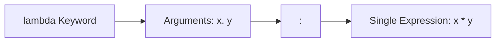
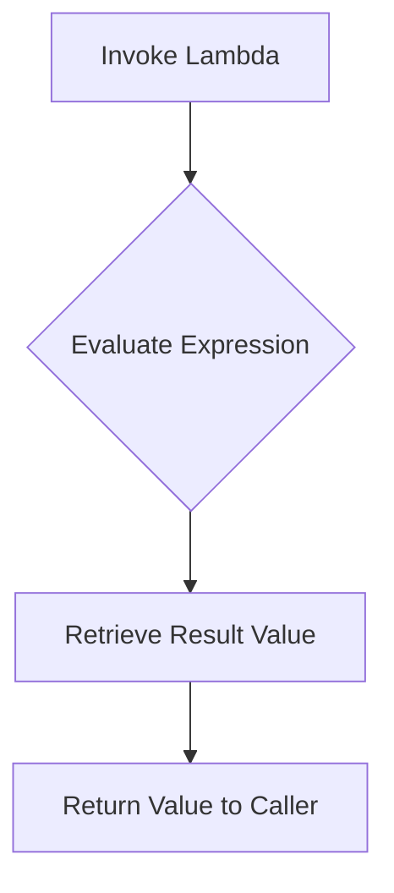

# Python Advanced: Lambda (Anonymous) Functions

---

# 1. Definition

## Lambda Function
A **Lambda Function** is a small, anonymous, inline function defined using the `lambda` keyword. It is called "anonymous" because it does not require a formal name bind identifier (unlike functions declared with the `def` keyword).

## Key Characteristics
* **Single Expression**: Lambdas are limited to a single expression that is evaluated and automatically returned.
* **No Statements**: They cannot contain statements (such as loops, variable assignments, `assert`, or `raise`) or multi-line blocks.
* **Implicit Return**: The `return` keyword is omitted; the result of the evaluated expression is returned automatically.



---

# 2. Why Do We Need It?

### The Problem of Namespace Clutter
When using higher-order functions (like `map()`, `filter()`, or `sorted()`), you often need to provide a simple, single-use transformation or comparison helper. Defining these using the `def` keyword creates unnecessary named functions that clutter the global or local namespace.

```python
# Traditional approach
def get_second_element(item):
    return item[1]

pairs = [(1, "one"), (2, "two")]
sorted_pairs = sorted(pairs, key=get_second_element)
```
* **Explanation**: Demonstrates declaring a separate, dedicated function simply to fetch a tuple element during sorting.
* **Expected Output**: Compiles and returns a list sorted alphabetically.
* **Memory Explanation**: Binds the function object `get_second_element` to the namespace permanently.
* **Time/Space Complexity**: $\mathcal{O}(N \log N)$ sorting speed.
* **Common Mistakes**: Creating multiple small helper functions that are never reused elsewhere.
* **Best Practices**: Use an inline lambda to keep the logic localized.

#### Issues:
1. **Namespace Clutter**: Small, single-use functions remain in the scope dictionary (`locals()` or `globals()`) long after their task is finished.
2. **Reduced Readability**: A reader must scroll to locate the definition of the helper function to understand how the list is being transformed or sorted.
3. **Verbose Syntax**: Writing a multi-line `def` block for a basic calculation increases boilerplate code.

---

# 3. Real-Life Analogies

### Analogy: The Disposable Cup
* **`def` Functions (Ceramic Mug)**: A ceramic coffee mug. It is sturdy, has a handle (name), is washed and stored in a cabinet (namespace), and is designed for long-term reuse.
* **Lambda Functions (Paper Cup)**: A disposable paper cup. It is used once at a water cooler for a quick drink (inline calculation) and discarded immediately without taking up cabinet space.

### Analogy: The Calculator Sticky Note
* **Lambda Function**: Writing a quick calculation (e.g., currency conversion factor) on a sticky note to solve a temporary problem, rather than printing a formal, signed document (`def`).

---

# 4. Syntax

```python
# 1. Standard Lambda definition (discouraged by PEP 8, shown for syntax demonstration)
square = lambda x: x ** 2
print("Square of 4:", square(4))

# 2. Lambda with conditional ternary expression
check_even = lambda x: "Even" if x % 2 == 0 else "Odd"
print("7 is:", check_even(7))

# 3. Idiomatic inline lambda usage (PEP 8 compliant)
pairs = [(1, "banana"), (2, "apple")]
pairs.sort(key=lambda item: item[1])  # Sorts alphabetically by value
print("Sorted pairs:", pairs)
```
* **Explanation**: Showcases lambda declaration syntax, ternary conditional logic, and inline sorting key usage.
* **Expected Output**:
  ```
  Square of 4: 16
  7 is: Odd
  Sorted pairs: [(2, 'apple'), (1, 'banana')]
  ```
* **Memory Explanation**: Creates an anonymous function object on the heap during execution, which is cleaned up by the garbage collector once the sorting operation completes.
* **Time Complexity**: $\mathcal{O}(N \log N)$ sorting speed.
* **Space Complexity**: $\mathcal{O}(1)$ auxiliary space.
* **Common Mistakes**: Using the `return` keyword inside the lambda expression block.
* **Best Practices**: Pass lambda functions directly to higher-order functions without binding them to a name variable.

---

# 5. Syntax Breakdown

Let's dissect the lambda structure:

* **`lambda`**: The keyword that initiates the anonymous function definition.
* **`arguments`**: A comma-separated list of inputs (e.g., `x`, `y`). Like regular functions, lambdas can accept optional, default, or variable arguments (`*args`, `**kwargs`).
* **`:`**: Separates the argument signature from the return expression.
* **`expression`**: A single line of code that evaluates to a value.

---

# 6. Memory Diagram

When you evaluate `lambda x: x ** 2`:

```
HEAP (Anonymous Function Object Allocation)
===================================================
| Attribute    | Value                            |
===================================================
| __name__     | "<lambda>"                       |
| __code__     | <code object at 0x700L>          |
| __annotations__| {}                             |
===================================================
```

* **Explanation**: The created object is a standard function instance, but its `__name__` attribute is set to the string `"<lambda>"`. It contains no variable references in the local namespace unless bound or passed as an argument.

---

# 7. Internal Working (Behind the Scenes)

## Why Lambdas are Restricted to Expressions
Python separates code into **Expressions** (which evaluate to a value) and **Statements** (which perform an action or declare structure, like `if`, `while`, `import`, or `pass`).
* A lambda function can only contain an expression because its return value is evaluated implicitly:
  ```python
  # Python internally translates this:
  lambda x: x * 2
  
  # Into a functional equivalent of:
  def anonymous(x):
      return x * 2
  ```
* Introducing statements (like assignments `y = 10` or loops) would require multi-line block parsing, which conflicts with Python's design goal of keeping lambdas lightweight and inline.

---

# 8. Rules

### Lambda Rules
1. **Implicit Return**: Do not use the `return` keyword. The expression is evaluated and returned automatically.
2. **Single Expression Constraint**: Semicolons and multiple expressions are prohibited.
3. **No Annotations**: Lambda parameters do not support type hinting signatures (e.g., `lambda x: int: x * 2` is invalid syntax).

---

# 9. Naming Conventions (PEP 8)

> [!WARNING]
> **PEP 8 Styling Guideline:**
> Do not bind lambda expressions to variables (e.g., write `def f(x): return x` instead of `f = lambda x: x`). Lambdas are intended for anonymous, inline usage. If a function is worth naming, it is worth declaring with `def`.

| Usage Pattern | Bad Example | Good Example | Industry Standard |
| :--- | :--- | :--- | :--- |
| Named Function | `square = lambda x: x**2` | `def square(x): return x**2`| Standard `def` |
| Inline Key | Passing a named helper function | `sorted(L, key=lambda x: x[0])`| Anonymous lambda |

---

# 10. Common Mistakes & Bugs

### Mistake 1: Using the `return` Keyword
```python
# BUGGY CODE
add = lambda x, y: return x + y  # SyntaxError: invalid syntax
```
* **Expected Output**: `SyntaxError: invalid syntax`
* **How to avoid**: Omit the `return` keyword entirely: `lambda x, y: x + y`.

---

### Mistake 2: Writing Statements Inside the Lambda
```python
# BUGGY CODE
log_val = lambda x: print(x); raise ValueError()  # Semicolon statements are forbidden!
```
* **Why it happens**: Python prevents statement chaining inside lambdas to preserve readability.
* **How to avoid**: Define a formal function using `def` if you need to execute statements or raise errors.

---

# 11. Best Practices & Pythonic Code

* **Use List Comprehensions Over Map/Filter**: For transformations, list comprehensions are generally more readable than combining `map()` or `filter()` with lambda functions.
```python
# Unpythonic (Harder to read)
squares = list(map(lambda x: x**2, range(10)))

# Pythonic (Clearer intent)
squares = [x**2 for x in range(10)]
```

---

# 12. Interview Questions

### Q1. What is the difference between a lambda function and a regular function?
* **Answer**: 
  1. **Syntax**: Lambdas are declared inline using `lambda`; regular functions use the `def` block keyword.
  2. **Naming**: Lambdas are anonymous; regular functions have a name bound to their namespace.
  3. **Structure**: Lambdas are limited to a single expression and support implicit returns; regular functions can contain multiple statements, control flow blocks, and explicit returns.

---

### Q2. Can you use conditional structures inside a lambda?
* **Answer**: Yes, but only by using ternary operators (`value_if_true if condition else value_if_false`). Full `if-elif-else` block statements are not supported.

---

### Q3. Tricky Output Question (Late Binding in Closures)
**What is the output of the following code?**
```python
funcs = [lambda x: x * i for i in range(3)]
print([f(10) for f in funcs])
```
* **Expected Output**: `[20, 20, 20]`
* **Explanation**: Python's closures exhibit late binding behavior. The variable `i` is looked up when the lambda is called, not when it is defined. By the time `f(10)` runs, the loop has completed and the value of `i` in the outer scope is `2`. Therefore, each function computes `10 * 2 = 20`.

---

# 13. Exam Points

* **Anonymous**: Lacking a name identifier.
* **Expression**: Code that evaluates to a value.
* **Ternary Operator**: The syntax structure used to write conditional expressions in a single line.

---

# 14. Real-World Examples

## Example 1: E-Commerce Product Catalog Sorter
```python
from typing import Dict, List, Any

# Catalog of products with details
products: List[Dict[str, Any]] = [
    {"name": "Laptop", "price": 999.99, "rating": 4.7},
    {"name": "Phone", "price": 499.50, "rating": 4.8},
    {"name": "Headphones", "price": 150.00, "rating": 4.3}
]

# 1. Sort catalog by rating descending
products.sort(key=lambda prod: prod["rating"], reverse=True)
print("Sorted by Rating:", products)

# 2. Filter products cheaper than $500
cheap_products = list(filter(lambda prod: prod["price"] < 500.0, products))
print("Cheaper than $500:", cheap_products)
```
* **Explanation**: Uses inline lambda functions to sort and filter a dictionary catalog without declaring custom comparison functions.
* **Expected Output**:
  ```
  Sorted by Rating: [{'name': 'Phone', 'price': 499.5, 'rating': 4.8}, {'name': 'Laptop', 'price': 999.99, 'rating': 4.7}, {'name': 'Headphones', 'price': 150.0, 'rating': 4.3}]
  Cheaper than $500: [{'name': 'Phone', 'price': 499.5, 'rating': 4.8}, {'name': 'Headphones', 'price': 150.0, 'rating': 4.3}]
  ```
* **Time Complexity**: $\mathcal{O}(N \log N)$ sorting speed.

---

# 15. Mini Practice

### Easy
Write an anonymous lambda function that adds two numbers, and call it inline with values `5` and `10`.

### Medium
Given a list of strings, use `sorted()` with a lambda key to sort the list by the length of the strings.

### Hard
Write a program that uses `sorted()` and a lambda key to sort a list of coordinates (tuples of `(x, y)`) based on their Euclidean distance from the origin `(0, 0)`.

---

# 16. Summary Table

| Feature | `def` Function | `lambda` Function |
| :--- | :--- | :--- |
| **Declaration Keyword** | `def` | `lambda` |
| **Explicit Name Required**| Yes | No |
| **Return Mechanism** | Explicit `return` statement | Implicit (auto-returns expression) |
| **Allowed Body Elements** | Any statements, loops, or declarations | Single expression only |

---

# 17. Cheat Sheet

```python
# Inline Sorting
items.sort(key=lambda x: x['key'])

# Ternary Conditional
f = lambda x: "High" if x > 10 else "Low"
```

---

# 18. Flow Diagram



---

# 19. Comparison Table

| Feature | Lambda + Map | List Comprehension |
| :--- | :--- | :--- |
| **Syntax** | `list(map(lambda x: x*2, seq))` | `[x*2 for x in seq]` |
| **Readability** | Low (cluttered with function calls) | High (declarative and readable) |
| **Performance** | Slower (function call overhead) | Faster (optimized loop overhead) |

---

# 20. Things to Remember

> [!IMPORTANT]
> **Key takeaways on Lambda Functions:**
> 1. **Do not assign to variables**: Avoid naming lambdas (e.g. `f = lambda x: x`); write a standard `def` function instead.
> 2. **Single expression limit**: Keep lambdas simple. If the logic requires complex conditions or loops, refactor it into a regular function.
