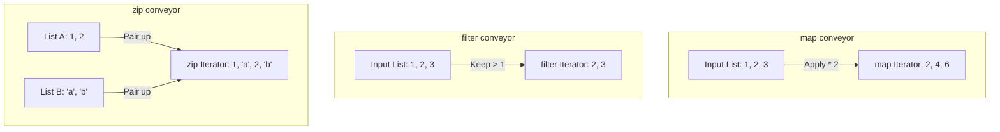
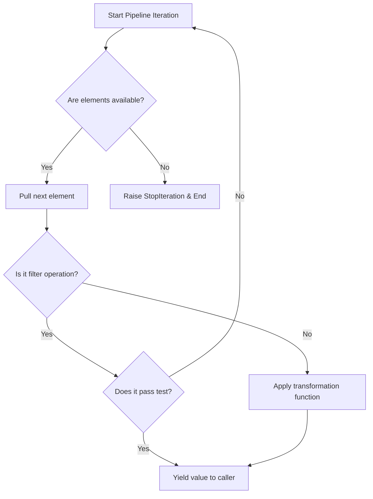

# Python Advanced: map(), filter(), & zip() (Functional Primitives)

---

# 1. Definition

## Functional Primitives
Python provides three built-in higher-order utility functions: **`map()`**, **`filter()`**, and **`zip()`**. They allow you to transform, selectively extract, and pair collections of data using functional programming patterns.

* **`map(func, iterable, ...)`**: Applies a transformation function to every item in one or more iterables, returning a lazy map iterator.
* **`filter(func, iterable)`**: Evaluates every item in an iterable against a boolean test function, returning an iterator containing only the items that evaluate to `True`.
* **`zip(iter1, iter2, ...)`**: Aggregates elements from multiple iterables element-by-element, producing tuples of paired values.



---

# 2. Why Do We Need It?

### The Problem of Boilerplate Iteration Loops
Before functional primitives, basic data cleaning tasks required writing verbose `for` loop pipelines, initializing accumulator variables, and managing append operations.

```python
numbers = [1, 2, 3, 4]
doubled = []
for num in numbers:
    doubled.append(num * 2)  # Boilerplate execution
```
* **Explanation**: Demonstrates using manual list-building loops to transform values.
* **Expected Output**: Returns `[2, 4, 6, 8]`.
* **Memory Explanation**: Allocates a mutable list and repeatedly resizes its C-array pointers.
* **Time/Space Complexity**: $\mathcal{O}(N)$
* **Common Mistakes**: Forgetting to initialize the target accumulator list.
* **Best Practices**: Use `map()` or list comprehensions for cleaner syntax.

#### Issues:
1. **Low Performance**: Standard `for` loop iterations run entirely within CPython's bytecode interpreter loop, which is significantly slower than the optimized C-loops running inside `map()` and `filter()`.
2. **Namespace Pollution**: Temporary loop index variables (like `num`) persist in the local namespace after the loop completes.
3. **High Memory Overhead**: Generating transformed lists directly on large datasets allocates memory for all elements immediately, rather than processing them on-demand.

---

# 3. Real-Life Analogies

### Analogy: The Factory Assembly Line (`map`)
* Think of a conveyer belt carrying unfinished toy cars. 
* A robotic arm (`func`) sprays red paint on every single car that passes by. 
* No cars are skipped (length remains unchanged); they are simply transformed from plain to red.

### Analogy: The Coin Sorter (`filter`)
* A mixed bucket of coins is poured into a sorting tray.
* The tray has holes of a specific size. Small coins fall through; large coins remain on top.
* The sorting tray acts as the filter, keeping only the coins that match the size criteria.

### Analogy: The Zipper (`zip`)
* Think of zipping up a jacket. 
* The left row of teeth (List A) pairs up with the right row of teeth (List B) in matching pairs.
* If one side of the jacket is missing teeth at the top (unequal list lengths), the zipper stops pairing once the shorter side ends.

---

# 4. Syntax

```python
# 1. map() Syntax
numbers = [1, 2, 3, 4]
doubled = map(lambda x: x * 2, numbers)
print("Doubled map:", list(doubled))

# 2. filter() Syntax
scores = [45, 82, 90, 30]
passing = filter(lambda x: x >= 50, scores)
print("Passing filter:", list(passing))

# 3. zip() Syntax
names = ["Saurabh", "Arin"]
ages = [21, 20]
paired = zip(names, ages)
print("Paired zip:", list(paired))
```
* **Explanation**: Demonstrates transforming items with `map`, filtering passing marks with `filter`, and pairing elements with `zip`.
* **Expected Output**:
  ```
  Doubled map: [2, 4, 6, 8]
  Passing filter: [82, 90]
  Paired zip: [('Saurabh', 21), ('Arin', 20)]
  ```
* **Memory Explanation**: Functional primitives return lightweight lazy iterator objects. To display their contents, you must cast them to a collection like `list()`.
* **Time Complexity**: $\mathcal{O}(N)$ construction/iteration speed.
* **Space Complexity**: $\mathcal{O}(1)$ memory consumption when used as lazy generators.
* **Common Mistakes**: Expecting `map()` or `filter()` to return standard lists directly instead of lazy iterators.
* **Best Practices**: Use functional primitives when processing large data streams to conserve memory.

---

# 5. Syntax Breakdown

Let's dissect the parameter signatures:

* **`map(function, *iterables)`**: Applies the function to the matching elements of each iterable. If multiple iterables are provided, the function must accept that many arguments (e.g., `map(lambda x, y: x + y, list1, list2)`).
* **`filter(function_or_None, iterable)`**: Evaluates each element against the function. If the first argument is `None`, it filters out all falsy values (like `0`, `""`, `[]`, `None`, `False`).
* **`zip(*iterables, strict=False)`**: Combines matching elements. In Python 3.10+, setting `strict=True` raises a `ValueError` if the iterables are not of equal length.

---

# 6. Memory Diagram

When you define `m = map(lambda x: x*2, [1, 2, 3])`:

```
HEAP (Lazy Generator Structure)
=============================================================
| Attribute      | Target Reference / Value                 |
=============================================================
| Type           | <class 'map'>                            |
| func           | <function <lambda> at 0x900A>            |
| iterators      | [<list_iterator at 0x100C>]              |
| State          | Not started (No values computed yet)    |
=============================================================
```

* **Explanation**: Declaring `map` only builds a lookup schema. No calculations occur until you iterate over the object or call `next(m)`. This is known as **Lazy Evaluation**.

---

# 7. Internal Working (Behind the Scenes)

## Lazy Evaluation & Iterator Exhaustion
1. When you run `map()` or `filter()`, Python allocates a tiny iterator object containing pointers to the target sequence and function.
2. Each time `next()` is called on this iterator, Python processes a single element, yields the result, and pauses execution.
3. **Exhaustion**: Once the iterator yields its final element, it raises a `StopIteration` exception. Calling `list(m)` a second time will return an empty list because the iterator has been consumed and cannot be reset.

---

# 8. Rules

### Functional Rules
1. **Callable First**: The first argument to `map` and `filter` must be a callable function or class reference (or `None` for `filter`).
2. **Shortest Length Dominance**: By default, both `map()` (with multiple inputs) and `zip()` stop executing once the shortest input iterable is exhausted.
3. **Lazy Execution**: Iterators must be consumed (via loops, list comprehensions, or `list()`) to trigger the processing logic.

---

# 9. Naming Conventions (PEP 8)

* Use lambda variables that clearly describe the elements they process.
* Keep intermediate iterator names descriptive.

| Variable Name | Bad Example | Good Example | Industry Standard |
| :--- | :--- | :--- | :--- |
| Iterator | `lst` | `user_map` | `parsed_records_iterator` |

---

# 10. Common Mistakes & Bugs

### Mistake 1: Re-iterating an Exhausted Iterator
```python
# BUGGY CODE
numbers = [1, 2, 3]
squared = map(lambda x: x**2, numbers)

print("First pass:", list(squared))   # Prints [1, 4, 9]
print("Second pass:", list(squared))  # Prints [] (Exhausted!)
```
* **Expected Output**:
  ```
  First pass: [1, 4, 9]
  Second pass: []
  ```
* **How to avoid**: If you need to reuse the results, cast the iterator to a list immediately and store it, or recreate the generator.

---

### Mistake 2: Missing Strict Check in `zip` leading to silent data loss
```python
# BUGGY CODE
users = ["Saurabh", "Arin", "Ravi"]
ids = [101, 102]  # Mismatched length!

paired = list(zip(users, ids))  # "Ravi" is silently dropped!
print(paired)  # [('Saurabh', 101), ('Arin', 102)]
```
* **Why it happens**: `zip()` silently drops excess items from longer lists to prevent runtime crashes.
* **How to avoid**: Use `strict=True` in Python 3.10+ to catch mismatched lengths, or use `itertools.zip_longest()`.

---

# 11. Best Practices & Pythonic Code

* **Use List Comprehensions Over Map/Filter**: List comprehensions are generally preferred in Python for simple transformations because they are more readable and run at comparable speeds.
```python
# Unpythonic
evens = list(filter(lambda x: x % 2 == 0, map(lambda x: x * 3, range(10))))

# Pythonic
evens = [val for x in range(10) if (val := x * 3) % 2 == 0]
```

---

# 12. Interview Questions

### Q1. What is Lazy Evaluation and how does it benefit Python applications?
* **Answer**: Lazy evaluation means delaying the execution of an operation until its result is actually needed. In `map()`, `filter()`, and `zip()`, this allows Python to process elements one at a time, conserving memory and allowing the program to handle massive or infinite data streams without loading the entire dataset into memory.

---

### Q2. How can you pair list elements of unequal lengths without losing data?
* **Answer**: By using `zip_longest` from the standard `itertools` module. It fills in missing values from the shorter list with a placeholder value (defaults to `None`).
```python
from itertools import zip_longest
print(list(zip_longest([1, 2], ['a'], fillvalue='?')))
# Output: [(1, 'a'), (2, '?')]
```

---

### Q3. Tricky Output Question
**What is the output of the following code?**
```python
names = ["A", "B"]
print(list(map(len, names)))
```
* **Expected Output**: `[1, 1]`
* **Explanation**: `map` accepts any callable. Here, the built-in `len` function is passed as the transformation callable, returning the length of each string element.

---

# 13. Exam Points

* **Iterator**: An object that yields elements one at a time when `next()` is called.
* **Lazy Evaluation**: Delaying computation until the value is requested.
* **`strict=True`**: A Python 3.10+ parameter that raises a `ValueError` if the iterables passed to `zip` are not of equal length.

---

# 14. Real-World Examples

## Example 1: Transaction Log Pipeline Cleaner
```python
from typing import Dict, List, Any

# Raw transaction logs
raw_logs: List[Dict[str, Any]] = [
    {"user": "Saurabh", "amount": 150.0, "status": "COMPLETED"},
    {"user": "Arin", "amount": 250.0, "status": "FAILED"},
    {"user": "Ravi", "amount": 50.0, "status": "COMPLETED"}
]

# 1. Filter: Keep only completed transactions
completed = filter(lambda log: log["status"] == "COMPLETED", raw_logs)

# 2. Map: Format statements
statements = map(lambda log: f"User {log['user']} spent ${log['amount']:.2f}", completed)

# Execution (consumes the pipeline)
for statement in statements:
    print(statement)
```
* **Explanation**: Chains `filter` and `map` to clean and format transaction data without allocating intermediate lists.
* **Expected Output**:
  ```
  User Saurabh spent $150.00
  User Ravi spent $50.00
  ```
* **Time Complexity**: $\mathcal{O}(N)$ where $N$ is log count.

---

# 15. Mini Practice

### Easy
Use `map()` and a lambda function to convert a list of Celsius temperatures to Fahrenheit.

### Medium
Given a list of words, use `filter()` to extract all words that are palindromes (read the same backwards).

### Hard
Write a program that uses `zip()` with `strict=True` to pair usernames and passwords from two lists, implementing a try-except block to catch and handle mismatched length errors.

---

# 16. Summary Table

| Primitive | Primary Input Parameter | Output Elements Length | Core Use Case |
| :--- | :--- | :--- | :--- |
| **`map()`** | Callable + 1 or more iterables | Matches input iterable length | Element transformation |
| **`filter()`**| Callable (Boolean test) + 1 iterable| $\le$ input iterable length | Conditional selection |
| **`zip()`** | 2 or more iterables | Matches the shortest input length | Element aggregation |

---

# 17. Cheat Sheet

```python
# Transform
map_obj = map(str.upper, ["a", "b"])

# Select
filter_obj = filter(None, [1, 0, False, 2])

# Pair
zip_obj = zip([1, 2], ["a", "b"], strict=True)
```

---

# 18. Flow Diagram



---

# 19. Comparison Table

| Feature | `map()` / `filter()` | List Comprehension |
| :--- | :--- | :--- |
| **Evaluation** | Lazy (evaluates on-demand) | Eager (evaluates immediately) |
| **Memory footprint**| $\mathcal{O}(1)$ | $\mathcal{O}(N)$ |
| **Syntax** | Functional (uses lambdas) | Declarative (uses Python syntax) |

---

# 20. Things to Remember

> [!IMPORTANT]
> **Key takeaways on Functional Primitives:**
> 1. **Handle exhaustion**: Map, filter, and zip iterators are consumed after one complete iteration; convert them to lists if you need to reuse the values.
> 2. **Check sequence lengths**: Use `strict=True` when using `zip()` on collections that should be of equal length to catch data mismatches early.
