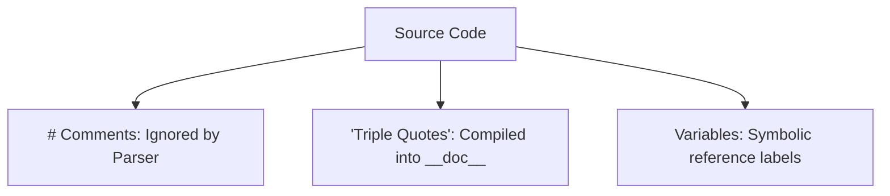
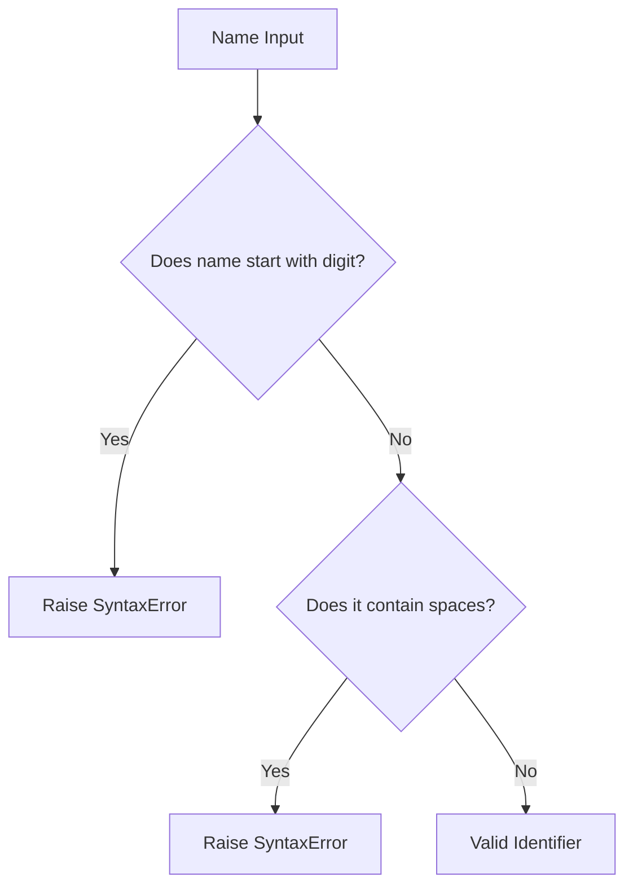

# Python OOP: Comments, Variables, & Conventions

---

# 1. Definition

## Comments
**Comments** are programmer-readable annotations in the source code. They are ignored by the Python interpreter during the tokenizing phase and are used to explain the code's intent.

## Variables
A **Variable** in Python is a reference name that acts as a label bound to an object in heap memory. Python variables do not store values directly; they point to the memory location of the object containing the value.

## Docstrings (Documentation Strings)
**Docstrings** are string literals enclosed in triple quotes (`"""..."""`) placed immediately as the first statement in a class, function, or module. Unlike comments, docstrings are not ignored by the parser; they are compiled into the object's `__doc__` metadata attribute.



---

# 2. Why Do We Need It?

### The Problem Before Variables (Magic Hardcoded Values)
Without variables, values are hardcoded directly into computations. This is known as using "magic numbers".

```python
# Code without variables
print(3.14159 * 5 * 5)
print(3.14159 * 10 * 10)
```
* **Explanation**: Calculates areas using a hardcoded value for Pi and radii.
* **Expected Output**:
  ```
  78.53975
  314.159
  ```
* **Memory Explanation**: Constants are loaded directly as literals into temporary interpreter stacks.
* **Time/Space Complexity**: $\mathcal{O}(1)$
* **Common Mistakes**: Mis-typing the constant value in one of the lines.
* **Best Practices**: Store constants in descriptive variables.

#### Problems:
1. **Redundancy**: Modifying the constant value requires updating every line manually.
2. **Code Obfuscation**: Reading the calculation does not explicitly clarify what the values represent.
3. **No Dynamic Execution**: The radius cannot change based on user input.

---

# 3. Real-Life Analogies

### Analogy 1: Sticky Notes in a Kitchen (Comments)
Imagine you have spice jars in a kitchen.
* **Comments**: Sticky notes on the jars saying `"Use sparingly, very hot!"`. The note does not change the flavor of the spice; it is just a guide for the cook.
* **Docstrings**: The official recipe booklet glued to the front of the spice drawer containing legal details and ingredient lists.

### Analogy 2: Luggage Tag (Variables)
Think of a variable as a paper label tied with a string (reference pointer) to a suitcase (object on the heap).
* The suitcase has a physical size and weight (object data).
* If you cut the string (variable re-assignment), the suitcase remains on the floor, but it no longer has a name tag. If it has no tags, the airport cleaning crew (Garbage Collector) throws it away.

---

# 4. Syntax

```python
# 1. Single-Line Comment

"""
2. Multi-line Docstring
   Used to explain complex modules.
"""

# 3. Variable Assignment
user_name = "Saurbh Prakash"
```
* **Explanation**: Demonstrates syntax for comments, docstrings, and variable assignments.
* **Expected Output**: Code runs without output.
* **Memory Explanation**: Assigns string object `"Saurbh Prakash"` to heap, and links variable name `user_name` to it in the namespace dictionary.
* **Time Complexity**: $\mathcal{O}(1)$
* **Space Complexity**: $\mathcal{O}(1)$
* **Common Mistakes**: Putting comments inside multi-line strings thinking they are deleted at parse time.
* **Best Practices**: Use docstrings for documentation, single-line comments for logical explanation.

---

# 5. Syntax Breakdown

Let's dissect variable assignment:

```python
user_name = "Saurbh Prakash"
```
* **`user_name`**: The variable identifier (reference label). Must comply with snake_case rules.
* **`=`**: The assignment operator (binds the identifier on the left to the memory address of the object on the right).
* **`"Saurbh Prakash"`**: The string literal object created in Heap memory.

---

# 6. Memory Diagram

When we execute:
```python
x = 100
y = x
```

```
STACK (Namespaces)                         HEAP (Objects)
======================                     =========================
|  Name   | Reference|                     |  Address  | Value     |
======================                     =========================
|   x     |  0x500A  | ------------------> |  0x500A   | int: 100  |
----------------------                     |           |           |
|   y     |  0x500A  | --------------------/           |           |
======================                     =========================
```

* **Explanation**: Setting `y = x` does not copy the value `100`. It copies the reference pointer, so both names point to the same memory location `0x500A`.

---

# 7. Internal Working (Behind the Scenes)

## Symbol Table & Namespace Bindings
During execution, Python maintains a **Symbol Table** (namespace) implemented as a hash map dictionary (`__dict__`).
1. **Parser Execution**: When parser reads `x = 100`, it adds the string `"x"` to the local symbol table.
2. **Object Creation**: The PVM creates an integer object on the heap containing the value `100`, sets its reference counter to `1`.
3. **Binding**: The PVM updates the symbol table value for `"x"` to point to the heap memory address of the integer object.

---

# 8. Rules

### Variable Naming Rules
1. **Allowed Characters**: Alphanumeric characters (`a-z`, `A-Z`, `0-9`) and underscores (`_`).
2. **Start Constraints**: Must start with a letter or an underscore. **Cannot start with a digit**.
3. **Keyword Restriction**: Reserved keywords (e.g., `class`, `def`, `if`, `while`, `print`) cannot be used as variable identifiers.
4. **Case Sensitivity**: `User` and `user` are two distinct variables.

---

# 9. Naming Conventions (PEP 8)

* **Variables & Functions**: snake_case, e.g., `user_registration_date`.
* **Constants**: UPPERCASE_WITH_UNDERSCORES, e.g., `MAX_CONNECTION_ATTEMPTS`.
* **Classes**: PascalCase, e.g., `SchoolDatabase`.

| Type | Bad Example | Good Example | Industry Standard |
| :--- | :--- | :--- | :--- |
| Variable | `saurbhPrakash` | `saurbh_prakash` | `saurbh_prakash_coding` |
| Constant | `pi = 3.14` | `PI = 3.14` | `DEFAULT_PORT = 8080` |

---

# 10. Common Mistakes & Bugs

### Mistake 1: Spaces in Variable Names
```python
# BUGGY CODE
user name = "Saurbh"
```
* **Expected Output**: `SyntaxError: invalid syntax`
* **How to avoid**: Use underscores `user_name`.

---

### Mistake 2: Modifying constant values
```python
# BUGGY CODE
PI = 3.14
PI = 3.14159  # Modifying what should be constant
```
* **Why it happens**: Python does not support true constant protection out-of-the-box.
* **How to avoid**: Treat uppercase variables as immutable by convention, or use a Final type checking library.

---

# 11. Best Practices & Pythonic Code

* **Descriptive Over Short**: Choose `number_of_students` instead of `n`.
* **Docstrings for modules**: Always include docstrings explaining classes.
```python
class DatabaseConnection:
    """Manages secure communication sockets to external databases."""
```

---

# 12. Interview Questions

### Q1. Does Python support constants natively?
* **Answer**: No. Python does not prevent re-assignment of variables. We use UPPERCASE naming conventions (PEP 8) to indicate to other developers that a variable must be treated as a constant.

---

### Q2. What is the difference between a comment and a docstring?
* **Answer**: Comments are stripped by the compiler at compile-time and are not retrievable at runtime. Docstrings are parsed, compiled into string objects, and stored in the `__doc__` attribute of the container object, allowing runtime documentation checks.

---

### Q3. Tricky Output Question
**What is the output of the following code?**
```python
a = [1, 2, 3]
b = a
b.append(4)
print(a)
```
* **Expected Output**: `[1, 2, 3, 4]`
* **Explanation**: Because lists are mutable and both variables point to the same memory reference, modifying `b` alters the object referenced by `a`.

---

# 13. Exam Points

* **Identifier**: A name used to identify a variable, function, class, or module.
* **Mutable**: Objects whose values can be altered in place (like lists).
* **Immutable**: Objects whose values cannot be altered in place (like integers and strings).

---

# 14. Real-World Examples

## Example 1: Configuration Management
```python
# Database Configurations (Constants)
DB_HOST = "localhost"
DB_PORT = 5432
max_connection_retries = 3  # Configuration mutable variable

def connect_db() -> None:
    print(f"Connecting to database at {DB_HOST}:{DB_PORT}...")

connect_db()
```
* **Explanation**: Uses constant naming style for host/port config.
* **Expected Output**:
  ```
  Connecting to database at localhost:5432...
  ```
* **Time/Space Complexity**: $\mathcal{O}(1)$

---

# 15. Mini Practice

### Easy
Declare a variable to store the count of zips in a bag, and add a single-line comment explaining it.

### Medium
Explain why `1st_student = "Aman"` raises a syntax error, and write the corrected version.

### Hard
Write a module containing a class with a multi-line docstring, print the docstring at runtime by querying the `__doc__` attribute.

---

# 16. Summary Table

| Convention Style | Target Object | Example |
| :--- | :--- | :--- |
| **camelCase** | Java/JS standard vars | `userAge` |
| **PascalCase** | Classes | `SchoolStudent` |
| **snake_case** | Python variables/methods | `student_age` |

---

# 17. Cheat Sheet

```python
# Variable
var_name = value

# Constant (convention)
CONSTANT_NAME = value

# Docstring query
print(obj.__doc__)
```

---

# 18. Flow Diagram



---

# 19. Comparison Table

| Feature | Python Variables | C++ Variables |
| :--- | :--- | :--- |
| **Type Binding** | Dynamic (runs on references) | Static (bound to memory slot) |
| **Declaration** | No type specifiers needed | Must declare type (e.g., `int x`) |

---

# 20. Things to Remember

> [!IMPORTANT]
> **Key takeaways on variables:**
> 1. **Variables are labels**: They point to objects; they do not contain them.
> 2. **Constants are symbolic**: Treat UPPERCASE variables as read-only.
