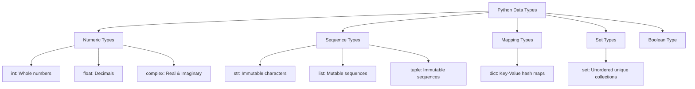
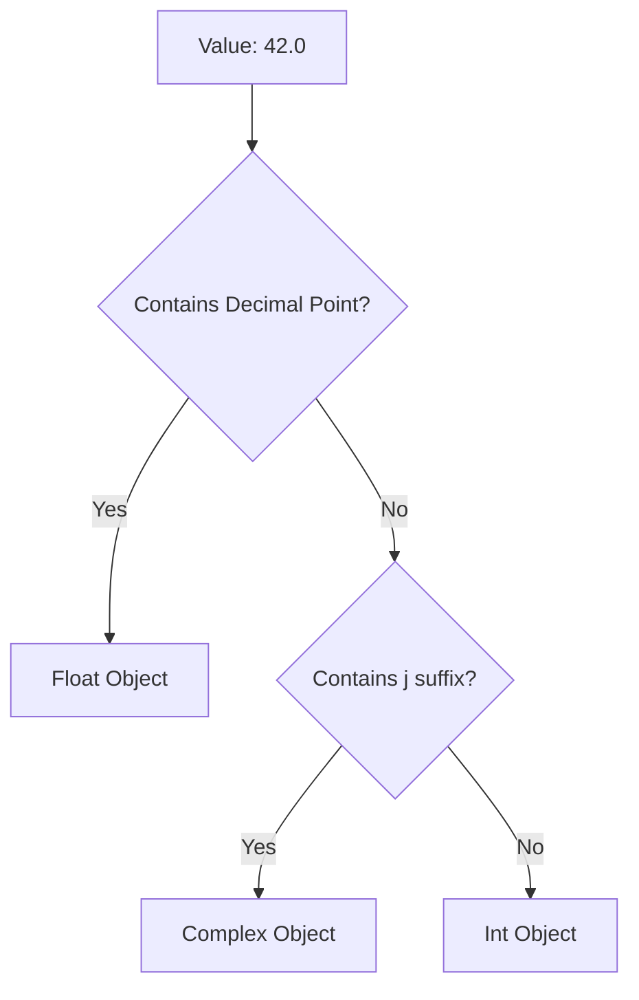

# Python OOP: Built-in Data Types & Type System

---

# 1. Definition

In Python, a **Data Type** is a classification that specifies which type of value a variable holds and what kind of mathematical, relational, or logical operations can be applied to it without causing an error. 

## Python Data Type Classification
Python is **Strongly Typed** (types are enforced and operations like `'string' + 5` raise a `TypeError`) and **Dynamically Typed** (variable binding happens at runtime).



---

# 2. Why Do We Need It?

### The Problem Without Structured Data Types
At the physical hardware level, all data is stored as raw, untyped sequences of bits (0s and 1s). Without a data type definition, the computer cannot interpret what those bits mean.

```
Raw Memory Sequence: 01000001
* Is it the integer 65?
* Is it the character 'A' (ASCII)?
* Is it a boolean state?
```

#### Issues:
1. **Ambiguity**: The CPU cannot determine if an addition or a string concatenation operation is required.
2. **Memory Overwrites**: Without boundary sizes, writing data can overwrite adjacent memory blocks.
3. **No Validation**: Storing text inside a variable meant for financial calculations leads to application failure.

---

# 3. Real-Life Analogies

### Analogy 1: The Sorting Bin
Think of data types like sorting slots in a vending machine:
* A coin slot only accepts coins (numbers).
* A card reader only accepts card chips (strings).
* A validation sensor checks if the transaction is complete (Boolean: True/False).
If you try to insert a coin into the card reader, the machine rejects it (Type Error).

---

# 4. Syntax

```python
# 1. Numeric Types
integer_val = 42
float_val = 3.14159
complex_val = 3 + 5j

# 2. Text Type
string_val = "Saurabh"

# 3. Boolean Type
boolean_val = True
```
* **Explanation**: Declaring instances of Python's primary built-in data types.
* **Expected Output**: Compiles and executes without terminal output.
* **Memory Explanation**: Python allocates `PyObject` wrappers on the heap for each variable.
* **Time Complexity**: $\mathcal{O}(1)$
* **Space Complexity**: $\mathcal{O}(1)$ auxiliary space.
* **Common Mistakes**: Writing `complex_val = 3 + 5i` (Python uses `j` for the imaginary unit).
* **Best Practices**: Use lowercase snake_case for naming variable instances.

---

# 5. Syntax Breakdown

Let's dissect complex number declarations:

```python
z = 3 + 5j
```
* **`z`**: Variable label referencing the complex object on the heap.
* **`3`**: The real part of the complex number (accessible via `z.real`).
* **`+`**: Addition symbol joining real and imaginary components.
* **`5j`**: The imaginary part, denoted by the `j` suffix (accessible via `z.imag`).

---

# 6. Memory Diagram

In CPython, every data type is wrapped inside a C struct named `PyObject` containing:
* `ob_refcnt`: Reference counter.
* `ob_type`: Pointer to the type object (specifying data class).
* Value representation.

```
HEAP MEMORY
===================================================
| Address | PyObject Type | Value / Data fields   |
===================================================
| 0x100A  | <class 'int'> | 42                    |
---------------------------------------------------
| 0x200B  | <class 'str'> | "Saurabh"             |
---------------------------------------------------
| 0x300C  | <class 'bool'>| True                  |
===================================================
```

---

# 7. Internal Working (Behind the Scenes)

## How `type()` Works
When you query `type(x)` in Python:
1. Python checks the `ob_type` pointer inside the `PyObject` structure referenced by `x`.
2. It returns a reference to the class object representing that data type (e.g., `<class 'int'>`).

---

# 8. Rules

### Type Rules
1. **Boolean Case-Sensitivity**: Boolean values must be written with capital letters: `True` and `False`. Lowercase `true` and `false` raise a `NameError`.
2. **Unicode representation**: Strings are stored using UTF-8 code points.
3. **Immutability of standard types**: Integers, floats, complexes, strings, and tuples are **immutable**. Their values cannot be modified without allocating a new object.

---

# 9. Naming Conventions (PEP 8)

* Avoid naming variables after type class names (e.g., do not name variables `str = "Saurabh"` or `int = 10`), as this shadows the built-in constructors.

| Type | Bad Example | Good Example | Industry Standard |
| :--- | :--- | :--- | :--- |
| Variable | `str = "hello"` | `message = "hello"` | `user_first_name = "hello"` |

---

# 10. Common Mistakes & Bugs

### Mistake 1: Lowercase Boolean Values
```python
# BUGGY CODE
is_active = true
```
* **Expected Output**: `NameError: name 'true' is not defined`
* **How to avoid**: Capitalize Booleans `True` or `False`.

---

### Mistake 2: Type Shadowing
```python
# BUGGY CODE
list = [1, 2, 3]  # Shadows built-in 'list' constructor
x = list("hello")  # Raises TypeError: 'list' object is not callable
```
* **Why it happens**: Reassigning class names within local namespace prevents constructor access.
* **How to avoid**: Do not use `list`, `dict`, `str`, `int` as variable names.

---

# 11. Best Practices & Pythonic Code

* **Use type functions for casting**: Use `int()`, `float()`, `str()` to explicitly cast data.
* **Check types using `isinstance()`** instead of comparing type outputs.
```python
# Pythonic type check
if isinstance(x, int):
    # Do integer arithmetic
```

---

# 12. Interview Questions

### Q1. What is the difference between dynamic typing and static typing?
* **Answer**: In statically typed languages (like C++, Java), variables have types, and they are checked at compile time. In dynamically typed languages (like Python), variables are type-neutral; the objects they point to have types, and they are evaluated at runtime.

---

### Q2. What is the precision of a float in Python?
* **Answer**: In standard CPython, a Python `float` is implemented under the hood as a double-precision (64-bit) floating-point number conforming to the IEEE 754 standard.

---

### Q3. Tricky Output Question
**What is the output of `type(3 + 0j)`?**
* **Expected Output**: `<class 'complex'>`
* **Explanation**: Even though the imaginary component is 0, the presence of the `j` suffix forces Python to initialize a complex number object on the heap.

---

# 13. Exam Points

* **Dynamic Binding**: Binds variable reference labels to heap addresses during execution.
* **Complex Number components**: Separated into real and imaginary float parts.
* **`type()`**: Returns the class constructor of an object.

---

# 14. Real-World Examples

## Example 1: Scientific Impedance
```python
# Calculations with complex impedances in AC circuits
r = 10  # Resistance
x = 5j  # Reactance

impedance = r + x
print(f"Total Impedance: {impedance}")
print(f"Real component: {impedance.real}, Imaginary: {impedance.imag}")
```
* **Explanation**: Demonstrates complex number arithmetic.
* **Expected Output**:
  ```
  Total Impedance: (10+5j)
  Real component: 10.0, Imaginary: 5.0
  ```
* **Time/Space Complexity**: $\mathcal{O}(1)$

---

# 15. Mini Practice

### Easy
Create variables for an integer, float, and complex number, and print their types using the `type()` function.

### Medium
Explain what happens in memory when you perform the operation `text = "Hello"` followed by `text = text + " World"`.

### Hard
Write a function that accepts any variable and prints its type name string only (e.g., prints `"int"` instead of `<class 'int'>`) without hardcoded string parsing.

---

# 16. Summary Table

| Data Type | Class Name | Mutability | Example |
| :--- | :--- | :--- | :--- |
| **Integer** | `int` | Immutable | `100` |
| **Floating Point** | `float` | Immutable | `3.14` |
| **Complex** | `complex` | Immutable | `2+3j` |
| **String** | `str` | Immutable | `"Aman"` |
| **Boolean** | `bool` | Immutable | `True` |

---

# 17. Cheat Sheet

```python
# Check type
type(x)

# Cast type
int("100")
float(10)
str(45)

# Verify type safely
isinstance(x, int)
```

---

# 18. Flow Diagram



---

# 19. Comparison Table

| Property | Mutable Types (e.g., list) | Immutable Types (e.g., tuple, str) |
| :--- | :--- | :--- |
| **In-place updates** | Allowed | Forbidden (raises TypeError) |
| **Memory behavior** | Keeps same ID address | Allocates new ID address on changes |

---

# 20. Things to Remember

> [!IMPORTANT]
> **Key takeaways on Data Types:**
> 1. **Strong typing is absolute**: Python won't implicitly cast string to numbers.
> 2. **Check with `isinstance`**: Prefer `isinstance()` over comparing `type(x) == Y`.