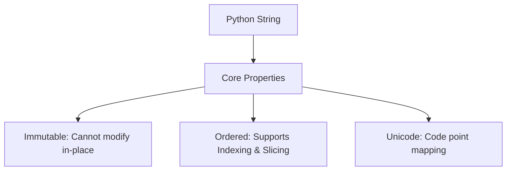
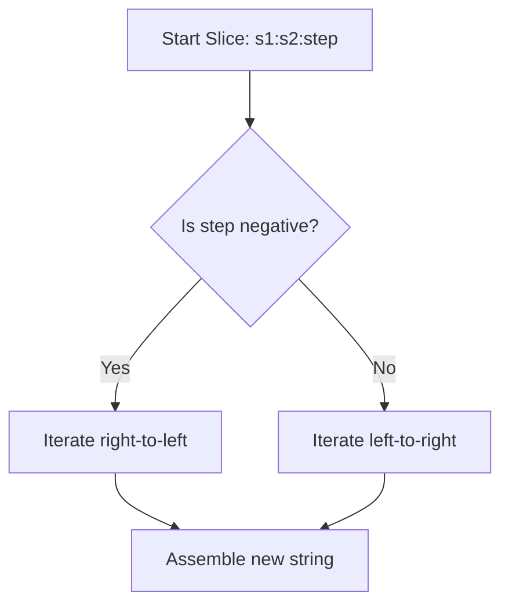

# Python OOP: Strings, Slicing, & DSA Design Patterns

---

# 1. Definition

## String Data Type
A **String** (`str` in Python) is an ordered, immutable sequence of Unicode characters representing text data.
* **Immutable**: Once a string object is allocated on the heap, its characters cannot be modified, deleted, or replaced in-place. Any operations that appear to modify a string (like `.upper()` or concatenation) allocate a brand-new string object in memory.
* **Unicode Support**: Python stores characters as Unicode code points, allowing native support for multiple languages, symbols, and emojis.



---

# 2. Why Do We Need It?

### The Problem Before High-Level Strings (C-Style Character Arrays)
In low-level languages like C, strings are represented as raw arrays of characters terminated by a null character (`\0`).

```c
// C-Style String
char name[6] = {'H', 'e', 'l', 'l', 'o', '\0'};
```

#### Issues with C-Style Character Arrays:
1. **Buffer Overflow**: Writing past the array boundaries corrupts memory.
2. **Manual Memory Management**: Resizing text requires manual re-allocation (`realloc`) and copying.
3. **ASCII Limitation**: Standard character arrays do not natively support international characters (like Chinese glyphs) or emojis.

---

# 3. Real-Life Analogies

### Analogy 1: A String of Pearls
Think of a string as a necklace of pearls:
* Each pearl (character) has a specific position (index) on the thread.
* You can look at the 3rd pearl easily.
* If you want to change the color of the 3rd pearl, you cannot do it while they are on the thread (immutability). Instead, you must cut the thread, take all the pearls, paint the 3rd one, and string them onto a brand-new thread (allocating a new string object).

---

# 4. Syntax

```python
# 1. String Declarations
s1 = 'Hello'
s2 = "Python"
s3 = """This is a
multiline string."""

# 2. Indexing & Slicing
text = "Python"
first_char = text[0]
sub_string = text[1:4]  # 'yth'
```
* **Explanation**: Demonstrates string declarations and substring extractions.
* **Expected Output**: Compiles and executes.
* **Memory Explanation**: Python allocates string objects on the heap and creates references.
* **Time Complexity**: $\mathcal{O}(1)$ for indexing, $\mathcal{O}(K)$ for slicing (where $K$ is slice length).
* **Space Complexity**: $\mathcal{O}(1)$ for indexing, $\mathcal{O}(K)$ for slice output.
* **Common Mistakes**: Expecting `text[1:4]` to include index `4` (stop index is exclusive).
* **Best Practices**: Use triple quotes for long multiline strings or docstrings.

---

# 5. Syntax Breakdown

Let's dissect slicing syntax:

$$\text{substring} = \text{string}[\text{start} : \text{stop} : \text{step}]$$

* **`start`**: The index where the slice begins (inclusive). Default is `0`.
* **`stop`**: The index where the slice ends (exclusive; slices up to `stop - 1`). Default is the end of the string.
* **`step`**: The increment value. If positive, slicing moves left-to-right. If negative, slicing moves right-to-left. Default is `1`.

---

# 6. Memory Diagram

When we execute:
```python
s = "Python"
slice_val = s[0:3]
```

```
STACK                                      HEAP
======================                     ============================================
|  Name   | Reference|                     |  Address  | Object Type | Value          |
======================                     ============================================
|   s     |  0x100A  | ------------------> |  0x100A   | str         | "Python"       |
----------------------                     ============================================
|slice_val|  0x200B  | ------------------> |  0x200B   | str         | "Pyt"          |
======================                     ============================================
```

* **Explanation**: Slicing creates a completely separate string object `"Pyt"` at address `0x200B`.

---

# 7. Internal Working (Behind the Scenes)

## String Interning
To optimize memory, Python uses **String Interning**.
* For small, alphanumeric string literals, CPython checks a central registry (intern pool).
* If the string `"hello"` already exists, Python binds the new variable reference to the existing address instead of allocating a duplicate string.

```python
a = "hello"
b = "hello"
print(a is b)
```
* **Explanation**: Compares object identity.
* **Expected Output**: `True`
* **Memory Explanation**: Both `a` and `b` reference the same heap address.
* **Time Complexity**: $\mathcal{O}(1)$

---

# 8. Rules

### String Rules
1. **Immutability Constraint**: Any attempt to write `s[0] = 'X'` will raise a `TypeError`.
2. **Negative Index Limits**: Negative indexes range from `-1` (last character) down to `-len(s)`. Indexing beyond this range raises an `IndexError`.
3. **Short-Circuit Slicing**: Slicing index parameters can exceed boundaries without raising errors; Python automatically clamps them to the string boundaries.

---

# 9. Naming Conventions (PEP 8)

* Use snake_case for string variables.
* Use raw string prefix `r"..."` when storing Windows file paths or regular expressions to prevent escape sequence conflicts.

| Type | Bad Example | Good Example | Industry Standard |
| :--- | :--- | :--- | :--- |
| File Path | `path = "C:\new_folder\text.txt"` | `path = r"C:\new_folder\text.txt"` | `input_file_path = r"C:\data\source.csv"` |

---

# 10. Common Mistakes & Bugs

### Mistake 1: Attempting In-Place Modification
```python
# BUGGY CODE
word = "Python"
word[0] = "J"
```
* **Expected Output**: `TypeError: 'str' object does not support item assignment`
* **How to avoid**: Construct a new string: `word = "J" + word[1:]`.

---

### Mistake 2: Quadratic Loop Concatenation
```python
# BUGGY CODE
result = ""
for char in ["a", "b", "c"]:
    result += char  # Slow! Allocates new string on every iteration
```
* **Why it happens**: Re-allocation inside a loop leads to $\mathcal{O}(N^2)$ time complexity.
* **How to avoid**: Use `"".join(["a", "b", "c"])` which runs in $\mathcal{O}(N)$ time.

---

# 11. Best Practices & Pythonic Code

* **Use `.join()`** for list-to-string operations.
* **Use f-strings** instead of older `%` or `.format()` styles.
```python
# Pythonic formatting
details = f"Language: {s1}, Developer: {s2}"
```

---

# 12. Interview Questions

### Q1. Why are Python strings immutable?
* **Answer**: 
  1. **Security**: Strings are frequently used as dictionary keys, network credentials, and file paths. If strings were mutable, an attacker could alter the path after validation.
  2. **Memory Efficiency**: Immutability allows String Interning; Python can share a single string object among multiple variables safely.
  3. **Thread Safety**: Immutable objects are naturally thread-safe and don't require synchronization locks.

---

### Q2. What is the time complexity of string slicing `s[start:stop]`?
* **Answer**: $\mathcal{O}(K)$ where $K$ is the length of the slice (i.e., `stop - start`), because Python must copy the characters from the original string to populate the new slice object.

---

### Q3. Tricky Output Question
**What is the output of `"hello".find("x")`?**
* **Expected Output**: `-1`
* **Explanation**: The `.find()` method returns `-1` if the substring is not found, unlike `.index()` which raises a `ValueError`.

---

# 13. Exam Points

* **`ord()`**: Returns the Unicode code point integer of a character.
* **`chr()`**: Returns the character corresponding to a Unicode integer.
* **Truthy Strings**: Any non-empty string is evaluated as `True` in boolean statements.

---

# 14. Real-World Examples

## Example 1: Input Cleansing
```python
def clean_user_input(raw_input: str) -> str:
    # Removes whitespace, converts to lowercase
    return raw_input.strip().lower()

# Execution
print(clean_user_input("   SaUrAbH   "))
```
* **Explanation**: Sanitizes input strings before database writes.
* **Expected Output**:
  ```
  saurabh
  ```
* **Time/Space Complexity**: $\mathcal{O}(N)$ where $N$ is input length.

---

## Example 2: Palindrome Checker (DSA Pattern)
```python
def is_palindrome(text: str) -> bool:
    # Clean non-alphanumeric chars
    cleaned = "".join(char.lower() for char in text if char.isalnum())
    return cleaned == cleaned[::-1]

print(is_palindrome("A man, a plan, a canal: Panama"))
```
* **Explanation**: Compares a string with its reversed slice.
* **Expected Output**: `True`
* **Time Complexity**: $\mathcal{O}(N)$
* **Space Complexity**: $\mathcal{O}(N)$

---

# 15. Mini Practice

### Easy
Reverse the string `"Developer"` using slice syntax.

### Medium
Implement an anagram detector function that accepts two strings and returns True if they are anagrams.

### Hard
Write a function that compresses a string like `"aaabbcc"` to `"a3b2c2"` using a single loop traversal.

---

# 16. Summary Table

| Method | Return Type | Side Effect | Key Use Case |
| :--- | :--- | :--- | :--- |
| `.strip()` | `str` | None (New String) | Removing white space |
| `.split(sep)` | `list[str]` | None (New List) | Parsing comma-separated files |
| `.replace(o, n)`| `str` | None (New String) | Substituting template tokens |

---

# 17. Cheat Sheet

```python
# Reversal
reversed_str = s[::-1]

# Concatenation
joined_str = ",".join(list_of_strings)

# Char check
ascii_val = ord('A')  # 65
char_val = chr(65)    # 'A'
```

---

# 18. Flow Diagram



---

# 19. Comparison Table

| Feature | Slicing (`s[1:4]`) | Direct Access (`s[1]`) |
| :--- | :--- | :--- |
| **Out of Range Behavior** | Handled safely (returns empty string) | Raises IndexError |
| **Returned Object** | A new copy of segment | Single character string reference |

---

# 20. Things to Remember

> [!IMPORTANT]
> **Key takeaways on Strings:**
> 1. **Strings are immutable**: Do not attempt in-place character updates.
> 2. **Avoid loop concatenation**: Always build lists and join them at the end.