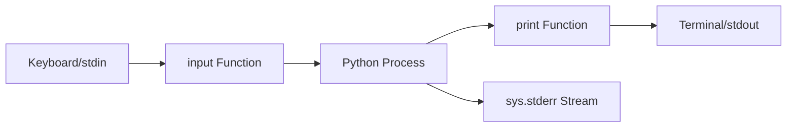
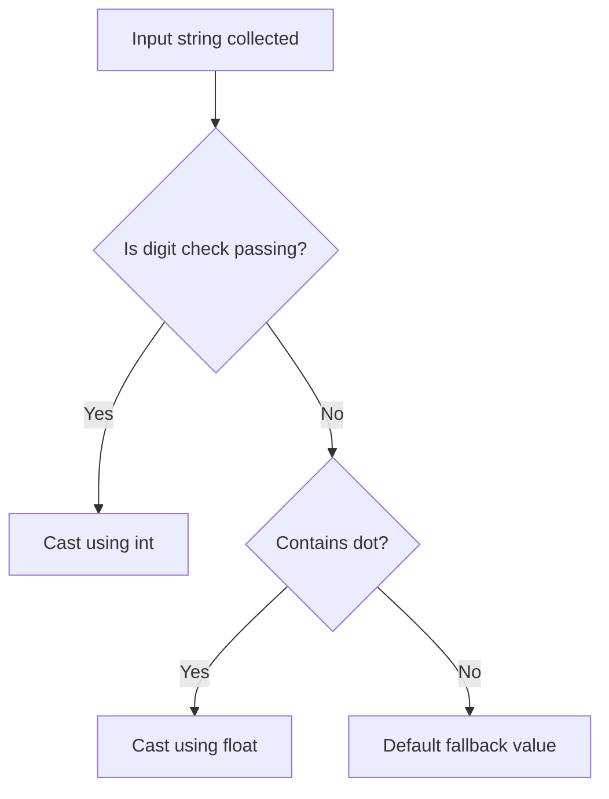

# Python OOP: Input, Output, & Console Streams

---

# 1. Definition

## Console Input/Output (I/O)
**Console I/O** is the process of transferring data between a running computer program and its external execution environment (typically the terminal or command line prompt). 

## Standard Streams
In modern operating systems, console I/O is managed using three standard stream channels:
1. **`sys.stdin` (Standard Input)**: The stream used to capture user inputs (default: Keyboard).
2. **`sys.stdout` (Standard Output)**: The stream used to output standard program data (default: Monitor/Terminal screen).
3. **`sys.stderr` (Standard Error)**: The stream used to output diagnostics and runtime errors separately.



---

# 2. Why Do We Need It?

### The Problem Before Dynamic I/O
If a program lacks execution-time I/O channels, it can only run using variables initialized directly inside the source code (hardcoded parameters).

```python
# Hardcoded credentials
admin_user = "Aman"
```

#### Issues:
1. **No Interactive Usability**: The program must be modified and recompiled every time a user wants to input their own data.
2. **No Diagnostics**: If a calculation fails mid-way, there is no stdout channel to notify the user.
3. **Pipelining Failure**: Operating systems cannot route output from one program into another without stdout/stdin redirection.

---

# 3. Real-Life Analogies

### Analogy 1: The Fast-Food Order Window
* **`input()`**: The speaker at the drive-thru. The cashier pauses the transaction, waits for you to say your order, and records it as text.
* **`print()`**: The terminal screen showing your receipt.
* **The Input Trap**: Even if you order `"10"` burgers, the cashier writes down the characters `1`, `0` on the order receipt. The kitchen must interpret that word as a number to know how many patties to grill (Type Casting).

---

# 4. Syntax

```python
# 1. Accepting Input
raw_input = input("Enter quantity: ")

# 2. Type Casting Input
quantity = int(raw_input)

# 3. Output with Parameters
print("Processing", quantity, "items...", sep=" ", end="\n")
```
* **Explanation**: Demonstrates standard input collection, integer casting, and output configuration.
* **Expected Output**: (Interactive input prompts user).
* **Memory Explanation**: `input()` allocates a string object. `int()` parses it and allocates a new integer object on the heap.
* **Time/Space Complexity**: $\mathcal{O}(N)$ where $N$ is input string character count.
* **Common Mistakes**: Performing numeric operations directly on `raw_input` before casting it.
* **Best Practices**: Always specify type casting inside error-handling blocks.

---

# 5. Syntax Breakdown

Let's dissect the advanced parameters of `print()`:

```python
print(object1, object2, sep="-", end="!!!\n")
```
* **`object1, object2`**: Positional arguments representing objects to be converted to strings and printed.
* **`sep`**: Specifies the character string inserted between objects. Default is a space `" "`.
* **`end`**: Specifies what character string is appended at the very end of the output. Default is a newline `\n`.

---

# 6. Memory Diagram

When a user types `25` into `input()` and we run `val = int(input())`:

```
HEAP STORAGE
=========================================================
| Address | Object Type | Value  | References           |
=========================================================
| 0x500A  | <class 'str'> | "25"  | Temp input buffer    |
---------------------------------------------------------
| 0x600B  | <class 'int'> | 25    | val                  |
=========================================================
```

* **Explanation**: The string `"25"` is first allocated. The `int()` constructor reads it, allocates a new integer object `25` at address `0x600B`, and binds the label `val` to it.

---

# 7. Internal Working (Behind the Scenes)

## Standard IO Redirection
Under the hood:
* **`input(prompt)`** writes the prompt string to `sys.stdout`, flushes the buffer, and then reads a line of characters from `sys.stdin` until it encounters a newline character (`\n`). The newline is stripped before returning the string.
* **`print(*objects)`** converts each object to a string representation, writes them to `sys.stdout` separated by the `sep` string, and terminates by writing the `end` string.

---

# 8. Rules

### I/O Rules
1. **The String Trap**: `input()` **always** returns data of type `<class 'str'>`.
2. **Casting Failures**: If the input string contains non-numeric characters (e.g., `"25a"`), calling `int()` will raise a `ValueError`.
3. **Dynamic Buffer Flush**: `print()` is line-buffered by default. To force printing immediately without waiting for a newline, use the `flush=True` parameter.

---

# 9. Naming Conventions (PEP 8)

* Keep prompt strings descriptive and append a trailing space so the cursor does not touch the prompt text.

| Prompt Style | Bad Example | Good Example | Industry Standard |
| :--- | :--- | :--- | :--- |
| User Prompt | `input("Age:")` | `input("Enter your age: ")` | `input("Please enter user age: ")` |

---

# 10. Common Mistakes & Bugs

### Mistake 1: Math Operations on Raw Input
```python
# BUGGY CODE
age = input("Enter age: ")
years_left = 100 - age
```
* **Expected Output**: `TypeError: unsupported operand type(s) for -: 'int' and 'str'`
* **How to avoid**: Cast the input: `age = int(input("Enter age: "))`.

---

### Mistake 2: Missing Trailing Space in Prompts
```python
# BUGGY CODE
name = input("Enter your name:")
# Resulting Terminal: Enter your name:Saurabh
```
* **Why it happens**: Forgetting to add whitespace at the end of the prompt string.
* **How to avoid**: Always end prompt strings with a space: `input("Enter your name: ")`.

---

# 11. Best Practices & Pythonic Code

* **Use f-strings** for printing variable values to keep code clean.
* **Implement safe casting** using structured checks or try-except blocks.
```python
# Pythonic Input Parsing
raw_val = input("Enter integer: ")
val = int(raw_val) if raw_val.isdigit() else 0
```

---

# 12. Interview Questions

### Q1. How do you print outputs directly to the Standard Error stream instead of Standard Output?
* **Answer**: You can redirect the output of the print function by passing the file descriptor to the `file` parameter.
```python
import sys
print("Error: Access Denied", file=sys.stderr)
```

---

### Q2. What is the difference between `input()` in Python 3 and `raw_input()` in Python 2?
* **Answer**: In Python 2, `raw_input()` returns a string, while `input()` evaluates the input string as active Python code (which is a security risk). In Python 3, `raw_input()` was removed, and `input()` was renamed to behave like `raw_input()`, returning only strings.

---

### Q3. Tricky Output Question
**What is the output of the following statement?**
```python
print("A", "B", sep=None)
```
* **Expected Output**: `A B`
* **Explanation**: If `sep` is set to `None`, Python uses the default separator, which is a single space `" "`.

---

# 13. Exam Points

* **`sep`**: Character separator (default: space).
* **`end`**: Appended string (default: newline `\n`).
* **`ValueError`**: Raised when converting an incompatible string format using `int()`.

---

# 14. Real-World Examples

## Example 1: User Registration Terminal CLI
```python
def register_user() -> None:
    print("=== System Registration CLI ===", end="\n\n")
    name = input("Enter Username: ").strip()
    
    raw_age = input("Enter Age: ")
    age = int(raw_age) if raw_age.isdigit() else 0
    
    print(f"\nUser Registration Successful!")
    print(f"Details: Name = {name} | Age = {age}")

# Execution
register_user()
```
* **Explanation**: Prompts for system profile configuration inputs.
* **Expected Output**: Runs interactive session output.
* **Time Complexity**: $\mathcal{O}(N)$
* **Space Complexity**: $\mathcal{O}(N)$

---

# 15. Mini Practice

### Easy
Ask the user for their favorite color, and print `"Your choice: <color>"` using an f-string.

### Medium
Accept two float numbers using separate inputs and output their product formatted to exactly 2 decimal places.

### Hard
Write a program that takes three values separated by spaces in a single input line, splits them, and prints them on separate lines.

---

# 16. Summary Table

| Stream Name | Python Wrapper | Default System Target | Print Parameter |
| :--- | :--- | :--- | :--- |
| **stdout** | `sys.stdout` | Terminal Display | `file=sys.stdout` |
| **stderr** | `sys.stderr` | Terminal Display | `file=sys.stderr` |
| **stdin** | `sys.stdin` | Keyboard Buffer | `input()` |

---

# 17. Cheat Sheet

```python
# Print no newline
print("Hello", end="")

# Cast inline
age = int(input("Age: "))

# Log to error stream
import sys
print("Critical log", file=sys.stderr)
```

---

# 18. Flow Diagram



---

# 19. Comparison Table

| Output Call | Output Mechanism | Buffered |
| :--- | :--- | :--- |
| `print("msg")` | Standard high-level helper | Yes |
| `sys.stdout.write("msg")` | Direct file stream write | Yes (requires manual flush) |

---

# 20. Things to Remember

> [!IMPORTANT]
> **Key takeaways on I/O:**
> 1. **input() is a string**: Never perform mathematical equations directly on raw input values.
> 2. **Errors are separate**: Redirect system errors to `sys.stderr` in production systems.
