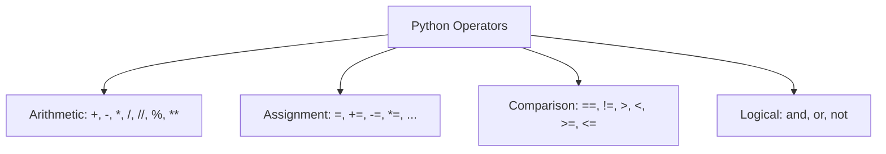
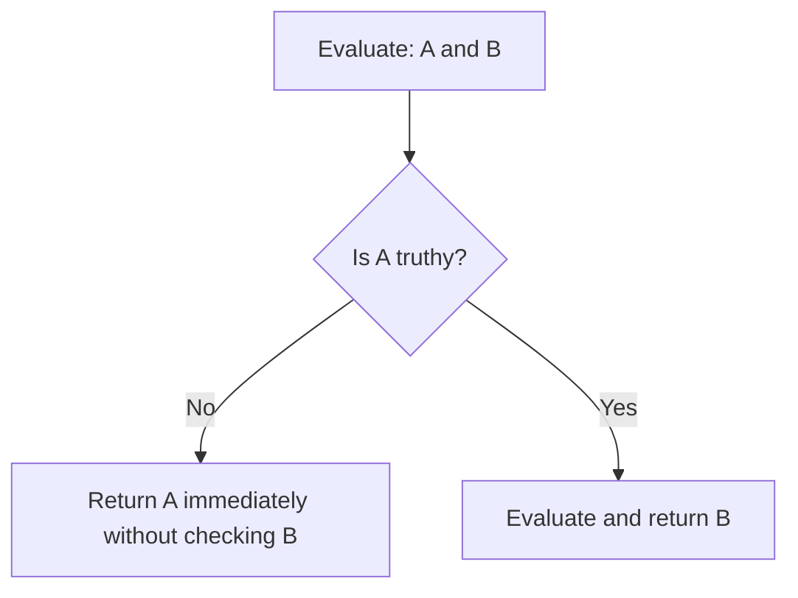

# Python OOP: Operators, Expression Evaluation, & Short-Circuit Logic

---

# 1. Definition

## Operators and Operands
**Operators** are special symbolic tokens in Python that instruct the compiler/interpreter to perform specific mathematical, relational, or logical manipulations on data elements called **Operands**.

```python
x + y  # '+' is the operator, 'x' and 'y' are the operands
```

## Operator Classification in Python
Python supports several categories of operators:
1. **Arithmetic Operators**: For mathematical calculations.
2. **Assignment Operators**: For binding values to variables.
3. **Comparison (Relational) Operators**: For evaluating equality or inequality (returns a Boolean).
4. **Logical Operators**: For combining Boolean conditions.



---

# 2. Why Do We Need It?

### The Problem Without Operators (Functional Calculation Calls)
Without symbolic operators, even basic math or logic would require calling functions directly from code, which is extremely verbose and difficult to parse.

```python
# Hypothesized code without operators
x = assign("x", add(multiply(5, 10), divide(100, 2)))
```

#### Issues:
1. **Low Readability**: Simple expressions are buried in nested parentheses.
2. **Standardization Gaps**: Different libraries would implement different naming patterns for basic arithmetic (e.g., `add()` vs `plus()`).
3. **Optimizing Complexity**: Interpreting functions requires function call stacks, which is slower than executing native bytecode instructions for symbols.

---

# 3. Real-Life Analogies

### Analogy: The Security Gate
* **AND Operator**: A bank vault that requires *both* keycard A and keycard B to open. If either card is missing, the gate remains closed.
* **OR Operator**: An office door that can be opened using *either* a security keycard OR a fingerprint scanner. At least one valid input grants access.
* **NOT Operator**: A toggle switch that flips the status of the vault (if open, lock it; if locked, open it).

---

# 4. Syntax

```python
# 1. Arithmetic & Floor Division
val1 = 17 / 5   # Float Division: 3.4
val2 = 17 // 5  # Floor Division: 3

# 2. String ASCII Comparison
is_greater = "apple" > "Banana"  # True (lowercase 'a' > uppercase 'B')

# 3. Logical Evaluation
access_granted = True and (5 > 2)  # True
```
* **Explanation**: Demonstrates operations for math, string ASCII comparison, and short-circuit evaluation.
* **Expected Output**: Compiles and executes.
* **Memory Explanation**: Operations evaluate to transient objects on the stack before being bound to references.
* **Time Complexity**: $\mathcal{O}(1)$ for numeric operations, $\mathcal{O}(N)$ for string comparisons (where $N$ is string length).
* **Space Complexity**: $\mathcal{O}(1)$ auxiliary space.
* **Common Mistakes**: Confusing `/` (always returns a float) with `//` (truncates decimal values).
* **Best Practices**: Use brackets in compound conditions to explicitly specify execution order.

---

# 5. Syntax Breakdown

Let's dissect the 7 arithmetic operators:

* **`+` (Addition)**: Adds operands.
* **`-` (Subtraction)**: Subtracts right operand from left.
* **`*` (Multiplication)**: Multiplies operands.
* **`/` (Division)**: Divides left operand by right operand; **always returns a float**.
* **`//` (Floor Division)**: Divides and rounds down to the nearest integer.
* **`%` (Modulus)**: Returns the remainder of division.
* **`**` (Exponentiation)**: Raises base to power.

---

# 6. Memory Diagram

When we run `x += 5` on an integer vs a list:

```
IMMUTABLE (int)
x = 10 (Address 0x100A)
x += 5 -> Allocates 15 (Address 0x200B). x now references 0x200B.

MUTABLE (list)
lst = [1] (Address 0x300C)
lst += [2] -> Modifies list in-place at Address 0x300C. lst still references 0x300C.
```

---

# 7. Internal Working (Behind the Scenes)

## Operator Overloading / Dunder Methods
In Python, symbols are syntactic sugar for special methods called **Magic Methods** or **Dunder Methods** (double underscores):
* When you write `a + b`, Python calls `a.__add__(b)`.
* When you write `a == b`, Python calls `a.__eq__(b)`.
* When you write `a > b` with strings, Python calls `__gt__` which compares the Unicode code point of each character from index `0` onwards.

```python
# "apple" vs "Banana"
# ord('a') is 97
# ord('B') is 66
# Since 97 > 66, "apple" is greater than "Banana"
```

---

# 8. Rules

### Operator Rules
1. **Operator Precedence**: Python evaluates expressions based on precedence levels (e.g., Parentheses $\rightarrow$ Exponentiation $\rightarrow$ Multiplication/Division $\rightarrow$ Addition/Subtraction).
2. **Boolean Short-Circuiting**:
   * For `A and B`: If `A` is `False`, Python returns `False` immediately and **does not evaluate B**.
   * For `A or B`: If `A` is `True`, Python returns `True` immediately and **does not evaluate B**.
3. **Floor Division Negative Rounding**: Floor division rounds down towards negative infinity. Thus, `-5 // 2` evaluates to `-3`, not `-2`.

---

# 9. Naming Conventions (PEP 8)

* Surround binary operators with a single space on either side to improve readability.
* Exception: Do not use spaces around the `=` sign when defining parameter default values in function definitions (e.g., `def func(a=10):`).

| Code Style | Bad Example | Good Example | Industry Standard |
| :--- | :--- | :--- | :--- |
| Operations | `x=a+b*c` | `x = a + b * c` | `total_score = base_score + (multiplier * factor)` |

---

# 10. Common Mistakes & Bugs

### Mistake 1: Assignment vs Equality Comparison
```python
# BUGGY CODE
if user_role = "Admin":
    print("Access Granted")
```
* **Expected Output**: `SyntaxError: invalid syntax`
* **How to avoid**: Use `==` for comparison: `if user_role == "Admin":`.

---

### Mistake 2: Short-circuit Evaluation Side Effects
```python
# BUGGY CODE
def activate():
    print("Activated!")
    return True

# If the first condition is True, 'activate()' is NEVER called
if True or activate():
    pass
```
* **Why it happens**: Logical OR short-circuits execution as soon as a True value is encountered.
* **How to avoid**: Call functional updates outside the conditional check if they must run.

---

# 11. Best Practices & Pythonic Code

* **Use Chained Comparisons** instead of nested logical checks.
```python
# Pythonic Chaining
if 10 < x < 20:
    print("Within range")
```

---

# 12. Interview Questions

### Q1. Explain the difference between `==` and `is` in Python.
* **Answer**: 
  * `==` is an equality operator. It checks if the values of two objects are equal by calling the `__eq__` method.
  * `is` is an identity operator. It checks if two variables point to the exact same object in memory by comparing their memory addresses (`id(a) == id(b)`).

---

### Q2. What is the output of `float('inf') > 100000`?
* **Answer**: `True`. Python's floating-point system supports special infinity representations that are greater than any real numeric values.

---

### Q3. Tricky Output Question
**What is the output of the following expression?**
```python
print(10 and 20 or 30)
```
* **Expected Output**: `20`
* **Explanation**: `10 and 20` evaluates to `20` (since both are truthy, the last evaluated value is returned). Then, `20 or 30` evaluates to `20` (since `20` is truthy, the OR operator short-circuits and returns it immediately).

---

# 13. Exam Points

* **PEMDAS**: Order of operations: Parentheses, Exponents, Multiplication, Division, Addition, Subtraction.
* **Association**: Python arithmetic operations are evaluated left-to-right (except exponentiation, which is evaluated right-to-left).
* **ASCII values**: Uppercase letters (A-Z) range from 65 to 90. Lowercase letters (a-z) range from 97 to 122.

---

# 14. Real-World Examples

## Example 1: E-Commerce Discount Calculations
```python
def check_discount_eligibility(cart_total: float, is_first_purchase: bool) -> bool:
    # Customer gets a discount if their cart is > 100 AND they are a first-time buyer
    # OR if they spend > 500 unconditionally
    return (cart_total > 100 and is_first_purchase) or (cart_total > 500)

print("Eligibility:", check_discount_eligibility(150, True))  # True
print("Eligibility:", check_discount_eligibility(150, False)) # False
```
* **Explanation**: Combines arithmetic comparisons and logical operators.
* **Expected Output**:
  ```
  Eligibility: True
  Eligibility: False
  ```
* **Time/Space Complexity**: $\mathcal{O}(1)$

---

# 15. Mini Practice

### Easy
Evaluate the expression `(10 * 2) + (50 // 3)` manually, then write a script to confirm.

### Medium
Explain why `"Python" > "Java"` evaluates to True by comparing ASCII characters.

### Hard
Write a program that uses logical operators to check if a year is a leap year (rules: divisible by 4 and not divisible by 100, or divisible by 400).

---

# 16. Summary Table

| Operator Category | Operators | Return Type | Precedence |
| :--- | :--- | :--- | :--- |
| **Parentheses** | `()` | Matches evaluated type | 1 (Highest) |
| **Exponentiation** | `**` | `int` or `float` | 2 |
| **Multiplication/Division** | `*`, `/`, `//`, `%` | `int` or `float` | 3 |
| **Relational** | `==`, `!=`, `>`, `<`, `>=`, `<=` | `bool` | 4 |
| **Logical** | `not`, `and`, `or` | Evaluated operand type | 5 (Lowest) |

---

# 17. Cheat Sheet

```python
# Floor Division
3 // 2  # 1

# Modulus (remainder)
10 % 3  # 1

# Identity
a is b  # Checks memory address

# Equality
a == b  # Checks value
```

---

# 18. Flow Diagram



---

# 19. Comparison Table

| Operator | Return Type on `10 / 2` | Return Type on `10 // 2` |
| :--- | :--- | :--- |
| **`/` (Division)** | `float` (`5.0`) | N/A |
| **`//` (Floor Division)** | N/A | `int` (`5`) |

---

# 20. Things to Remember

> [!IMPORTANT]
> **Key takeaways on Operators:**
> 1. **Short-circuiting is key**: Place cheaper comparisons on the left of an `and` statement to save CPU time.
> 2. **Avoid `is` for values**: Use `==` to compare values; reserve `is` for identity checks (like `is None`).