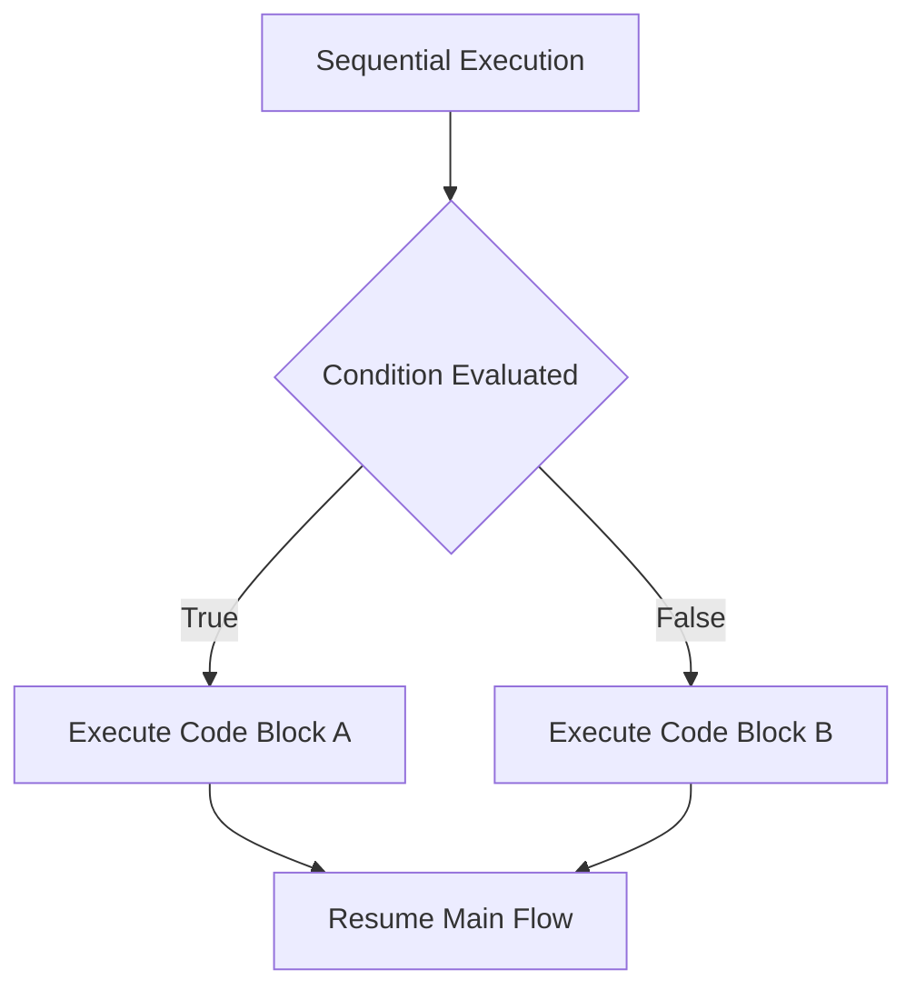
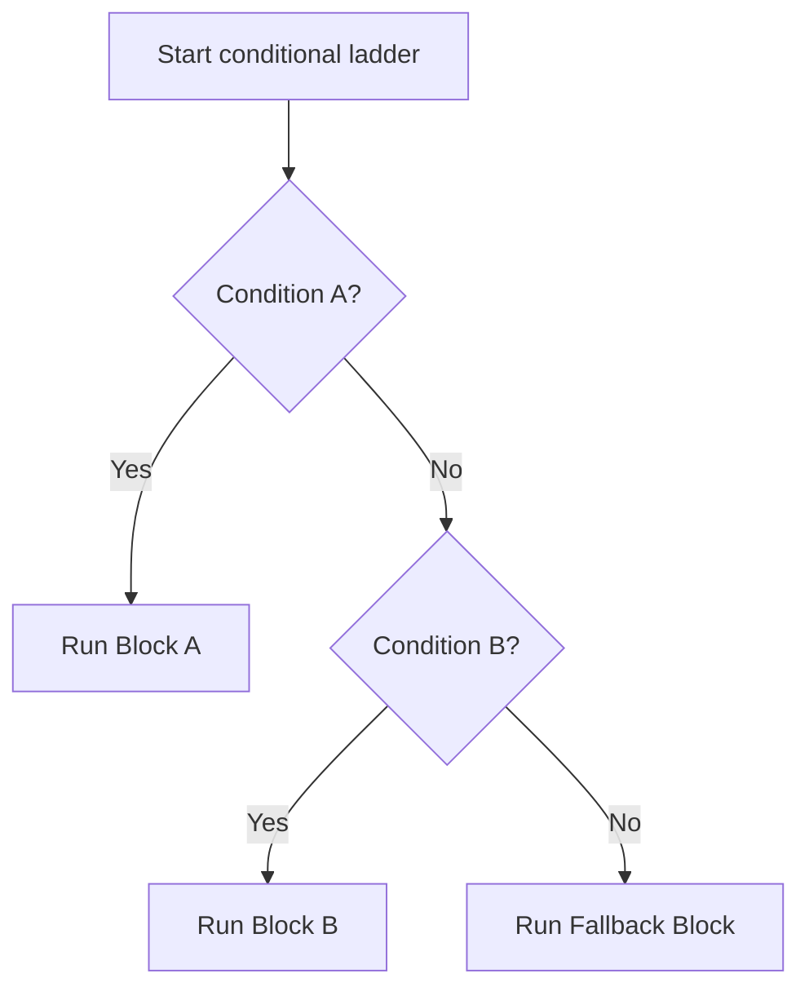

# Python OOP: Conditional Statements & Control Flow

---

# 1. Definition

## Control Flow
**Control Flow** is the order in which individual statements, instructions, or function calls are executed or evaluated in a running program. 

## Conditional Statements
**Conditional Statements** are control structures that allow a program to branch its execution path. By evaluating Boolean expressions (which resolve to `True` or `False`), a program determines at runtime which block of code to run and which block to bypass.



---

# 2. Why Do We Need It?

### The Problem With Strictly Sequential Execution
Without control flow structures, code execution is purely linear. The interpreter executes line 1, then line 2, down to the final line, without exception.

```python
# Sequential execution
print("User authorized")
print("Display admin dashboard")
```

#### Issues:
1. **No Decision Making**: The program cannot customize its responses based on inputs (e.g., checking if a password is correct).
2. **Lack of Validation**: Invalid inputs (like dividing by zero) cannot be intercepted, crashing the application.
3. **No Fallback Paths**: There is no way to define alternative outcomes or error-handling flows.

---

# 3. Real-Life Analogies

### Analogy: The Railway Switch
Imagine a train track:
* A train is traveling down a single main track (Sequential execution).
* It reaches a railway switch (Conditional statement).
* If the switch is turned left (Condition: True), the train routes to Track A.
* If the switch is turned right (Condition: False), the train routes to Track B.
* The train cannot travel on both tracks simultaneously; the switch directs it to a single execution path.

---

# 4. Syntax

```python
# 1. Standard if-elif-else Ladder
score = 85

if score >= 90:
    grade = "A"
elif score >= 80:
    grade = "B"
else:
    grade = "C"

# 2. Inline Ternary Operator (Conditional Expression)
status = "Pass" if score >= 40 else "Fail"
```
* **Explanation**: Demonstrates standard multi-branch selection and the Python ternary operator.
* **Expected Output**: Compiles and executes.
* **Memory Explanation**: Conditional checks read variables on the stack. The ternary expression evaluates a single object reference directly.
* **Time Complexity**: $\mathcal{O}(1)$
* **Space Complexity**: $\mathcal{O}(1)$ auxiliary space.
* **Common Mistakes**: Forgetting the colon (`:`) after `if`, `elif`, or `else`, which raises a `SyntaxError`.
* **Best Practices**: Use ternary operators only for simple, single-line assignments to keep code readable.

---

# 5. Syntax Breakdown

Let's dissect the inline Ternary Operator:

$$\text{Result} = \text{Expression}_{\text{True}} \ \mathbf{if} \ \text{Condition} \ \mathbf{else} \ \text{Expression}_{\text{False}}$$

* **`Expression_True`**: The value returned if the condition evaluates to `True`.
* **`if Condition`**: The conditional check.
* **`else Expression_False`**: The fallback value returned if the condition evaluates to `False`.

---

# 6. Memory Diagram

When evaluating the ternary statement `val = node.val if node else 0` where `node` is `None`:

```
STACK                                      HEAP
======================                     ============================================
|  Name   | Reference|                     |  Address  | Object Type | Value          |
======================                     ============================================
|  node   |  0x0000  | ------------------> |  0x0000   | NoneType    | None           |
----------------------                     ============================================
|  val    |  0x100A  | ------------------> |  0x100A   | int         | 0              |
======================                     ============================================
```

* **Explanation**: Because `node` evaluates to `False` (is `None`), the condition fails. The expression short-circuits and binds `val` to the integer object `0` on the heap.

---

# 7. Internal Working (Behind the Scenes)

## Statements vs Expressions
It is important to understand the technical difference:
* **Statements** (like `if-else` blocks) perform actions but do not return a value. They cannot be assigned to variables or passed directly to functions.
* **Expressions** (like the Ternary Operator) evaluate to a single value, allowing inline assignment, lambda returns, and functional arguments.

## Jump Instructions in Bytecode
Under the hood, the Python compiler compiles conditional statements into bytecode jump instructions (`POP_JUMP_IF_FALSE` or `POP_JUMP_IF_TRUE`). The PVM checks the top of the evaluation stack; if the value is false, it changes the instruction pointer to the address of the `else` or `elif` block.

---

# 8. Rules

### Indentation Rules
1. **Indentation is Mandatory**: Code blocks inside conditional branches must be indented (PEP 8 recommends exactly **4 spaces**). Mixing tabs and spaces will raise an `TabError`.
2. **Order of Evaluation**: An `if-elif-else` ladder is evaluated sequentially from top to bottom. Once a condition evaluates to `True`, its block executes, and the remaining branches are skipped.

---

# 9. Naming Conventions (PEP 8)

* Use snake_case for conditional flag variables.
* Name boolean flags with prefix words like `is_`, `has_`, or `should_` (e.g., `is_authorized`, `has_permission`).

| Variable Type | Bad Example | Good Example | Industry Standard |
| :--- | :--- | :--- | :--- |
| Boolean Flag | `active = True` | `is_active = True` | `is_system_initialized = True` |

---

# 10. Common Mistakes & Bugs

### Mistake 1: The Indentation Error
```python
# BUGGY CODE
if True:
print("Hello")
```
* **Expected Output**: `IndentationError: expected an indented block`
* **How to avoid**: Always indent the block inside conditionals.

---

### Mistake 2: Ternary Spaghetti
```python
# BUGGY CODE
status = "Excellent" if score > 90 else "Good" if score > 80 else "Fair" if score > 70 else "Poor"
```
* **Why it happens**: Nesting multiple ternary operators in a single line.
* **How to avoid**: Use standard `if-elif-else` ladders for structures with more than two branches.

---

# 11. Best Practices & Pythonic Code

* **Use Guard Clauses**: Return early from functions to keep indentation levels shallow.
```python
# Pythonic Guard Clause
def process_data(data):
    if not data:
        return None  # Guard Clause
    # Process data with low indentation
```

---

# 12. Interview Questions

### Q1. How does Python's ternary operator prevent runtime errors when accessing attributes?
* **Answer**: It evaluates lazily. If the condition checks that a reference exists, the expression branch that accesses the attribute is only evaluated if that condition is true.
```python
# Safe lookup
val = node.val if node is not None else 0
```

---

### Q2. Can an `else` statement exist without an `if` in Python?
* **Answer**: Yes, but not in conditional branching. Python allows `else` blocks after `for` loops, `while` loops, and `try-except` blocks.

---

### Q3. Tricky Output Question
**What is the output of the following function if `root` is `None`?**
```python
def max_depth(root):
    return 0 if not root else 1 + max(max_depth(root.left), max_depth(root.right))
```
* **Expected Output**: `0`
* **Explanation**: Since `root` is `None`, `not root` evaluates to `True`, returning the base case value `0` immediately.

---

# 13. Exam Points

* **`elif`**: Short form of "else if" in Python.
* **`if`**: The only mandatory statement in a conditional branch.
* **Ternary Operator**: Syntactic shorthand for basic `if-else` returns.

---

# 14. Real-World Examples

## Example 1: Recursive Binary Tree Base Cases (DSA Pattern)
```python
class TreeNode:
    def __init__(self, val=0, left=None, right=None):
        self.val = val
        self.left = left
        self.right = right

def get_node_val(node: TreeNode | None) -> int:
    # Safe attribute evaluation to prevent AttributeError
    return node.val if node else 0
```
* **Explanation**: Safely extracts the value of a tree node.
* **Expected Output**: Compiles.
* **Time Complexity**: $\mathcal{O}(1)$

---

## Example 2: Dynamic Programming Table State transitions
```python
def lcs_transition(i: int, j: int, text1: str, text2: str, dp: list[list[int]]) -> int:
    # DP lookup using inline ternary operator
    return dp[i-1][j-1] + 1 if text1[i-1] == text2[j-1] else max(dp[i-1][j], dp[i][j-1])
```
* **Explanation**: Transition step calculation for the Longest Common Subsequence algorithm.
* **Time Complexity**: $\mathcal{O}(1)$

---

# 15. Mini Practice

### Easy
Write a ternary operator that assigns `"Adult"` to `status` if `age` is 18 or older, and `"Minor"` otherwise.

### Medium
Implement a temperature classifier (`celsius < 0` is Freezing, `0-20` is Cold, `>20` is Warm) using a standard `if-elif-else` ladder.

### Hard
Write a leap year checker function that uses a single line ternary expression to return `True` or `False`.

---

# 16. Summary Table

| Structure | Syntax Type | Nests Well | Returns a Value |
| :--- | :--- | :--- | :--- |
| **`if-elif-else`** | Statement | Yes | No |
| **Ternary Operator** | Expression | No | Yes |

---

# 17. Cheat Sheet

```python
# Ternary
val = x if cond else y

# if-elif-else
if cond1:
    # Code
elif cond2:
    # Code
else:
    # Code
```

---

# 18. Flow Diagram



---

# 19. Comparison Table

| Feature | `if-else` Statement | Ternary Expression |
| :--- | :--- | :--- |
| **Syntax** | Multi-line blocks | Single-line inline |
| **Return** | Must use explicit `return` | Evaluates directly to value |

---

# 20. Things to Remember

> [!IMPORTANT]
> **Key takeaways on Control Flow:**
> 1. **Do not nest ternaries**: Nesting ternaries reduces readability.
> 2. **Leverage lazy evaluation**: Put checks like `node is not None` on the left of conditional expressions to avoid crash errors.