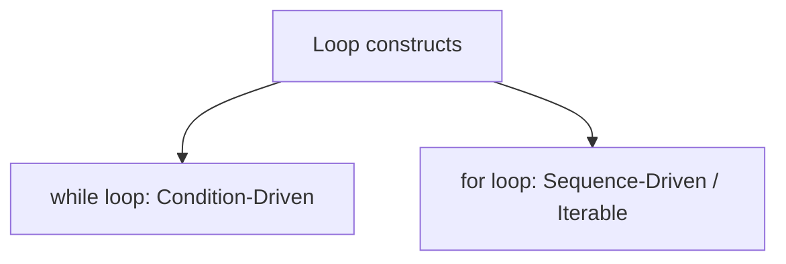
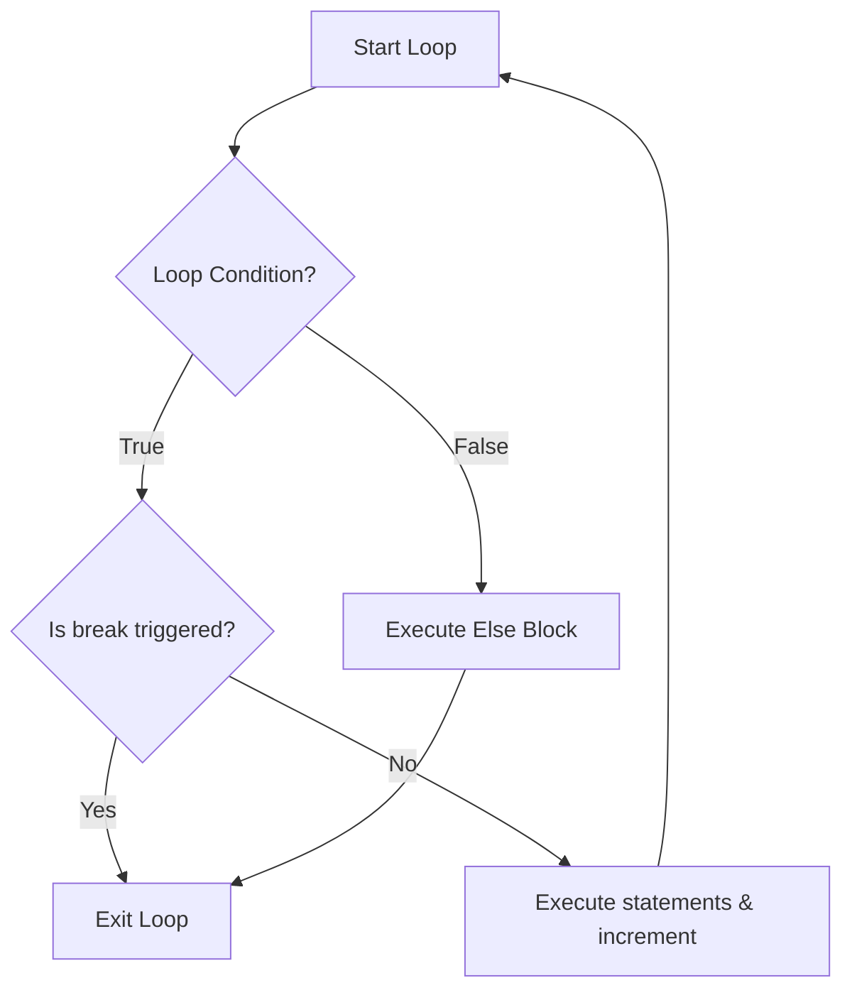

# Python OOP: Loops & Iterative Control Flow

---

# 1. Definition

## Iterative Control Flow (Loops)
**Iterative Control Flow** refers to the execution of a block of code repeatedly, either for a set number of times or until a specific termination condition is satisfied.

## Loop Types in Python
Python supports two native loop constructs:
1. **`while` Loop**: A condition-driven loop that repeats its block as long as a Boolean condition evaluates to `True`.
2. **`for` Loop**: A sequence-driven loop that iterates over a sequence (such as a list, string, range, tuple, or dictionary) and executes its block for each element.



---

# 2. Why Do We Need It?

### The Problem Without Loops
Without iterative loops, repetitive tasks require manual code duplication. If you need to print a message 100 times, you must write 100 print statements.

```python
# Repetitive operations
print("Log Entry")
print("Log Entry")
# ... repeat 100 times
```

#### Issues:
1. **Code Bloat**: Bloating the source file, making it hard to read and compile.
2. **Maintenance Nightmare**: Changing the print format requires editing 100 individual lines of code.
3. **No Dynamic Counts**: The program cannot run a task a dynamic number of times decided at runtime.

---

# 3. Real-Life Analogies

### Analogy: The Water Buckets
* **`for` Loop (Known iteration count)**: You have exactly 5 empty bottles. Your task is to fill each bottle with water. You know in advance that you will repeat the action exactly 5 times.
* **`while` Loop (Unknown iteration count)**: You have a single bucket of water. Your task is to scoop water out with a cup *until the bucket is empty*. You do not know if it will take 8, 10, or 12 scoops, but you stop as soon as the condition "bucket is empty" is met.

---

# 4. Syntax

```python
# 1. Condition-driven: while loop
count = 1
while count <= 5:
    print(count)
    count += 1
else:
    print("While loop complete")

# 2. Sequence-driven: for loop with range
for i in range(1, 6):
    print(i)
else:
    print("For loop complete")
```
* **Explanation**: Demonstrates counting from 1 to 5 using both while and for loops, including their respective `else` blocks.
* **Expected Output**:
  ```
  1
  2
  3
  4
  5
  While loop complete
  1
  2
  3
  4
  5
  For loop complete
  ```
* **Memory Explanation**: `count` tracks current integer on stack. `for` loop manages internal iterator variable on heap.
* **Time Complexity**: $\mathcal{O}(N)$ where $N$ is loop iteration count.
* **Space Complexity**: $\mathcal{O}(1)$ auxiliary space.
* **Common Mistakes**: Forgetting to increment the loop variable (`count += 1`), creating an infinite loop.
* **Best Practices**: Use `for` loops when iterating over sequences for cleaner code.

---

# 5. Syntax Breakdown

Let's dissect the `range()` function:

$$\text{range}(\text{start}, \text{stop}, \text{step})$$

* **`start`**: The starting value (inclusive). Default is `0`.
* **`stop`**: The ending value (exclusive).
* **`step`**: The increment value. Can be negative for reverse counting.

---

# 6. Memory Diagram

When iterating over a sequence `for item in [10, 20]`:

```
STACK                                      HEAP
======================                     ============================================
|  Name   | Reference|                     |  Address  | Object Type | Value          |
======================                     ============================================
|  item   |  0x100A  | ------------------> |  0x100A   | int         | 10 (Iter 1)    |
|         |  0x200B  | ------------------> |  0x200B   | int         | 20 (Iter 2)    |
======================                     ============================================
```

* **Explanation**: The iterator updates `item` to reference different values in heap memory during each step.

---

# 7. Internal Working (Behind the Scenes)

## The Iterator Protocol
When executing a `for` loop, Python:
1. Calls the `__iter__()` method on the target object to obtain an **Iterator**.
2. Calls the `__next__()` method on that iterator repeatedly to retrieve elements.
3. Catches the `StopIteration` exception raised when no more elements remain, terminating the loop safely.

---

# 8. Rules

### Loop Rules
1. **Loop Else execution**: The optional `else` block executes *only if* the loop completes naturally without encountering a `break` statement.
2. **Infinite Loops**: A `while` loop condition that never becomes false runs indefinitely.
3. **Modification during iteration**: Modifying a list (adding/deleting elements) while iterating over it is a major bug and can cause skipped elements.

---

# 9. Naming Conventions (PEP 8)

* Use `_` as the loop index variable if you do not use the index value inside the loop block.
* Use snake_case for index indicators (e.g., `student_index`).

| Loop Variable | Bad Example | Good Example | Industry Standard |
| :--- | :--- | :--- | :--- |
| Unused Index | `for i in range(5): print("Hi")` | `for _ in range(5): print("Hi")` | `for _ in range(MAX_RETRIES): run_check()` |

---

# 10. Common Mistakes & Bugs

### Mistake 1: Infinite Loops due to missing update
```python
# BUGGY CODE
i = 1
while i <= 5:
    print(i)
    # Missing i += 1
```
* **Expected Output**: Prints `1` continuously, consuming CPU resources.
* **How to avoid**: Ensure control variables are updated in every path.

---

### Mistake 2: Modifying Iterable in Loop
```python
# BUGGY CODE
lst = [1, 2, 3]
for val in lst:
    if val == 2:
        lst.remove(val)  # Mutating list under active iteration
```
* **Why it happens**: Changes the underlying list size and index pointers.
* **How to avoid**: Iterate over a copy of the list: `for val in lst.copy():`.

---

# 11. Best Practices & Pythonic Code

* **Use Guard Clauses with `continue`** to avoid nested `if` statements inside loops.
```python
# Pythonic Guard Clauses
for user in users:
    if not user.is_active:
        continue
    # Process active user
```

---

# 12. Interview Questions

### Q1. What is the time complexity of nested loops?
* **Answer**: If the outer loop runs $N$ times and the inner loop runs $N$ times, the overall time complexity is $\mathcal{O}(N^2)$ (Quadratic time complexity).

---

### Q2. How does the `else` block behave in loops?
* **Answer**: The `else` block runs when the loop condition becomes false. If the loop is terminated using a `break` statement, the `else` block is bypassed completely.

---

### Q3. Tricky Output Question
**What is the output of the following code?**
```python
for i in range(1, 4):
    if i == 2:
        break
    print(i)
else:
    print("Done")
```
* **Expected Output**:
  ```
  1
  ```
* **Explanation**: The loop prints `1`. When `i` becomes `2`, the `break` statement triggers, skipping both the print statement and the `else` block.

---

# 13. Exam Points

* **`break`**: Immediately exits the loop.
* **`continue`**: Skips the current iteration and jumps to the next loop step.
* **`pass`**: Syntactic placeholder that does nothing.

---

# 14. Real-World Examples

## Example 1: Sentinel Search (DSA Pattern)
```python
def find_item(items: list[str], target: str) -> None:
    # Use for-else to search without boolean flags
    for item in items:
        if item == target:
            print(f"Found: {target}!")
            break
    else:
        print("Not Found!")

# Execution
find_item(["apple", "banana", "cherry"], "banana")
```
* **Explanation**: Searches for an item using `for-else`.
* **Expected Output**:
  ```
  Found: banana!
  ```
* **Time Complexity**: $\mathcal{O}(N)$
* **Space Complexity**: $\mathcal{O}(1)$

---

## Example 2: Prime Check Algorithm (O(sqrt(N)))
```python
import math

def is_prime(n: int) -> bool:
    if n <= 1:
        return False
    if n == 2:
        return True
    if n % 2 == 0:
        return False
        
    # Check odd divisors up to square root of n
    limit = int(math.sqrt(n))
    for i in range(3, limit + 1, 2):
        if n % i == 0:
            return False
    return True

print("Is 29 prime?", is_prime(29))
```
* **Explanation**: Optimized primality test.
* **Expected Output**: `Is 29 prime? True`
* **Time Complexity**: $\mathcal{O}(\sqrt{N})$
* **Space Complexity**: $\mathcal{O}(1)$

---

# 15. Mini Practice

### Easy
Write a loop that prints all even numbers from 1 to 20.

### Medium
Print a right-angled triangle pattern of height 5 using asterisks:
```
*
**
***
****
*****
```

### Hard
Generate the first $N$ terms of the Fibonacci sequence using a loop.

---

# 16. Summary Table

| Control Statement | Action | Loop Counter | Else Block Executed |
| :--- | :--- | :--- | :--- |
| **`break`** | Terminates loop immediately | Halts | No |
| **`continue`** | Skips remaining block statements | Increments / Steps | Yes (if loop completes) |
| **`pass`** | No-op placeholder | Unchanged | Yes |

---

# 17. Cheat Sheet

```python
# Reverse Range
for i in range(10, 0, -1):
    pass

# For-Else
for x in collection:
    if cond:
        break
else:
    # Runs if NO break triggered
```

---

# 18. Flow Diagram



---

# 19. Comparison Table

| Feature | `for` Loop | `while` Loop |
| :--- | :--- | :--- |
| **Control** | Sequence/Iterable collection | Conditional Boolean Expression |
| **Risk of Infinite Loops** | Zero (if collection is finite) | High (if update statement is omitted) |

---

# 20. Things to Remember

> [!IMPORTANT]
> **Key takeaways on Loops:**
> 1. **Do not modify collections in loops**: Modifying lists during iteration causes skip bugs.
> 2. **Leverage optimized algorithms**: Use primality check limits up to $\mathcal{O}(\sqrt{N})$ for search operations.