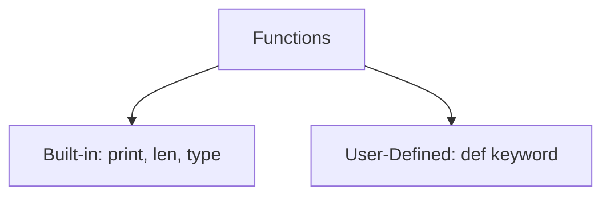
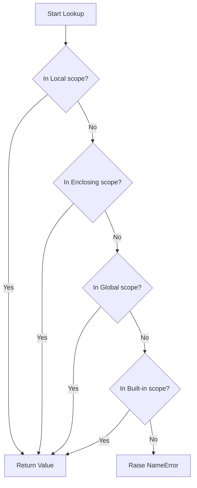
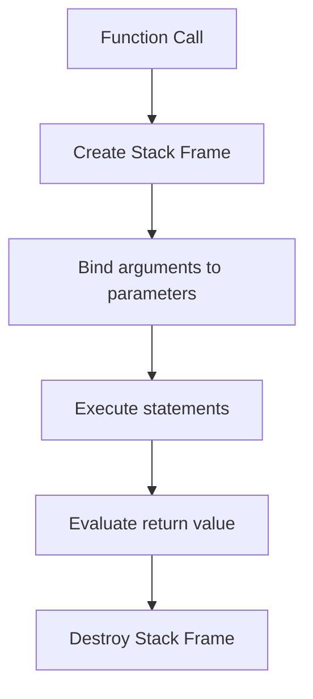

# Python OOP: Functions, Scope, & Modular Programming

---

# 1. Definition

## Function
A **Function** is a self-contained block of organized, reusable code designed to perform a single, related action. Functions provide better modularity for your application and high code reuse.

## Python Classification
Functions are categorized into two types:
1. **Built-in Functions**: Pre-defined functions available in Python's standard library (e.g., `print()`, `len()`, `sum()`).
2. **User-Defined Functions (UDFs)**: Custom functions created by developers using the `def` keyword.



---

# 2. Why Do We Need It?

### The Problem With Monolithic Code
Without functions, code is monolithic and repetitive. If a task needs to be performed in three different files, the logic must be copied and pasted.

```python
# Duplicate calculations
area1 = 10 * 20
# ... other statements
area2 = 15 * 30
```

#### Issues:
1. **DRY Principle Violation**: "Don't Repeat Yourself" (DRY) is violated.
2. **Hard to Debug**: Fixing a bug in calculation logic requires tracking down and updating every duplicate block.
3. **No Namespace Isolation**: Variables declared for temporary calculations leak into the global namespace, causing clashes.

---

# 3. Real-Life Analogies

### Analogy: The Restaurant Kitchen
Think of a function as a chef specializing in making soup:
* **The Calling Script**: The waiter places an order (invokes the function) and hands the chef the ingredients (arguments).
* **The Function (Chef)**: The chef goes to a private kitchen counter (local scope/namespace), processes the ingredients (function body), and prepares the soup.
* **The Return Statement**: The chef puts the soup on a tray and sends it back to the waiter (returns the result). The waiter can now serve it (assign to a variable) or show it to others (print it).

---

# 4. Syntax

```python
# 1. Function definition with Type Hints
def calculate_area(length: float, width: float) -> float:
    """Calculates the area of a rectangle."""
    return length * width

# 2. Invocation (Calling)
result = calculate_area(10.5, 20.0)
```
* **Explanation**: Defines a function with type hints and a docstring, then calls it with arguments.
* **Expected Output**: Compiles and executes. `result` stores `210.0`.
* **Memory Explanation**: Calling the function pushes a new stack frame containing local variables `length` and `width`.
* **Time Complexity**: $\mathcal{O}(1)$
* **Space Complexity**: $\mathcal{O}(1)$
* **Common Mistakes**: Putting default parameters before positional parameters.
* **Best Practices**: Use type hints to clarify input and output structures.

---

# 5. Syntax Breakdown

Let's dissect parameter type categories:

* **Positional Arguments**: Matched to parameters by position.
* **Keyword Arguments**: Matched by explicitly naming the parameter (`width=20.0`).
* **Default Arguments**: Pre-assigned parameters used if values are omitted (`country="India"`).

---

# 6. Memory Diagram

When calling `func(x)` with local namespace isolation:

```
GLOBAL FRAME (Namespace)                   LOCAL FRAME (func)
======================                     =========================
| Name | Reference   |                     | Name  | Reference     |
======================                     =========================
| val  |   0x100A    | ------------------> | arg   |   0x100A      |
======================                     =========================
```

* **Explanation**: Local variables inside function calls live on the execution stack frame and are destroyed when the function returns.

---

# 7. Internal Working (Behind the Scenes)

## Scope Resolution (LEGB Rule)
When variable lookup occurs inside a function, Python checks scopes in a strict hierarchy:
1. **L (Local)**: Variables declared inside the function.
2. **E (Enclosing)**: Variables in enclosing function namespaces (for nested functions).
3. **G (Global)**: Variables declared at the module level.
4. **B (Built-in)**: Built-in names (like `len`, `int`).



---

# 8. Rules

### Function Rules
1. **Default Argument Positioning**: Default parameters **must follow** non-default parameters.
   * `def func(a, b=10):` $\rightarrow$ **Valid**
   * `def func(a=10, b):` $\rightarrow$ **Invalid**
2. **Mutable Default Parameter Trap**: Never use mutable objects (like empty lists `[]`) as default argument values; they are shared across all calls.
3. **Scope Shadows**: Local variables shadow global variables with the same name.

---

# 9. Naming Conventions (PEP 8)

* Use snake_case for function names.
* Use descriptive verbs (e.g., `get_user_profile`, `calculate_sum`).

| Type | Bad Example | Good Example | Industry Standard |
| :--- | :--- | :--- | :--- |
| Function | `CalculateArea()` | `calculate_area()` | `process_invoice_payment()` |

---

# 10. Common Mistakes & Bugs

### Mistake 1: The Mutable Default Argument Bug
```python
# BUGGY CODE
def append_to(element, target=[]):
    target.append(element)
    return target

print(append_to(1))  # [1]
print(append_to(2))  # [1, 2] (Shared reference!)
```
* **Why it happens**: Default arguments are evaluated once when the function is defined, not when it is called.
* **How to avoid**: Use `None` as default:
```python
def append_to(element, target=None):
    if target is None:
        target = []
    target.append(element)
    return target
```

---

### Mistake 2: Missing Return Statement
```python
# BUGGY CODE
def calculate(a, b):
    result = a + b

x = calculate(5, 5)
print(x)  # Prints None!
```
* **Why it happens**: Functions without an explicit `return` statement return `None` by default in Python.
* **How to avoid**: Ensure you return calculations: `return result`.

---

# 11. Best Practices & Pythonic Code

* **Use Multiple Returns** as tuples for complex calculations.
```python
# Pythonic Unpacking
def get_min_max(arr: list[int]) -> tuple[int, int]:
    return min(arr), max(arr)

low, high = get_min_max([5, 2, 9])
```

---

# 12. Interview Questions

### Q1. What is the difference between parameters and arguments?
* **Answer**: 
  * **Parameters** are the placeholders defined in the function signature (e.g., `def func(x, y):`).
  * **Arguments** are the actual values passed to the function during invocation (e.g., `func(10, 20)`).

---

### Q2. Explain the LEGB rule.
* **Answer**: It is the order Python searches namespaces for variable resolution: Local, Enclosing (nested functions), Global (module level), and Built-in namespaces.

---

### Q3. Tricky Output Question
**What is the output of the following code?**
```python
def test(x, y=[]):
    y.append(x)
    return y
print(test(1, [2]))
```
* **Expected Output**: `[2, 1]`
* **Explanation**: Because an explicit argument `[2]` was passed, the default list `[]` was bypassed and the user-provided list was updated.

---

# 13. Exam Points

* **`def`**: The keyword used to start user-defined function blocks.
* **Docstring**: Explanatory string placed inside triple quotes as the first line of a function.
* **`return`**: Terminates function execution and passes values back.

---

# 14. Real-World Examples

## Example 1: Multi-value Return Pattern
```python
def convert_celsius(celsius: float) -> tuple[float, float]:
    """Converts Celsius to Fahrenheit and Kelvin."""
    fahrenheit = (celsius * 9/5) + 32
    kelvin = celsius + 273.15
    return fahrenheit, kelvin

f, k = convert_celsius(25.0)
print(f"Fahrenheit: {f}, Kelvin: {k}")
```
* **Explanation**: Returns multiple float objects as a tuple.
* **Expected Output**:
  ```
  Fahrenheit: 77.0, Kelvin: 298.15
  ```
* **Time/Space Complexity**: $\mathcal{O}(1)$

---

# 15. Mini Practice

### Easy
Create a function that takes a name and prints a greeting. Include type hints.

### Medium
Write a calculator function that accepts two numbers and a math symbol (`+`, `-`, `*`, `/`) and performs the calculation using helper functions.

### Hard
Write a function `find_primes_in_range(start, end)` that calls a helper function `is_prime(n)` to find all primes in an interval.

---

# 16. Summary Table

| Argument Type | Position Strict | Named | Default Fallback |
| :--- | :--- | :--- | :--- |
| **Positional** | Yes | No | No |
| **Keyword** | No | Yes | No |
| **Default** | No | Optional | Yes |

---

# 17. Cheat Sheet

```python
# Structure
def func_name(param: type) -> return_type:
    return value

# Variable args (tuple)
def add(*args):
    return sum(args)

# Keyword args (dict)
def info(**kwargs):
    pass
```

---

# 18. Flow Diagram



---

# 19. Comparison Table

| Feature | Return Statement | Print Statement |
| :--- | :--- | :--- |
| **Purpose** | Sends data back to calling environment | Outputs representation to terminal |
| **Usability** | Result can be stored and reused | Output cannot be captured for variables |

---

# 20. Things to Remember

> [!IMPORTANT]
> **Key takeaways on Functions:**
> 1. **Default arguments trap**: Never use mutable types (like lists/dicts) as default parameter values.
> 2. **Leverage type hints**: Use type hints to build cleaner codebases.